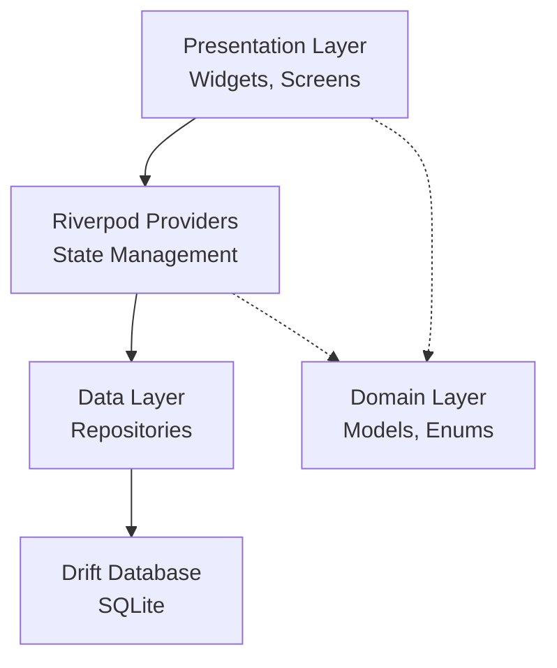

# CLupData - KI Coding Assistent Regelwerk

> **Gültig für**: Alle Flutter/Dart Code-Generierungen in diesem Projekt  
> **Version**: 2.0.0  
> **Letzte Aktualisierung**: 2026-03-23

---

## 1. Projekt-Übersicht

### 1.1 Kontext

**CLupData** ist eine Desktop-Anwendung (Windows/Linux/macOS) zur Verwaltung eines Boxclubs:
- Mitgliederverwaltung
- Beitrags-/Rechnungsverwaltung  
- Warenwirtschaft (POS)
- Leistungskatalog
- Stammdaten/Einstellungen

### 1.2 Tech Stack

| Komponente | Package | Zweck |
|------------|---------|-------|
| **Framework** | Flutter 3.x | UI Framework |
| **State Management** | `hooks_riverpod` + CodeGen | Reaktiver State |
| **Datenbank** | `drift` (SQLite) | Lokale Persistenz |
| **Routing** | `go_router` | Navigation |
| **Data Grids** | `pluto_grid` | Tabellarische Daten |
| **UI Utilities** | `flutter_hooks`, `gap`, `intl` | Hooks, Layout, Lokalisierung |
| **Data Classes** | `freezed` + `json_serializable` | Immutable Models |

### 1.3 Single Source of Truth

**[`lib/assets/data/structur.md`](lib/assets/data/structur.md:1)** ist die zentrale Spezifikation für:
- Datenbank-Schema (Tabellen, Felder, Indizes)
- Relationen zwischen Entities
- UI-Konfiguration (Screens, Dialoge, Data Grid Spalten)
- Status-Farben und Business-Regeln

**[MUST]** Jede Änderung an Datenbank oder UI MUSS zuerst in `structur.md` dokumentiert werden.

---

## 2. Architektur-Regeln

### 2.1 Projektstruktur (Feature-First)

```
lib/
├── core/                          # Shared Kernel
│   ├── database/                  # Drift Setup, Tables, Migrationen
│   ├── providers/                 # Globale Riverpod Provider
│   ├── router/                    # go_router Konfiguration
│   └── theme/                     # Material 3 Theme
├── common_widgets/                # Wiederverwendbare UI-Komponenten
│   ├── forms/                     # Formular-Felder
│   │   ├── app_text_field.dart
│   │   ├── app_date_picker_field.dart
│   │   ├── app_dropdown_field.dart   # [MUST] Für alle Dropdowns
│   │   ├── app_select_field.dart     # [MUST] Für Autocomplete
│   │   └── app_entity_autocomplete.dart
│   ├── app_shell.dart
│   ├── app_edit_dialog_scaffold.dart
│   └── feature_screen_scaffold.dart
├── widgets/                       # Komplexe Shared Widgets
│   └── data_grid_v2/              # [MUST] Einziges DataGrid System
│       ├── vpit_data_grid.dart
│       ├── data_grid_controller.dart
│       ├── data_grid_column_config.dart
│       ├── sort_settings_dialog.dart
│       └── filter_settings_dialog.dart
└── features/                      # Feature-Module
    ├── members/                   # Mitgliederverwaltung
    ├── beitraege/                 # Beitragsverwaltung
    ├── leistungen/                # Leistungskatalog
    ├── waren/                     # Warenwirtschaft
    ├── rechnungen/                # Rechnungsstellung
    └── stammdaten/                # Einstellungen
```

### 2.2 Layer-Architektur



### 2.3 Coding Standards

#### [MUST] State Management

```dart
// ✅ RICHTIG: Riverpod mit Code-Generierung
@riverpod
class MemberList extends _$MemberList {
  @override
  Future<List<MemberRowData>> build() async {
    final repo = ref.watch(membersRepositoryProvider);
    return repo.watchAll().first;
  }
}

// ✅ RICHTIG: Flutter Hooks für lokalen State
class MyWidget extends HookConsumerWidget {
  @override
  Widget build(BuildContext context, WidgetRef ref) {
    final searchController = useTextEditingController();
    final isLoading = useState(false);
    // ...
  }
}

// ❌ FALSCH: StatefulWidget
class MyWidget extends StatefulWidget { }  // VERBOTEN
```

#### [MUST] Data Classes mit Freezed

```dart
// ✅ RICHTIG: Freezed für Models
@freezed
class MemberRowData with _$MemberRowData {
  const factory MemberRowData({
    required int id,
    required String name,
    required String vorname,
    String? leistungName,
    String? beitrag,
  }) = _MemberRowData;
}

// ❌ FALSCH: Manuelle copyWith/equals
class MemberRowData {  // VERBOTEN
  final int id;
  MemberRowData copyWith(...) { }  // NIE manuell implementieren
}
```

#### [MUST] Repository Pattern

```dart
// Repositories kapseln ALLE Datenbankzugriffe
class MembersRepository {
  final AppDatabase _db;
  MembersRepository(this._db);
  
  Stream<List<Mitglied>> watchAll();
  Future<Mitglied?> getById(int id);
  Future<int> insert(MitgliedCompanion companion);
  Future<bool> update(MitgliedCompanion companion);
  Future<int> delete(int id);
}

// Provider exposen Repository
@Riverpod(keepAlive: true)
MembersRepository membersRepository(Ref ref) {
  return MembersRepository(ref.watch(databaseProvider));
}
```

---

## 3. UI-Komponenten-Regeln

### 3.1 DataGrid (VpitDataGrid)

**[MUST]** Alle tabellarischen Datenansichten MÜSSEN [`VpitDataGrid`](lib/widgets/data_grid_v2/vpit_data_grid.dart:1) verwenden.

#### Grundlegende Nutzung

```dart
class MemberDataGrid extends HookConsumerWidget {
  @override
  Widget build(BuildContext context, WidgetRef ref) {
    final membersAsync = ref.watch(memberListProvider);
    
    return membersAsync.when(
      data: (members) => VpitDataGrid<MemberRowData>(
        items: members,
        columnConfigs: _buildColumns(),
        toSearchString: (m) => '${m.name} ${m.vorname} ${m.ort}',
        toJson: (m) => {...},
        fromJson: (json) => MemberRowData(...),
        detailModalBuilder: (item, columnId) => MemberEditDialog.show(...),
        rowBgColorResolver: (item) => item.isActive ? null : Colors.grey.shade200,
      ),
      loading: () => const CircularProgressIndicator(),
      error: (err, stack) => Text('Error: $err'),
    );
  }
}
```

#### Interaktions-Regeln

| Aktion | Verhalten |
|--------|-----------|
| **Einfacher Klick** | Zeile wird ausgewählt |
| **Doppelklick** | Öffnet Detail-Dialog |
| **Enter-Taste** | Öffnet Detail-Dialog (Barrierefreiheit) |
| **Spalten-Header** | Einzelspalten-Sortierung |

#### Column Config

```dart
List<DataGridColumnConfig<MemberRowData>> _buildColumns() {
  return [
    DataGridColumnConfig<MemberRowData>(
      field: 'name',
      title: 'Name',
      type: PlutoColumnType.text(),
      valueExtractor: (m) => m.name,
      sortable: true,
      filterable: true,
    ),
    DataGridColumnConfig<MemberRowData>(
      field: 'alter',
      title: 'Alter',
      type: PlutoColumnType.number(),
      valueExtractor: (m) => m.alter,  // Berechnet im Provider
      sortable: false,  // Berechnete Felder nicht sortierbar
      editable: false,  // Read-only
    ),
  ];
}
```

### 3.2 Formularfelder

#### [MUST] Dropdown/Select Felder

**NIE** Flutter's `DropdownMenu`, `DropdownButton` oder `Autocomplete` verwenden.

```dart
// ✅ RICHTIG: AppDropdownField für feste Listen
AppDropdownField<String>(
  controller: statusController,
  label: 'Status',
  options: BeitragStatus.allStringValues,
  getLabel: (s) => s,
)

// ✅ RICHTIG: AppSelectField für Autocomplete (große Listen)
AppSelectField<Mitglied>(
  mode: AppSelectMode.autocomplete,
  controller: mitgliedController,
  label: 'Mitglied suchen',
  options: allMitglieder,
  getLabel: (m) => '${m.name}, ${m.vorname}',
)
```

#### [MUST] Dialog-Struktur

```dart
class MemberEditDialog extends HookConsumerWidget {
  static Future<void> show(BuildContext context, {int? memberId}) {
    return showDialog(
      context: context,
      builder: (_) => MemberEditDialog(memberId: memberId),
    );
  }

  @override
  Widget build(BuildContext context, WidgetRef ref) {
    // Hooks für Controller
    final nameController = useTextEditingController();
    
    return AppEditDialogScaffold(
      title: memberId == null ? 'Neues Mitglied' : 'Mitglied bearbeiten',
      onSave: () => _save(context, ref),
      onDelete: memberId != null ? () => _delete(context, ref) : null,
      child: Column(
        children: [
          AppTextField(
            controller: nameController,
            label: 'Name',
            required: true,
          ),
          // ... weitere Felder
        ],
      ),
    );
  }
}
```

#### Dialog-Pflicht-Elemente

- **[MUST]** X-Button in der Titelleiste (`IconButton(Icons.close)`)
- **[MUST]** "Abbrechen" Button in Actions
- **[MUST]** `CallbackShortcuts` mit Escape (schließen) und Enter (speichern)
- **[MUST]** Löschen-Button (rot) bei bestehenden Datensätzen
- **[MUST]** Bestätigungsdialog vor dem Löschen

### 3.3 Status-Farben (VERBINDLICH)

**Beitrag-Status** (in [`lib/features/beitraege/domain/models/beitrag_status.dart`](lib/features/beitraege/domain/models/beitrag_status.dart:1)):

| Status | Farbe | Hex |
|--------|-------|-----|
| `kontiert` | Hellgelb | `#FFF9C4` |
| `offen` | Hellorange | `#FFE0B2` |
| `bezahlt` | Hellgrün | `#C8E6C9` |
| `angemahnt` | Hellrot | `#FFCDD2` |
| `storniert` | Hellgrau | `#EEEEEE` |
| `inkasso` | Pink | `#F8BBD0` |

```dart
// ✅ RICHTIG: Status-Farben aus Enum verwenden
VpitDataGrid<BeitragRowData>(
  rowBgColorResolver: (beitrag) {
    final status = BeitragStatus.fromString(beitrag.status);
    return status.backgroundColor;
  },
)

// ❌ FALSCH: Hartkodierte Farben
Color(0xFFFFF9C4)  // VERBOTEN - immer über Enum!
```

---

## 4. Datenbank-Regeln

### 4.1 Tabellen-Definition (Drift)

```dart
// Jede Tabelle in eigener Datei unter lib/core/database/tables/
class MitgliedTable extends Table {
  IntColumn get id => integer().autoIncrement()();
  TextColumn get name => text().withLength(min: 1, max: 100)();
  
  // Foreign Keys mit onDelete
  IntColumn get leistungId => 
      integer().references(LeistungTable, #id, onDelete: KeyAction.setNull)();
  
  // Timestamps
  DateTimeColumn get erstelltAm => 
      dateTime().withDefault(currentDateAndTime)();
  
  @override
  String? get tableName => 'mitglied';
}
```

### 4.2 Migrationen

```dart
@DriftDatabase(tables: [...])
class AppDatabase extends _$AppDatabase {
  @override
  int get schemaVersion => 8;  // Aktuelle Version

  @override
  MigrationStrategy get migration => MigrationStrategy(
    onCreate: (m) async {
      await m.createAll();
      await _seedData();
    },
    onUpgrade: (m, from, to) async {
      // Schrittweise Migrationen
      if (from < 2) { /* ... */ }
      if (from < 3) { /* ... */ }
    },
  );
}
```

### 4.3 Indizes

Siehe [`structur.md` Kapitel 2](lib/assets/data/structur.md:230) für verbindliche Index-Definitionen.

---

## 5. Performance-Regeln

### 5.1 Kein Mapping im Build

```dart
// ✅ RICHTIG: useMemoized für Data-Mapping
final plutoRows = useMemoized(() {
  return items.map((item) => _toPlutoRow(item)).toList();
}, [items]);

// ❌ FALSCH: Direktes Mapping im Build
final plutoRows = items.map((item) => ...).toList();  // VERBOTEN
```

### 5.2 Selektive Rebuilds

```dart
// ✅ RICHTIG: Nur spezifische Felder beobachten
final name = ref.watch(memberProvider.select((m) => m.name));

// ❌ FALSCH: Ganzen Provider beobachten wenn nicht nötig
final member = ref.watch(memberProvider);  // Nur wenn alle Daten gebraucht
```

### 5.3 Streams statt Polling

```dart
// ✅ RICHTIG: Drift .watch() Streams
Stream<List<Mitglied>> watchAll() {
  return db.select(db.mitglieds).watch();
}

// ❌ FALSCH: Manuelles Refetching
Future<void> refresh() => refetch();  // VERBOTEN
```

### 5.4 Berechnete Felder

```dart
// ✅ RICHTIG: Berechnung im Provider/Model
@freezed
class WarenRowData with _$WarenRowData {
  const factory WarenRowData({
    required Ware ware,
    required double mwstSatz,
  }) = _WarenRowData;
  
  double get nettopreis => ware.bruttopreis / (1 + mwstSatz / 100);
}

// ❌ FALSCH: Berechnung im Widget
Text('${ware.bruttopreis / 1.19}')  // VERBOTEN
```

---

## 6. Lokalisierung & Formatierung

### 6.1 Deutsche Lokalisierung (VERBINDLICH)

- **Sprache**: Deutsch (de_DE)
- **Datumsformat**: `dd.MM.yyyy`
- **Zahlenformat**: Deutsche Konvention (1.234,56)
- **Währung**: €-Symbol nach dem Betrag (123,45 €)

```dart
// Datumsformatierung
DateFormat('dd.MM.yyyy').format(date);

// Währungsformatierung
NumberFormat.currency(locale: 'de_DE', symbol: '€').format(betrag);
```

---

## 7. Checklisten

### 7.1 Vor Code-Generierung

- [ ] `structur.md` geprüft für Schema/UI-Änderungen
- [ ] Feature-Ordner-Struktur korrekt
- [ ] Riverpod Provider definiert
- [ ] Repository-Methode für DB-Zugriff

### 7.2 DataGrid Implementierung

- [ ] Erweitert `VpitDataGrid<T>`
- [ ] `toSearchString` implementiert
- [ ] `columnConfigs` aus `structur.md`
- [ ] `detailModalBuilder` für Doppelklick
- [ ] `rowBgColorResolver` wenn nötig

### 7.3 Dialog Implementierung

- [ ] `AppEditDialogScaffold` als Basis
- [ ] X-Button in Titelleiste
- [ ] Abbrechen-Button in Actions
- [ ] Escape/Enter Keybindings
- [ ] Löschen-Button (bei bestehenden)
- [ ] Validierung implementiert
- [ ] Erfolgs-Feedback (SnackBar)

### 7.4 Nach Änderungen an Models/Providern

```bash
# Code-Generierung ausführen
dart run build_runner build -d
```

---

## 8. Anti-Patterns (STRENG VERBOTEN)

| ❌ Anti-Pattern | ✅ Korrekte Lösung |
|----------------|-------------------|
| `StatefulWidget` | `HookConsumerWidget` + `flutter_hooks` |
| `DropdownMenu` / `DropdownButton` | `AppDropdownField` / `AppSelectField` |
| Manuelles `copyWith` | `@freezed` Annotation |
| Raw SQL Strings | Drift Type-Safe API |
| DataMapping in `build()` | `useMemoized()` |
| Hartkodierte Farben | Status Enum `backgroundColor` |
| `context.watch()` ganze Objekte | `select()` für spezifische Felder |
| `flutter run` im Agent | Entwickler führt Builds aus |

---

## 9. Referenzen

| Datei | Zweck |
|-------|-------|
| [`lib/assets/data/structur.md`](lib/assets/data/structur.md:1) | Single Source of Truth |
| [`lib/widgets/data_grid_v2/vpit_data_grid.dart`](lib/widgets/data_grid_v2/vpit_data_grid.dart:1) | DataGrid Dokumentation |
| [`lib/common_widgets/forms/app_select_field.dart`](lib/common_widgets/forms/app_select_field.dart:1) | Select/Dropdown Dokumentation |
| [`lib/features/beitraege/domain/models/beitrag_status.dart`](lib/features/beitraege/domain/models/beitrag_status.dart:1) | Status Enum Beispiel |
| [`AGENTS.md`](AGENTS.md:1) | Agent-Modi Übersicht |

---

*Diese Dokumentation ist verbindlich für alle KI-generierten Code-Änderungen im Projekt.*
