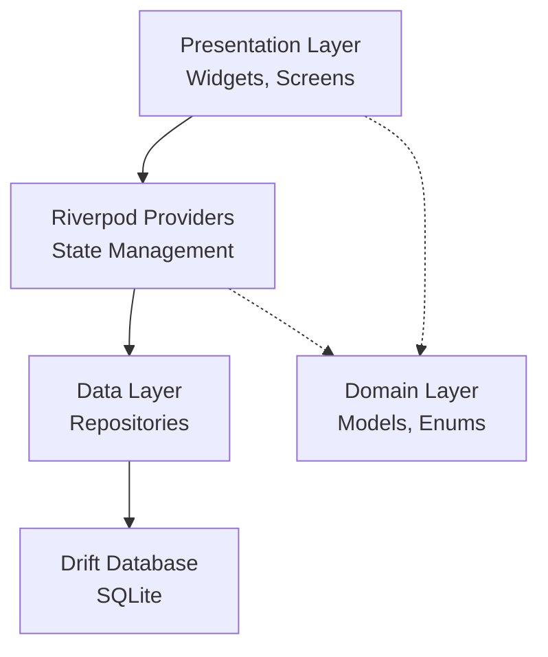

# Flutter Architektur-Regeln

## Geltungsbereich

Diese Regeln gelten für den **Architect-Mode** bei der Planung und Gestaltung der Systemarchitektur.

## Architektur-Überblick

```
lib/
├── main.dart                    # Entry Point
├── core/                        # Shared Kernel
│   ├── database/               # Drift Database
│   │   ├── database.dart       # Database Setup
│   │   ├── tables/            # Table Definitions
│   │   └── schema_versions.dart
│   ├── providers/             # Global Riverpod Providers
│   ├── router/                # GoRouter Configuration
│   └── theme/                 # AppTheme & Styling
├── common_widgets/            # Shared UI Components
│   ├── forms/                 # Form Field Widgets
│   └── ...                    # Dialogs, Shell, etc.
└── features/                  # Feature Modules
    ├── members/               # Mitgliederverwaltung
    │   ├── data/              # Repositories
    │   ├── models/            # Domain Models
    │   ├── presentation/      # UI Layer
    │   │   ├── providers/     # Riverpod Providers
    │   │   ├── screens/       # Screens
    │   │   └── widgets/       # Feature Widgets
    │   └── members_screen.dart # Feature Entry
    ├── beitraege/             # Beitragsverwaltung
    ├── leistungen/            # Leistungskatalog
    ├── waren/                 # Warenwirtschaft
    ├── rechnungen/            # Rechnungsstellung
    └── stammdaten/            # Einstellungen
```

## Layer-Architektur

### 1. Data Layer

```dart
// Repositories kapseln Datenbankzugriff
// Keine Business-Logik hier!

class MembersRepository {
  final AppDatabase _db;
  
  MembersRepository(this._db);
  
  // CRUD + Queries
  Stream<List<Mitglied>> watchAll();
  Future<Mitglied?> getById(int id);
  Future<int> insert(MitgliedCompanion companion);
  Future<bool> update(MitgliedCompanion companion);
  Future<int> delete(int id);
  
  // Spezifische Queries
  Stream<List<Mitglied>> search(String query);
  Stream<List<Mitglied>> getExpiringContracts(DateTime before);
}
```

### 2. Domain Layer (Lightweight)

```dart
// Models mit Business-Logik (keine Flutter-Dependencies!)

@freezed
class MemberRowData with _$MemberRowData {
  const factory MemberRowData({
    required int id,
    required String name,
    required String vorname,
    String? leistungName,
    String? beitrag,
  }) = _MemberRowData;
  
  factory MemberRowData.fromMitglied(Mitglied m, {Leistung? leistung}) {
    return MemberRowData(
      id: m.id,
      name: m.name,
      vorname: m.vorname,
      leistungName: leistung?.name,
      beitrag: leistung?.preis?.bruttopreis?.toString(),
    );
  }
}

// Enums für Status
enum BeitragStatus {
  kontiert('Kontiert'),
  offen('Offen'),
  bezahlt('Bezahlt'),
  angemahnt('Angemahnt'),
  storniert('Storniert'),
  inkasso('Inkasso');
  
  final String displayName;
  const BeitragStatus(this.displayName);
  
  Color get color => BeitragStatusColors.colorFor(this);
}
```

### 3. Presentation Layer

```dart
// Providers verbinden UI mit Data Layer
@riverpod
class MemberListNotifier extends _$MemberListNotifier {
  @override
  Future<List<MemberRowData>> build() async {
    final repository = ref.watch(membersRepositoryProvider);
    return repository.watchAllMapped().first;
  }
  
  Future<void> refresh() async {
    ref.invalidateSelf();
  }
  
  Future<void> deleteMember(int id) async {
    final repository = ref.read(membersRepositoryProvider);
    await repository.delete(id);
    ref.invalidateSelf();
  }
}

// Widgets sind "dumm" und konsumieren nur Provider
class MemberDataGrid extends ConsumerWidget {
  @override
  Widget build(BuildContext context, WidgetRef ref) {
    final membersAsync = ref.watch(memberListNotifierProvider);
    // UI-Rendering...
  }
}
```

## Dependency Flow



## Feature-Module Struktur

Jedes Feature folgt dieser Struktur:

```
features/{feature_name}/
├── data/
│   └── {feature}_repository.dart      # Repository + Provider
├── domain/                            # Optional für komplexe Domains
│   ├── models/
│   └── services/                      # Business Services
├── presentation/
│   ├── providers/                     # Feature-Spezifische Provider
│   ├── screens/                       # Routable Screens
│   └── widgets/                       # Interne Widgets
├── {feature}_screen.dart              # Main Screen (Export)
└── feature_router.dart                # Feature Routes (Optional)
```

## Routing-Strategie

### Zentrale Router-Konfiguration

```dart
// lib/core/router/app_router.dart
@riverpod
goRouter appRouter(AppRouterRef ref) {
  return GoRouter(
    initialLocation: '/',
    routes: [
      ShellRoute(
        builder: (context, state, child) => AppShell(child: child),
        routes: [
          GoRoute(
            path: '/mitglieder',
            builder: (context, state) => const MembersScreen(),
          ),
          GoRoute(
            path: '/beitraege',
            builder: (context, state) => const BeitraegeScreen(),
          ),
          // ...
        ],
      ),
    ],
  );
}
```

### Navigation Patterns

```dart
// ✅ RICHTIG: Deeplinking-freundlich
context.go('/mitglieder/edit?id=123');

// ✅ RICHTIG: Mit State
context.go('/mitglieder/edit', extra: member);

// ✅ RICHTIG: Zurück navigieren
context.pop();

// Dialogs als Routes (für Deep Linking)
GoRoute(
  path: '/mitglieder/new',
  pageBuilder: (context, state) => DialogPage(
    builder: (_) => const NeuesMitgliedDialog(),
  ),
),
```

## State Management Patterns

### 1. AsyncNotifier für komplexe States

```dart
@riverpod
class BeitragEditNotifier extends _$BeitragEditNotifier {
  @override
  Future<BeitragEditState> build(int? beitragId) async {
    if (beitragId == null) {
      return BeitragEditState.empty();
    }
    
    final repository = ref.watch(beitraegeRepositoryProvider);
    final beitrag = await repository.getById(beitragId);
    
    if (beitrag == null) {
      throw Exception('Beitrag nicht gefunden');
    }
    
    return BeitragEditState.fromBeitrag(beitrag);
  }
  
  Future<void> save(BeitragData data) async {
    state = const AsyncValue.loading();
    state = await AsyncValue.guard(() async {
      final repository = ref.read(beitraegeRepositoryProvider);
      await repository.update(data);
      return state.value!.copyWith(isSaved: true);
    });
  }
}
```

### 2. StreamProvider für Live-Daten

```dart
@riverpod
Stream<List<BeitragRowData>> beitragListStream(BeitragListStreamRef ref) {
  final repository = ref.watch(beitraegeRepositoryProvider);
  return repository.watchAllMapped();
}
```

### 3. StateNotifier für UI-States

```dart
@riverpod
class DataGridFilterNotifier extends _$DataGridFilterNotifier {
  @override
  FilterState build() => const FilterState();
  
  void setColumnFilter(String column, String? value) {
    state = state.copyWith(
      filters: {...state.filters, column: value},
    );
  }
  
  void clearFilters() {
    state = const FilterState();
  }
}
```

## Datenbank-Design-Prinzipien

### 1. Table Design

```dart
// Jede Tabelle in eigener Datei
// Dateiname: {entity}_table.dart

class MitgliedTable extends Table {
  IntColumn get id => integer().autoIncrement()();
  TextColumn get name => text().withLength(min: 1, max: 100)();
  
  // Foreign Keys mit onDelete
  IntColumn get leistungId => 
      integer().references(LeistungTable, #id, onDelete: KeyAction.setNull)();
  
  // Timestamps
  DateTimeColumn get erstelltAm => 
      dateTime().withDefault(currentDateAndTime)();
  
  @override
  String? get tableName => 'mitglied';
  
  @override
  bool get withoutRowId => false;
}
```

### 2. Migrationen

```dart
// In schema_versions.dart
const schemaVersion = 3;

// Migrationen im database.dart
@DriftDatabase(...)
class AppDatabase extends _$AppDatabase {
  @override
  MigrationStrategy get migration => MigrationStrategy(
    onCreate: (m) async {
      await m.createAll();
      await _seedData();
    },
    onUpgrade: (m, from, to) async {
      if (from < 2) {
        await m.addColumn(warenTable, warenTable.mindestbestand);
      }
      if (from < 3) {
        await m.createTable(rechnungPositionTable);
      }
    },
  );
}
```

### 3. Views für komplexe Queries

```dart
abstract class MitgliedMitLeistungView extends View {
  MitgliedTable get mitglied;
  LeistungTable get leistung;
  
  @override
  Query as() => select([
    mitglied.id,
    mitglied.name,
    mitglied.vorname,
    leistung.name,
  ]).from(mitglied).join([
    leftOuterJoin(leistung, leistung.id.equalsExp(mitglied.leistungId))
  ]);
}
```

## UI-Komponenten-Architektur

### 1. Design System

```dart
// lib/core/theme/app_theme.dart
class AppTheme {
  static ThemeData get lightTheme {
    return ThemeData(
      useMaterial3: true,
      colorScheme: ColorScheme.fromSeed(
        seedColor: Colors.blue,
        brightness: Brightness.light,
      ),
      inputDecorationTheme: _inputDecorationTheme,
      dataTableTheme: _dataTableTheme,
    );
  }
  
  // Konsistente Abstände
  static const spacingUnit = 8.0;
  static const spacingSmall = spacingUnit;
  static const spacingMedium = spacingUnit * 2;
  static const spacingLarge = spacingUnit * 3;
}
```

### 2. Wiederverwendbare Widgets

```dart
// common_widgets/ für projektübergreifende Widgets
// Feature-Widgets bleiben im Feature-Ordner

// ✅ RICHTIG: Generische Formularfelder
class AppTextField extends StatelessWidget {
  final String label;
  final String? value;
  final ValueChanged<String>? onChanged;
  final String? Function(String?)? validator;
  final bool readOnly;
  
  const AppTextField({
    required this.label,
    this.value,
    this.onChanged,
    this.validator,
    this.readOnly = false,
  });
  
  @override
  Widget build(BuildContext context) {
    return TextFormField(
      initialValue: value,
      onChanged: onChanged,
      validator: validator,
      readOnly: readOnly,
      decoration: InputDecoration(
        labelText: label,
        border: const OutlineInputBorder(),
      ),
    );
  }
}
```

### 3. Dialog-Pattern

```dart
// Dialogs als eigenständige Routen oder Widgets
class MemberEditDialog extends ConsumerWidget {
  final int? memberId;
  
  const MemberEditDialog({this.memberId});
  
  @override
  Widget build(BuildContext context, WidgetRef ref) {
    return AppEditDialogScaffold(
      title: memberId == null ? 'Neues Mitglied' : 'Mitglied bearbeiten',
      child: MemberEditForm(memberId: memberId),
      onSave: () => _save(context, ref),
    );
  }
}
```

## Performance-Architektur

### 1. Lazy Loading

```dart
// Data Grids mit Pagination
class MemberDataGrid extends HookConsumerWidget {
  @override
  Widget build(BuildContext context, WidgetRef ref) {
    final pagination = useState(const PaginationState(page: 0, pageSize: 50));
    
    return PlutoGrid(
      onLoaded: (event) {
        event.stateManager.setPageSize(pagination.value.pageSize);
      },
      onFetch: (event) async {
        final members = await ref.read(membersRepositoryProvider)
            .getPage(page: event.page, size: event.pageSize);
        return members;
      },
    );
  }
}
```

### 2. Caching-Strategie

```dart
// Riverpod's built-in caching nutzen
// autoDispose für speicherintensive Provider

@riverpod
AutoDisposeFutureProvider<Member> memberDetail(MemberDetailRef ref, int id) async {
  // Automatisch disposed wenn nicht mehr verwendet
  final repo = ref.watch(membersRepositoryProvider);
  return await repo.getById(id);
}

// keepAlive für globale Daten
@Riverpod(keepAlive: true)
StammdatenRepository stammdatenRepository(StammdatenRepositoryRef ref) {
  return StammdatenRepository();
}
```

## Fehlerbehandlungs-Architektur

```dart
// Zentrale Fehlerbehandlung
class AppErrorHandler {
  static void handle(BuildContext context, Object error) {
    final message = switch (error) {
      DriftWrappedException e => 'Datenbankfehler: ${e.message}',
      FormatException e => 'Ungültiges Format: ${e.message}',
      _ => 'Ein unerwarteter Fehler ist aufgetreten',
    };
    
    ScaffoldMessenger.of(context).showSnackBar(
      SnackBar(content: Text(message), backgroundColor: Colors.red),
    );
  }
}

// Global Error Handler im Router
GoRouter(
  errorBuilder: (context, state) => ErrorScreen(error: state.error),
)
```

## Testing-Strategie

```dart
// Unit Tests für Repositories (mit In-Memory DB)
// Widget Tests für Screens (mit Provider Overrides)

group('MembersRepository', () {
  late AppDatabase db;
  late MembersRepository repository;
  
  setUp(() {
    db = AppDatabase.forTesting();
    repository = MembersRepository(db);
  });
  
  tearDown(() => db.close());
  
  test('inserts member successfully', () async {
    final id = await repository.insert(
      MitgliedCompanion.insert(name: 'Test', vorname: 'User'),
    );
    expect(id, isPositive);
  });
});
```

## Sicherheits-Architektur

```dart
// Input-Validierung an den Grenzen
class InputValidator {
  static String? sanitizeString(String? input, {int maxLength = 1000}) {
    if (input == null) return null;
    return input.trim().substring(0, min(input.length, maxLength));
  }
  
  static bool isValidEmail(String email) {
    return RegExp(r'^[\w.-]+@[\w.-]+\.\w+$').hasMatch(email);
  }
}

// Keine sensiblen Daten in Logs
// Debug-Logging nur im Debug-Mode
```

## Dokumentations-Anforderungen

### 1. Code-Kommentare

```dart
/// Repository für Mitgliederverwaltung.
/// 
/// Bietet CRUD-Operationen und spezialisierte Queries für Mitglieder.
/// Alle Methoden geben Futures oder Streams zurück für asynchrone Operationen.
/// 
/// Siehe auch:
/// - [MitgliedTable] für die Datenbank-Definition
/// - [MembersScreen] für die UI
class MembersRepository {
  /// Gibt alle Mitglieder als Stream zurück (live updates).
  Stream<List<Mitglied>> watchAll();
  
  /// Sucht Mitglieder nach Name/Vorname.
  /// [query] wird als LIKE-Filter auf beide Felder angewendet.
  Future<List<Mitglied>> search(String query);
}
```

### 2. Architektur-Entscheidungen dokumentieren

- Wichtige Design-Entscheidungen in `/plans/` als Markdown dokumentieren
- Mermaid-Diagramme für komplexe Flows
- ADRs (Architecture Decision Records) für größere Änderungen
