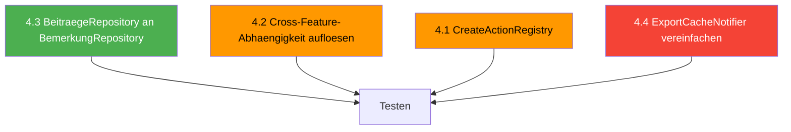

# Architektur-Korrekturen Plan

## Überblick

4 Architektur-Issues mit unterschiedlichen Komplexitätsgraden.

**Abhängigkeiten:**
- 4.2 und 4.3 sind unabhängig voneinander
- 4.1 und 4.4 sind unabhängig voneinander
- 4.2 (Cross-Feature) hat eine Teillösung durch 3.1 (Provider-Ebene), aber der Edit-Dialog ist noch nicht bereinigt

**Empfohlene Reihenfolge:**



---

## 4.3: BeitraegeRepository an zentrales BemerkungRepository anbinden

### Aktueller Stand

[`BemerkungRepository`](lib/core/data/bemerkung_repository.dart:13) existiert bereits zentral und wird von 4 Feature-Repos verwendet:
- ✅ [`MembersRepository`](lib/features/members/data/members_repository.dart:12) – delegiert an `_bemerkungRepo`
- ✅ [`WarenRepository`](lib/features/waren/data/waren_repository.dart:12) – delegiert an `_bemerkungRepo`
- ✅ [`LeistungenRepository`](lib/features/leistungen/data/leistungen_repository.dart:12) – delegiert an `_bemerkungRepo`
- ✅ [`RechnungenRepository`](lib/features/rechnungen/data/rechnungen_repository.dart:15) – delegiert an `_bemerkungRepo`
- ❌ [`BeitraegeRepository`](lib/features/beitraege/data/beitraege_repository.dart:10) – hat **kein** BemerkungRepository, macht SQL-JOIN direkt

### Problem

`BeitraegeRepository` hat keine Bemerkung-Schreiboperationen und keinen Delegation-Pattern. Falls in Zukunft Bemerkung-CRUD für Beiträge benötigt wird, müsste es neu implementiert werden statt zu delegieren.

### Lösung

**Datei: [`beitraege_repository.dart`](lib/features/beitraege/data/beitraege_repository.dart)**

1. `BemerkungRepository` als Dependency injizieren:
```dart
class BeitraegeRepository {
  final AppDatabase _db;
  final BemerkungRepository _bemerkungRepo;
  BeitraegeRepository(this._db, this._bemerkungRepo);
```

2. `watchBemerkungForBeitrag()` bleibt als SQL-JOIN (das ist ein lesender Query, der spezifisch für Beitraege ist – das ist korrekt so)

3. Provider anpassen:
```dart
@riverpod
BeitraegeRepository beitraegeRepository(Ref ref) {
  return BeitraegeRepository(
    ref.watch(appDatabaseProvider),
    ref.watch(bemerkungRepositoryProvider),
  );
}
```

### Betroffene Dateien
| Datei | Änderung |
|-------|----------|
| [`beitraege_repository.dart`](lib/features/beitraege/data/beitraege_repository.dart) | `BemerkungRepository` injizieren |
| [`beitraege_repository.g.dart`](lib/features/beitraege/data/beitraege_repository.g.dart) | Wird durch build_runner neu generiert |

---

## 4.2: Cross-Feature-Abhängigkeit Members → Leistungen auflösen

### Aktueller Stand

Die Provider-Ebene wurde durch Issue 3.1 bereinigt – [`members_list_provider.dart`](lib/features/members/presentation/providers/members_list_provider.dart:1) importiert **nicht mehr** aus dem Leistungen-Feature.

Aber [`member_edit_dialog.dart`](lib/features/members/widgets/member_edit_dialog.dart:12) importiert noch:
```dart
import '../../leistungen/presentation/providers/leistungen_list_provider.dart';
import '../../leistungen/domain/models/leistung_row_data.dart';
import '../../leistungen/data/preise_repository.dart';
```

Verwendungszweck:
- `leistungenGridRowsProvider` → Dropdown der verfügbaren Leistungen
- `LeistungRowData` → Typ für die Dropdown-Items
- `preiseRepositoryProvider` → Laden des Preises für die ausgewählte Leistung

### Analyse

Die Domain-Beziehung ist legitim: Ein Mitglied hat eine `leistungId` FK. Der Edit-Dialog muss die verfügbaren Leistungen als Dropdown anzeigen. Das Problem ist die **Import-Richtung**: Members importiert aus Leistungen.

### Lösung

**Strategie: Lookup-Data im MembersRepository kapseln**

Anstatt den Dialog direkt auf Leistungen-Provider zuzugreifen, stellt das MembersRepository die nötigen Lookup-Daten zur Verfügung. Der Dialog importiert nur noch aus dem eigenen Feature.

**Datei: [`members_repository.dart`](lib/features/members/data/members_repository.dart)**

1. Neue Methoden für Lookup-Daten hinzufügen:
```dart
/// Streams all available Leistungen for dropdown selection.
/// Decouples the Member edit dialog from the Leistungen feature module.
Stream<List<LeistungItem>> watchLeistungenForDropdown() {
  return _db.select(_db.leistung).watch();
}

/// Gets a Preis by its ID.
/// Decouples the Member edit dialog from the Preise repository.
Future<PreisItem?> getPreisById(int id) {
  return (_db.select(_db.preis)..where((p) => p.id.equals(id)))
      .getSingleOrNull();
}
```

**Datei: [`members_list_provider.dart`](lib/features/members/presentation/providers/members_list_provider.dart)**

2. Neuen Provider für Lookup-Daten hinzufügen:
```dart
/// Streams available Leistungen for the member edit dialog dropdown.
/// Decoupled from the Leistungen feature module (Issue 4.2).
final leistungenForDropdownProvider = StreamProvider<List<LeistungItem>>((ref) {
  return ref.watch(membersRepositoryProvider).watchLeistungenForDropdown();
});
```

**Datei: [`member_edit_dialog.dart`](lib/features/members/widgets/member_edit_dialog.dart)**

3. Cross-Feature-Imports ersetzen:
```dart
// ALT:
import '../../leistungen/presentation/providers/leistungen_list_provider.dart';
import '../../leistungen/domain/models/leistung_row_data.dart';
import '../../leistungen/data/preise_repository.dart';

// NEU:
import '../presentation/providers/members_list_provider.dart';
// LeistungRowData wird nicht mehr benötigt – stattdessen LeistungItem aus database.dart
```

4. Im Dialog:
- `leistungenGridRowsProvider` → `leistungenForDropdownProvider`
- `LeistungRowData` → `LeistungItem` (bereits über `database.dart` verfügbar)
- `preiseRepositoryProvider.getPreisById()` → `membersRepositoryProvider.getPreisById()`

### Betroffene Dateien
| Datei | Änderung |
|-------|----------|
| [`members_repository.dart`](lib/features/members/data/members_repository.dart) | `watchLeistungenForDropdown()` + `getPreisById()` |
| [`members_list_provider.dart`](lib/features/members/presentation/providers/members_list_provider.dart) | `leistungenForDropdownProvider` |
| [`member_edit_dialog.dart`](lib/features/members/widgets/member_edit_dialog.dart) | Imports + Provider-Referenzen anpassen |

---

## 4.1: CreateActionRegistry für MainMenuBar (OCP-Konformität)

### Problem

[`MainMenuBar`](lib/common_widgets/main_menu_bar.dart:16) importiert 4 Feature-spezifische Dialoge direkt:
```dart
import '../features/members/widgets/member_edit_dialog.dart';
import '../features/leistungen/widgets/leistung_edit_dialog.dart';
import '../features/waren/widgets/waren_edit_dialog.dart';
import '../features/beitraege/presentation/dialogs/rechnungslegung_dialog.dart';
```

Jedes neue Feature erfordert eine Änderung an `MainMenuBar` → Open/Closed Principle verletzt.

### Lösung

**Registry-Pattern mit Riverpod-Provider**

Statt einer statischen Registry nutzen wir einen Riverpod-Provider, der zur Laufzeit befüllt wird. Das ist konsistent mit der bestehenden Architektur und ermöglicht Context-Abhängige Aktionen.

**Neue Datei: `lib/core/providers/create_action_provider.dart`**

```dart
import 'package:flutter/material.dart';
import 'package:riverpod_annotation/riverpod_annotation.dart';

part 'create_action_provider.g.dart';

/// Ein registrierter Erstellen-Aktionseintrag für das Menü.
class CreateActionEntry {
  final String label;
  final void Function(BuildContext context) action;
  final String? group; // Für Trennlinien-Gruppierung

  const CreateActionEntry({
    required this.label,
    required this.action,
    this.group,
  });
}

/// Riverpod-basierte Registry für Erstellen-Aktionen.
/// Features registrieren ihre Aktionen hier, MainMenuBar konsumiert sie.
@Riverpod(keepAlive: true)
class CreateActionRegistry extends _$CreateActionRegistry {
  @override
  List<CreateActionEntry> build() => [];

  void register(CreateActionEntry entry) {
    state = [...state, entry];
  }

  void unregister(String label) {
    state = state.where((e) => e.label != label).toList();
  }
}
```

**Registrierung in den Feature-Screens**

Jedes Feature registriert seine Aktion beim Aufbau des Screens:

```dart
// In members_screen.dart:
useEffect(() {
  ref.read(createActionRegistryProvider.notifier).register(
    CreateActionEntry(
      label: 'Mitglied',
      action: (context) => MemberEditDialog.show(context),
    ),
  );
  return () => ref.read(createActionRegistryProvider.notifier).unregister('Mitglied');
}, []);
```

**Datei: [`main_menu_bar.dart`](lib/common_widgets/main_menu_bar.dart)**

Vereinfachung des Erstellen-Menüs:
```dart
// ALT: 4 hardcodierte Imports + 4 hardcodierte PopupMenuItems
// NEU: Dynamisch aus Registry

_MenuButton(
  title: 'Erstellen',
  items: [
    for (final entry in ref.watch(createActionRegistryProvider))
      PopupMenuItem(
        child: Text(entry.label),
        onTap: () => entry.action(context),
      ),
  ],
),
```

4 Feature-Imports entfallen komplett.

### Betroffene Dateien
| Datei | Änderung |
|-------|----------|
| Neu: `lib/core/providers/create_action_provider.dart` | Registry + Provider |
| [`main_menu_bar.dart`](lib/common_widgets/main_menu_bar.dart) | 4 Imports entfernen, dynamisches Menü |
| [`members_screen.dart`](lib/features/members/members_screen.dart) | Registrierung + Unregister |
| [`leistungen_screen.dart`](lib/features/leistungen/leistungen_screen.dart) | Registrierung + Unregister |
| [`waren_screen.dart`](lib/features/waren/waren_screen.dart) | Registrierung + Unregister |
| [`beitraege_screen.dart`](lib/features/beitraege/beitraege_screen.dart) | Registrierung + Unregister |

---

## 4.4: ExportCacheNotifier vereinfachen

### Problem

[`ExportCacheNotifier`](lib/core/providers/export_context_provider.dart:89) verwaltet einen LIFO-Stack von Generator-Funktionen:

```dart
class ExportCacheNotifier extends Notifier<ExportGenerator?> {
  final List<ExportGenerator> _stack = [];

  void pushGenerator(ExportGenerator generator) {
    if (!_stack.contains(generator)) {
      _stack.add(generator);
    } else {
      _stack.remove(generator);
      _stack.add(generator);
    }
    state = generator;
  }

  void removeGenerator(ExportGenerator generator) {
    _stack.remove(generator);
    state = _stack.isEmpty ? null : _stack.last;
  }
}
```

Da immer nur ein DataGrid sichtbar ist, ist die Stack-Logik überflüssig. Zudem existiert bereits [`ActiveDataGridController`](lib/core/providers/active_data_grid_provider.dart:17), der den aktiven Controller trackt.

### Lösung

**Vereinfachung: Einzelner aktiver Generator statt Stack**

Die Stack-Logik wird durch eine einfache Setter/Null-Logik ersetzt. Der Export-Generator wird direkt im `ActiveDataGridController` mitgeführt, da beide ohnehin denselben Lebenszyklus haben.

**Option A (empfohlen): Export-Generator in ActiveDataGridController integrieren**

```dart
// lib/core/providers/active_data_grid_provider.dart
@Riverpod(keepAlive: true)
class ActiveDataGridController extends _$ActiveDataGridController {
  ExportGenerator? _exportGenerator;

  @override
  DataGridController<dynamic>? build() => null;

  void register(
    DataGridController<dynamic> controller, {
    ExportGenerator? exportGenerator,
  }) {
    state = controller;
    _exportGenerator = exportGenerator;
  }

  void unregister() {
    state = null;
    _exportGenerator = null;
  }

  ExportGenerator? get exportGenerator => _exportGenerator;
}
```

**Datei: [`export_context_provider.dart`](lib/core/providers/export_context_provider.dart)**

`ExportCacheNotifier` und `exportCacheProvider` werden entfernt. Stattdessen:

```dart
/// Convenience-Provider, der den Export-Generator vom aktiven DataGrid liefert.
final exportCacheProvider = Provider<ExportGenerator?>((ref) {
  // Access the export generator through the active controller
  final activeController = ref.watch(activeDataGridControllerProvider);
  // The export generator is stored in the controller's registration
  return ref.read(activeDataGridControllerProvider.notifier).exportGenerator;
});
```

**Datei: [`vpit_data_grid.dart`](lib/widgets/data_grid_v2/vpit_data_grid.dart)**

Anpassung der Registrierung – Export-Generator wird beim `register()`-Aufruf mitgegeben:

```dart
// ALT:
useEffect(() {
  final notifier = ref.read(activeDataGridControllerProvider.notifier);
  Future(() {
    notifier.register(ctrl);
  });
  return () {
    Future(() {
      notifier.unregister();
    });
  };
}, [ctrl]);

// ... und separater pushGenerator/removeGenerator

// NEU: Kombinierte Registrierung
useEffect(() {
  final notifier = ref.read(activeDataGridControllerProvider.notifier);
  Future(() {
    notifier.register(ctrl, exportGenerator: proxyGenerator);
  });
  return () {
    Future(() {
      notifier.unregister();
    });
  };
}, [ctrl]);
```

Die separate `pushGenerator`/`removeGenerator`-Logik entfällt komplett.

**Datei: [`list_export_menu_button.dart`](lib/features/export/presentation/list_export_menu_button.dart)**

Keine Änderung nötig – konsumiert weiterhin `exportCacheProvider`, der jetzt nur anders backed ist.

### Betroffene Dateien
| Datei | Änderung |
|-------|----------|
| [`active_data_grid_provider.dart`](lib/core/providers/active_data_grid_provider.dart) | `exportGenerator` Feld + angepasster `register()` |
| [`export_context_provider.dart`](lib/core/providers/export_context_provider.dart) | `ExportCacheNotifier` entfernen, `exportCacheProvider` als Proxy |
| [`vpit_data_grid.dart`](lib/widgets/data_grid_v2/vpit_data_grid.dart) | Kombinierte Registrierung, push/remove-Logik entfernen |

---

## Zusammenfassung: Änderungsmatrix

| Issue | Dateien | Risiko | Aufwand |
|-------|---------|--------|---------|
| 4.3 | `beitraege_repository.dart` | Niedrig | Klein |
| 4.2 | `members_repository.dart`, `members_list_provider.dart`, `member_edit_dialog.dart` | Mittel | Mittel |
| 4.1 | Neu: `create_action_provider.dart`, `main_menu_bar.dart`, 4 Feature-Screens | Mittel | Mittel |
| 4.4 | `active_data_grid_provider.dart`, `export_context_provider.dart`, `vpit_data_grid.dart` | Mittel | Mittel |

## Build-Runner

Nach Abschluss aller Änderungen muss `build_runner` ausgeführt werden:
```bash
flutter pub run build_runner build -d
```

Betroffene generierte Dateien:
- `create_action_provider.g.dart` (4.1 – neu)
- `active_data_grid_provider.g.dart` (4.4 – geändert)
- `beitraege_repository.g.dart` (4.3 – geändert)
