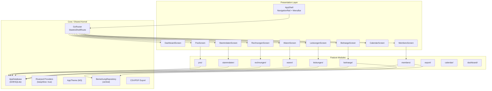
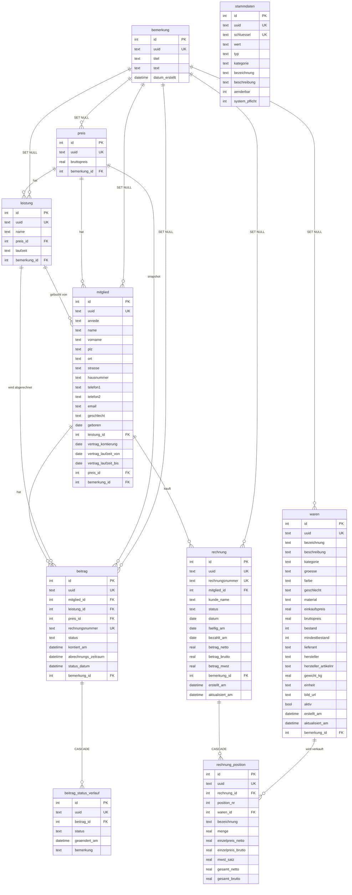
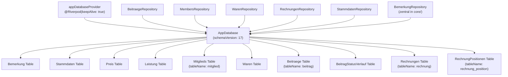
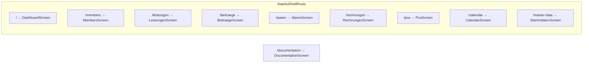
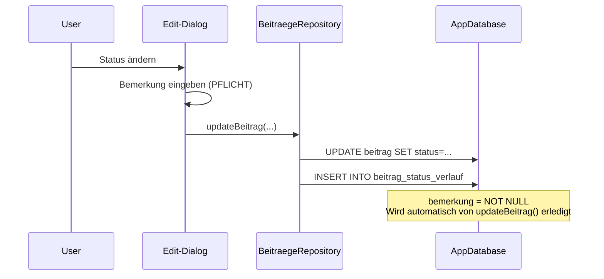
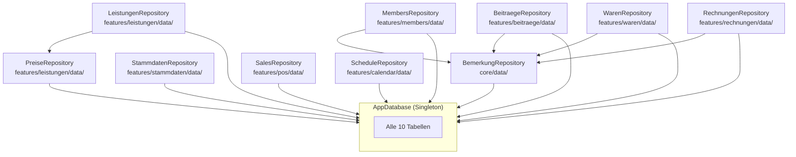

# ClupData – Architektur-Analyse

> Erstellt: 2026-04-27 | **Aktualisiert**: 2026-06-11 | Mode: Flutter Architect

## 1. Projektüberblick

**ClupData** ist eine Flutter Desktop-Anwendung (Windows/Linux/macOS) für die Verwaltung eines Boxclubs. Sie verwaltet Mitglieder, Beiträge/Rechnungen, Leistungen (Mitgliedschaften), Waren (Artikelverkauf) und POS-Transaktionen.

| Eigenschaft | Wert |
|---|---|
| Framework | Flutter Desktop |
| Dart SDK | ^3.11.0 |
| State Management | Riverpod (hooks_riverpod ^3.3.1) mit Code-Generation |
| Datenbank | Drift (^2.31.0) / SQLite |
| Routing | go_router (^17.1.0) mit StatefulShellRoute |
| Data Grid | Pluto Grid (^8.0.0) + eigenes VpitDataGrid |
| Architektur | Feature-basierte Clean Architecture |
| SSOT | [`structur.md`](lib/assets/data/structur.md) |
| Schema-Version | 17 ([`database.dart:46`](lib/core/database/database.dart:46)) |

---

## 2. Hocharchitektur



---

## 3. Datenbank-Schema (10 Tabellen)



### 3.1 Wichtige Schema-Regeln

| Regel | Details |
|---|---|
| **Drift-Klassennamen** | Deutsch Plural (`Mitglieds`, `Beitraege`, `Rechnungen`, `RechnungPositionen`) |
| **SQLite-Tabellennamen** | Singular via `tableName`-Override (`mitglied`, `beitrag`, `rechnung`, `rechnung_position`) |
| **FK Cascade** | `beitrag_status_verlauf`→`beitrag` = CASCADE; `rechnung_position`→`rechnung` = CASCADE |
| **FK Restrict** | `beitrag.mitglied_id`→`mitglied` = RESTRICT; `beitrag.leistung_id`→`leistung` = RESTRICT |
| **FK Set Null** | Alle `bemerkung_id`-FKs = SET NULL; `rechnung.mitglied_id` = SET NULL |
| **Computed Fields** | `nettopreis` (aus bruttopreis + MwSt), `alter` (aus geboren) – NICHT gespeichert |
| **Rechnungsnummer-Formate** | Beiträge: `RE-YYYY-XXXXX`; Waren: `R-YYYY-XXXXX` |
| **Status-Versionierung** | `beitrag.status` = aktueller Stand; `beitrag_status_verlauf` = unveränderliche Historie |
| **WAL Mode** | Aktiv; `db.checkpoint()` vor Backups erforderlich |

### 3.2 Indizes (32 definiert)

Hauptindizes für performante Abfragen auf:
- **mitglied**: name+vorname, plz+ort, leistung_id, vertrag_laufzeit_von/bis, geboren
- **beitrag**: rechnungsnummer (UNIQUE), mitglied_id, status
- **rechnung**: rechnungsnummer (UNIQUE), mitglied_id, status, datum
- **waren**: bezeichnung, kategorie, aktiv
- **leistung**: name, preis_id
- **stammdaten**: schluessel (UNIQUE), kategorie
- **bemerkung**: datum_erstellt
- **rechnung_position**: rechnung_id, waren_id
- **UUID-Indizes** (je UNIQUE pro Tabelle für CSV-Import-Lookup): bemerkung, stammdaten, preis, leistung, mitglied, waren, beitrag, beitrag_status_verlauf, rechnung, rechnung_position

---

## 4. Feature-Module – Strukturübersicht

Jedes Feature-Modul folgt der Clean-Architecture-Gliederung:

```
lib/features/<feature>/
├── <feature>_screen.dart          # Hauptscreen
├── data/                          # Data Layer
│   └── <feature>_repository.dart  # Repository (Drift-Zugriff)
├── domain/models/                 # Domain Layer
│   └── <entity>_row_data.dart     # Row-Data für DataGrid
│   └── <entity>_detail.dart       # Detail-Model für Edit-Dialog
├── presentation/                  # Presentation Layer
│   ├── providers/                 # Riverpod Provider
│   │   └── <feature>_list_provider.dart
│   └── dialogs/                   # Edit/New Dialogs
├── services/                      # Business Services
└── widgets/                       # Feature-spezifische Widgets
```

### 4.1 Implementierte Features

| Feature | Pfad | Repository | DataGrid | Edit-Dialog | Besonderheiten |
|---|---|---|---|---|---|
| **Members** | `features/members/` | ✅ | ✅ | ✅ | `selectedMemberIdProvider` (keepAlive), Bemerkung |
| **Beiträge** | `features/beitraege/` | ✅ | ✅ | ✅ | Status-Historie, Rechnungslegung-Service, Statusfarben |
| **Leistungen** | `features/leistungen/` | ✅ | ✅ | ✅ | Preis-Berechnung (Netto aus Brutto) |
| **Waren** | `features/waren/` | ✅ | ✅ | ✅ | Bestandsverwaltung, MwSt-Berechnung |
| **Rechnungen** | `features/rechnungen/` | ✅ | ✅ | ✅ | Positionen (CASCADE), Statusfarben |
| **Rechnungserstellung** | `features/rechnungserstellung/` | – | – | ✅ | Batch-Rechnungserstellung (Beiträge + Verkauf) |
| **Stammdaten** | `features/stammdaten/` | ✅ | ✅ | ✅ | Key/Value-Store, kategorisiert |
| **POS** | `features/pos/` | ✅ | – | – | Sales Repository |
| **Export** | `features/export/` | – | – | – | Batch-Export, PDF-Templates, Summary-Generators, DetailExportProvider |
| **Dashboard** | `features/dashboard/` | – | – | – | Nur Screen |
| **Calendar** | `features/calendar/` | ✅ | – | – | Schedule Repository |
| **Documentation** | `features/documentation/` | – | – | – | Nur Screen |

---

## 5. Core-Architektur

### 5.1 Datenbank-Layer



**Wichtige Designentscheidungen:**
- [`BemerkungRepository`](lib/core/data/bemerkung_repository.dart) ist **zentral** in `core/data/`, nicht pro Feature – alle Features delegieren Bemerkung-Operationen dorthin
- [`appDatabaseProvider`](lib/core/providers/database_provider.dart:12) ist `@Riverpod(keepAlive: true)` – Singleton über die gesamte App-Lebensdauer
- Migrationen sind **inkrementell** (v5→v17), niemals Tabellen in Produktion löschen ohne Datenmigration
- `PRAGMA foreign_keys = ON` wird in `beforeOpen` enforced
- Dev-DB: `clup_data_dev.sqlite` (Projekt-Root), Prod-DB: `clup_data.sqlite` (neben Executable)

### 5.2 Routing



- [`AppShell`](lib/common_widgets/app_shell.dart:16) wrappt alle Branches mit `NavigationRail` + `MenuBar`
- `StatefulShellRoute.indexedStack` erhält den Zustand aller Branches
- `/documentation` liegt **außerhalb** der Shell (keine NavigationRail)

### 5.3 Shared Widgets (`lib/common_widgets/`)

| Widget | Zweck |
|---|---|
| [`AppShell`](lib/common_widgets/app_shell.dart) | Haupt-Layout mit NavigationRail + MenuBar |
| [`MainMenuBar`](lib/common_widgets/main_menu_bar.dart) | Desktop-Menüleiste |
| [`FeatureScreenScaffold`](lib/common_widgets/feature_screen_scaffold.dart) | Standard-Scaffold für Feature-Screens |
| [`AppEditDialogScaffold`](lib/common_widgets/app_edit_dialog_scaffold.dart) | Basis-Layout für Edit-Dialoge |
| [`AppDialogDeleteAction`](lib/common_widgets/app_dialog_delete_action.dart) | Löschen-Bestätigungsaktion |
| [`BemerkungDetailView`](lib/common_widgets/bemerkung_detail_view.dart) | Bemerkung-Anzeige (wiederverwendet in allen Features) |
| [`AppSectionHeader`](lib/common_widgets/app_section_header.dart) | Bereichsüberschriften in Formularen |
| [`CsvExportDialog`](lib/common_widgets/csv_export_dialog.dart) | CSV-Export-Dialog |
| [`CsvImportDialog`](lib/common_widgets/csv_import_dialog.dart) | CSV-Import-Dialog |
| [`DatabaseBackupDialog`](lib/common_widgets/database_backup_dialog.dart) | Backup-Dialog |

### 5.4 Form Widgets (`lib/common_widgets/forms/`)

| Widget | Zweck |
|---|---|
| [`AppTextField`](lib/common_widgets/forms/app_text_field.dart) | Standard-Textfeld |
| [`AppDatePickerField`](lib/common_widgets/forms/app_date_picker_field.dart) | Datumsauswahl |
| [`AppDropdownField`](lib/common_widgets/forms/app_dropdown_field.dart) | Dropdown-Auswahl |
| [`AppSelectField`](lib/common_widgets/forms/app_select_field.dart) | Select-Auswahl |
| [`AppEntityAutocomplete`](lib/common_widgets/forms/app_entity_autocomplete.dart) | Autovervollständigung für Entities |

### 5.5 Data Grid System (`lib/widgets/data_grid_v2/`)

Das Projekt verwendet ein eigenes DataGrid-System basierend auf Pluto Grid:

| Komponente | Zweck |
|---|---|
| [`VpitDataGrid`](lib/widgets/data_grid_v2/vpit_data_grid.dart) | Haupt-DataGrid-Widget |
| [`DataGridColumnConfig`](lib/widgets/data_grid_v2/data_grid_column_config.dart) | Spaltenkonfiguration |
| [`DataGridController`](lib/widgets/data_grid_v2/data_grid_controller.dart) | Controller für DataGrid |
| [`SortSettingsDialog`](lib/widgets/data_grid_v2/sort_settings_dialog.dart) | Sortier-Einstellungen |
| [`FilterSettingsDialog`](lib/widgets/data_grid_v2/filter_settings_dialog.dart) | Filter-Einstellungen |
| [`CsvExporter`](lib/widgets/data_grid_v2/export/csv_exporter.dart) | CSV-Export (UTF-8 mit BOM) |
| [`PdfExport`](lib/widgets/data_grid_v2/export/pdf/pdf_export.dart) | PDF-Export |
| [`PdfTemplateRegistry`](lib/widgets/data_grid_v2/export/pdf/pdf_template_registry.dart) | Template-Registry für PDF |

**Export-Architektur-Split:**
- Feature-spezifisch: `lib/features/export/` (Batch-Export, Summary-Generators)
- Generisch wiederverwendbar: `lib/widgets/data_grid_v2/export/` (PDF/CSV-Infrastruktur)

---

## 6. Status-Farben (VERBINDLICH)

### 6.1 Beitrag-Status

| Status | Farbe | Hex | Quelle |
|---|---|---|---|
| `kontiert` | Hellgelb | `#FFF9C4` | [`beitrag_status_colors.dart`](lib/features/beitraege/utils/beitrag_status_colors.dart) |
| `offen` | Hellorange | `#FFE0B2` | |
| `bezahlt` | Hellgrün | `#C8E6C9` | |
| `angemahnt` | Hellrot | `#FFCDD2` | |
| `storniert` | Hellgrau | `#EEEEEE` | |
| `inkasso` | Pink | `#F8BBD0` | |

### 6.2 Rechnung-Status

| Status | Farbe | Hex | Quelle |
|---|---|---|---|
| `offen` | Hellorange | `#FFE0B2` | [`rechnung_status_colors.dart`](lib/features/rechnungen/utils/rechnung_status_colors.dart) |
| `bezahlt` | Hellgrün | `#C8E6C9` | |
| `storniert` | Hellgrau | `#EEEEEE` | |

**Regel:** NIEMALS Hex-Werte hardcoden – immer aus den zentralen Color-Utilities beziehen.

---

## 7. Business-Logik – Besondere Regeln

### 7.1 Beitrag-Status-Versionierung



- [`updateBeitrag()`](lib/features/beitraege/data/beitraege_repository.dart:134) erkennt Status-Änderungen automatisch
- `_addStatusEintrag()` darf **niemals** direkt aufgerufen werden
- `bemerkung` ist Pflichtfeld (NOT NULL) bei jedem Status-Wechsel
- Verlaufseinträge sind READ-ONLY nach dem Einfügen

### 7.2 Rechnungsnummer-Generierung

| Typ | Format | Beispiel |
|---|---|---|
| Beitrag | `RE-YYYY-XXXXX` | RE-2026-00001 |
| Ware/Rechnung | `R-YYYY-XXXXX` | R-2026-00001 |

### 7.3 Nettopreis-Berechnung

```
nettopreis = bruttopreis / (1 + mwst_aktiv_schluessel / 100)
```

- MwSt-Satz wird aus `stammdaten.mwst_aktiv_schluessel` gelesen
- Wird zur Laufzeit berechnet, NICHT in der DB gespeichert
- Betrifft: `preis`, `waren`, `leistung` (indirekt über preis)

### 7.4 Vertragslaufzeit-Berechnung

```
vertrag_laufzeit_bis = vertrag_laufzeit_von + leistung.laufzeit
```

- `laufzeit`-Enum: einmalig, monatlich, quartalsweise, jaehrlich
- Kann vom Benutzer manuell überschrieben werden

---

## 8. Migrations-Historie (Schema v1→v17)

| Version | Änderung |
|---|---|
| v5 | Komplettes Schema-Redesign (alle Tabellen neu erstellt) |
| v6 | `waren`-Tabelle hinzugefügt |
| v7 | `mitglied.geschlecht` hinzugefügt |
| v8 | `mitglied.preis_id` hinzugefügt |
| v9 | `stammdaten.typ` Migration: 'number' → 'float'/'integer' |
| v10 | `stammdaten.system_pflicht` hinzugefügt |
| v11 | `beitraege`-Tabelle hinzugefügt |
| v12 | `beitrag_status_verlauf`-Tabelle hinzugefügt |
| v13 | `beitrag_status_verlauf.bemerkung` NOT NULL (Tabelle neu erstellt) |
| v14 | `rechnungen` + `rechnung_positionen` Tabellen hinzugefügt |
| v15 | `beitraege.abrechnungs_zeitraum` hinzugefügt |
| v16 | Tabellennamen: Plural → Singular (mitglied, beitrag, rechnung, rechnung_position) |
| v17 | UUID-Spalten für alle 10 Tabellen (CSV-Export/Import-Unterstützung) |

---

## 9. Abhängigkeitsgraph der Feature-Repositories



---

## 10. Identifizierte Architektur-Beobachtungen

### 10.1 Konsistenz mit structur.md

| Aspekt | Status | Bemerkung |
|---|---|---|
| Tabellen-Schema | ✅ Konsistent | Alle 10 Tabellen aus structur.md sind in Drift implementiert |
| FK-Regeln | ✅ Konsistent | RESTRICT/SET NULL/CASCADE wie spezifiziert |
| Indizes | ⚠️ Teilweise | Indizes sind in structur.md definiert, aber nicht als Drift-`@TableIndex` annotiert – werden vermutlich zentral verwaltet |
| UI-Screens | ✅ Konsistent | Alle Screens aus structur.md sind als Routes registriert |
| Statusfarben | ✅ Konsistent | Zentrale Color-Utilities vorhanden |

### 10.2 Architektur-Stärken

1. **SSOT-Disziplin**: [`structur.md`](lib/assets/data/structur.md) ist umfassend und wird als verbindliche Quelle behandelt
2. **Zentrales Bemerkung-Management**: [`BemerkungRepository`](lib/core/data/bemerkung_repository.dart) vermeidet Duplikation
3. **Feature-First-Struktur**: Klare Trennung der Domänen
4. **Status-Versionierung**: Audit-Trail für Beitrag-Statusänderungen
5. **Konsistente Form-Widgets**: Wiederverwendbare Widgets in `common_widgets/forms/`
6. **Export-Architektur-Split**: Generische Infrastruktur vs. Feature-spezifische Logik

### 10.3 Potenzielle Verbesserungsbereiche

1. **Indizes**: Drift-`@TableIndex`-Annotationen fehlen in den Table-Definitionen – sollten ergänzt werden für Type-Safety
2. **Feature `master_data`**: Existiert parallel zu `stammdaten` – mögliche Redundanz (master_data hat nur presentation-Layer, keine data/domain)
3. **POS-Feature**: Nur Screen + Repository, keine Domain-Models oder Edit-Dialoge – möglicherweise noch unvollständig
4. **Calendar-Feature**: Nur Screen + Repository – scheint rudimentär
5. **Rechnungserstellung (Verkauf)**: `VerkaufBatchService` noch nicht implementiert (nur Beiträge-Batch vorhanden)
6. **PDF-Export**: `BatchPdfExporter` existiert noch parallel zu `BatchExportService` – Konsolidierung ausstehend (siehe `plans/pdf_print_refactoring.md` Schritt 2)

---

## 11. Technologie-Stack Zusammenfassung

```
┌─────────────────────────────────────────────┐
│                  Flutter Desktop             │
│            (Windows / Linux / macOS)         │
├─────────────────────────────────────────────┤
│  UI: Material 3 + Pluto Grid + gap          │
│  State: Riverpod + hooks_riverpod           │
│  Routing: go_router (StatefulShellRoute)    │
│  Forms: AppTextField, AppDatePickerField... │
├─────────────────────────────────────────────┤
│  Domain: Feature-Models + Business Logic    │
│  Data: Repositories + Services              │
├─────────────────────────────────────────────┤
│  Database: Drift (SQLite) + WAL Mode        │
│  Export: PDF (Templates) + CSV (UTF-8 BOM)  │
│  Backup: DatabaseBackupService              │
└─────────────────────────────────────────────┘
```
