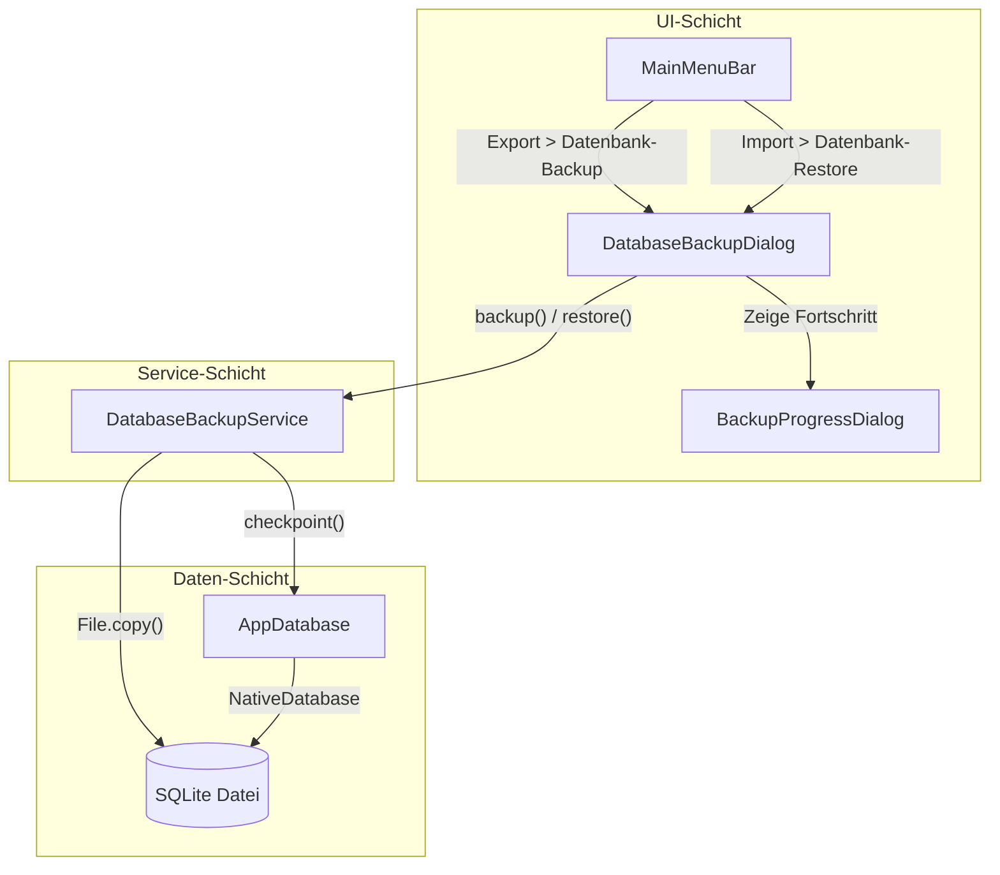

# Backup-Dokumentation

## 1. Überblick

Die Backup-Funktion ermöglicht das vollständige Sichern und Wiederherstellen der SQLite-Datenbank der Anwendung. Über das Menü **Datenübertragung** können Benutzer ein Backup der aktuellen Datenbank erstellen oder eine zuvor gesicherte Datenbank wiederherstellen.

Die Funktionalität ist in folgende Komponenten aufgeteilt:

- **[DatabaseBackupService](lib/core/data/database_backup_service.dart)** — Enthält die reine Backup/Restore-Logik
- **[DatabaseBackupDialog](lib/common_widgets/database_backup_dialog.dart)** — UI für Backup- und Restore-Dialoge
- **[MainMenuBar](lib/common_widgets/main_menu_bar.dart)** — Menüintegration
- **[AppDatabase](lib/core/database/database.dart)** — Datenbankverbindung mit WAL-Checkpoint-Unterstützung

---

## 2. Architektur



### Komponentenbeschreibung

| Komponente | Datei | Verantwortung |
|------------|-------|---------------|
| `DatabaseBackupService` | [lib/core/data/database_backup_service.dart](lib/core/data/database_backup_service.dart) | Reine Business-Logik für Backup/Restore, Dateivalidierung, Rollback |
| `DatabaseBackupDialog` | [lib/common_widgets/database_backup_dialog.dart](lib/common_widgets/database_backup_dialog.dart) | UI-Dialoge für Backup-Speicherort, Restore-Dateiauswahl, Bestätigungsdialog und Fortschrittsanzeige |
| `MainMenuBar` | [lib/common_widgets/main_menu_bar.dart](lib/common_widgets/main_menu_bar.dart) | Integration der Menüpunkte unter `Datenübertragung > Export/Import` |
| `AppDatabase` | [lib/core/database/database.dart](lib/core/database/database.dart) | Drift-Datenbank mit [`checkpoint()`](lib/core/database/database.dart:49) Methode und Pfad-Auflösung |

---

## 3. Backup-Funktion

### Ablauf

1. **Dateiname generieren** — [`DatabaseBackupService.defaultBackupFileName()`](lib/core/data/database_backup_service.dart:74) erzeugt einen zeitstempelbasierten Namen.
2. **Speicherort wählen** — Der Benutzer wählt über `FilePicker.platform.saveFile()` das Zielverzeichnis.
3. **WAL-Checkpoint** — [`AppDatabase.checkpoint()`](lib/core/database/database.dart:49) führt `PRAGMA wal_checkpoint(TRUNCATE)` aus. Dadurch werden alle ausstehenden WAL-Einträge in die Hauptdatei geschrieben und die WAL-Datei geleert.
4. **Datei kopieren** — [`DatabaseBackupService.backup()`](lib/core/data/database_backup_service.dart:21) kopiert die SQLite-Datei an den gewählten Zielort.
5. **Erfolgsmeldung** — Eine Snackbar bestätigt das erfolgreiche Backup.

### Standard-Dateiname

```
clup_data_backup_YYYY-MM-DD_HH-MM.sqlite
```

Beispiel: `clup_data_backup_2026-04-22_09-30.sqlite`

### Dateiformat

Das Backup ist eine vollständige SQLite-Datenbankdatei (`.sqlite`). Sie kann mit jedem SQLite-kompatiblen Tool geöffnet und analysiert werden.

---

## 4. Restore-Funktion

### Ablauf

1. **Bestätigungsdialog** — Der Benutzer muss explizit bestätigen, dass die aktuelle Datenbank überschrieben werden soll.
2. **Datei auswählen** — Über `FilePicker.platform.pickFiles()` wird die Backup-Datei ausgewählt.
3. **Validierung** — [`DatabaseBackupService.isValidSqliteFile()`](lib/core/data/database_backup_service.dart:86) prüft den Datei-Header auf die Magische Zeichenfolge `SQLite format 3`.
4. **Sicherheitskopie erstellen** — Die aktuelle Datenbank wird als `.bak` gesichert.
5. **DB-Verbindung schließen** — [`AppDatabase.close()`](lib/core/database/database.dart) wird aufgerufen, gefolgt von einer kurzen Verzögerung (500 ms), um sicherzustellen, dass die Datei freigegeben ist.
6. **Datei ersetzen** — Die Backup-Datei wird auf den aktuellen Datenbankpfad kopiert.
7. **Provider invalidieren** — [`ref.invalidate(appDatabaseProvider)`](lib/core/providers/database_provider.dart) sorgt dafür, dass die Datenbank beim nächsten Zugriff neu geöffnet wird und alle abhängigen Provider ihre Daten neu laden.
8. **Erfolgsmeldung** — Snackbar zeigt den erfolgreichen Abschluss an.

### Validierung der SQLite-Datei

Die Methode [`isValidSqliteFile()`](lib/core/data/database_backup_service.dart:86) liest die ersten 16 Bytes der Datei und vergleicht sie mit dem SQLite-Header:

```dart
// SQLite-Header beginnt mit "SQLite format 3\000"
const sqliteHeader = [83, 81, 76, 105, 116, 101, 32, 102, 111, 114, 109, 97, 116, 32, 51, 0];
```

Wenn der Header nicht übereinstimmt, wird der Restore abgebrochen und eine Fehlermeldung angezeigt.

### Rollback-Mechanismus bei Fehlern

Falls beim Kopieren der Backup-Datei ein Fehler auftritt, wird automatisch die zuvor erstellte `.bak`-Datei zurück auf den Originalpfad kopiert. Die temporäre `.bak`-Datei wird anschließend in jedem Fall gelöscht.

```dart
// Ablauf im Fehlerfall:
// 1. .bak existiert → wird auf Originalpfad zurückkopiert
// 2. Fehler wird erneut geworfen (rethrow)
// 3. finally-Block löscht die .bak-Datei
```

---

## 5. Bedienung

### Backup erstellen

**Menüpfad:** `Datenübertragung → Export → Datenbank-Backup`

1. Menüpunkt anklicken
2. Im Dateidialog den Speicherort wählen und speichern
3. Warten bis die Fortschrittsanzeige verschwindet
4. Erfolgsmeldung erscheint

### Restore durchführen

**Menüpfad:** `Datenübertragung → Import → Datenbank-Restore`

1. Menüpunkt anklicken
2. **Bestätigungsdialog** lesen und mit "Wiederherstellen" bestätigen
3. Backup-Datei (`.sqlite`) im Dateidialog auswählen
4. Warten bis die Fortschrittsanzeige verschwindet
5. Erfolgsmeldung erscheint

> ⚠️ **Hinweis:** Der Bestätigungsdialog beim Restore warnt den Benutzer, dass alle aktuellen Daten verloren gehen. Dies ist eine bewusste Sicherheitsmaßnahme.

---

## 6. Technische Details

### Datenbank-Pfade

| Umgebung | Dateiname | Pfad |
|----------|-----------|------|
| Development | `clup_data_dev.sqlite` | Projekt-Root (kDebugMode) |
| Production | `clup_data.sqlite` | Verzeichnis der Executable |

Aufgelöst durch [`_resolveDbPath()`](lib/core/database/database.dart:131):

```dart
String _resolveDbPath() {
  if (kDebugMode) {
    return 'clup_data_dev.sqlite';
  }
  final executableDir = File(Platform.resolvedExecutable).parent;
  return p.join(executableDir.path, 'clup_data.sqlite');
}
```

### WAL-Modus

Die Datenbank läuft im WAL-Modus (Write-Ahead Logging). Vor jedem Backup wird ein Checkpoint ausgeführt:

```sql
PRAGMA wal_checkpoint(TRUNCATE);
```

Das stellt sicher, dass:
- Alle ausstehenden Transaktionen in die Hauptdatei geschrieben werden
- Die `-wal` und `-shm` Dateien geleert werden
- Die Backup-Datei vollständig und konsistent ist

### Automatische Provider-Invalidierung nach Restore

Nach einem erfolgreichen oder fehlgeschlagenen Restore wird [`ref.invalidate(appDatabaseProvider)`](lib/core/providers/database_provider.dart) aufgerufen. Dies bewirkt:

- Die alte `AppDatabase`-Instanz wird disposed
- Beim nächsten Zugriff wird eine neue Verbindung zur (wiederhergestellten) Datei geöffnet
- Alle abhängigen Riverpod-Provider laden ihre Daten automatisch neu

---

## 7. Fehlerbehandlung

### Ungültige SQLite-Datei erkannt

Wird beim Restore eine Datei ausgewählt, die kein gültiger SQLite-Header hat, bricht der Vorgang ab:

- Es erscheint eine **Snackbar** mit der Meldung: *"Ungültige SQLite-Datenbankdatei"*
- Die aktuelle Datenbank bleibt unverändert

### Fehler beim Backup/Restore

Tritt während des Backup- oder Restore-Vorgangs ein Fehler auf:

- Die Fortschrittsanzeige wird geschlossen
- Eine **Snackbar** zeigt die Fehlermeldung an: *"Fehler beim Backup: …"* bzw. *"Fehler bei der Wiederherstellung: …"*
- Im Fehlerfall beim Restore wird zusätzlich der `appDatabaseProvider` invalidiert, um einen sauberen Zustand sicherzustellen

### Automatisches Backup der aktuellen DB vor Restore

Vor jedem Restore wird die aktuelle Datenbank automatisch als `.bak` gesichert:

```
clup_data_dev.sqlite.bak   (Development)
clup_data.sqlite.bak       (Production)
```

Diese Sicherheitskopie wird:
- **Bei Fehler:** Zurück auf den Originalpfad kopiert (Rollback)
- **Bei Erfolg:** Im `finally`-Block gelöscht

---

## 8. Sicherheitshinweise

| Hinweis | Beschreibung |
|---------|--------------|
| **Datenverlust** | Ein Restore überschreibt **alle** aktuellen Daten in der Datenbank unwiderruflich. |
| **Sicherheitskopie** | Vor jedem Restore wird automatisch eine `.bak`-Datei der aktuellen Datenbank erstellt. |
| **Bestätigung** | Der Restore erfordert eine explizite Bestätigung durch den Benutzer. |
| **Keine destruktiven Operationen** | Es gibt keine automatischen Löschvorgänge ohne vorherige Sicherung oder Bestätigung. |

---

## Zusammenfassung der beteiligten Dateien

- [lib/core/data/database_backup_service.dart](lib/core/data/database_backup_service.dart)
- [lib/common_widgets/database_backup_dialog.dart](lib/common_widgets/database_backup_dialog.dart)
- [lib/common_widgets/main_menu_bar.dart](lib/common_widgets/main_menu_bar.dart)
- [lib/core/database/database.dart](lib/core/database/database.dart)
- [lib/core/providers/database_provider.dart](lib/core/providers/database_provider.dart)
