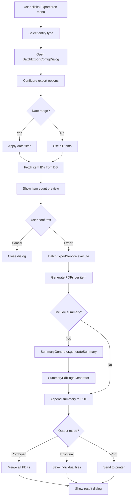

# Batch Export Feature Plan - ClupData

**Created:** 2026-04-07
**Status:** Draft for Review
**Goal:** Implement batch export functionality with menu entries, configuration dialog, and summary page

---

## Executive Summary

This plan describes the implementation of a batch export feature for the ClupData application. Users will be able to export multiple records as individual PDF detail views or print them, with configurable options like date range filtering. A summary page will be generated showing aggregated information about the exported data.

---

## Current Architecture Analysis

### Existing Components

```
┌─────────────────────────────────────────────────────────────────┐
│                         UI Layer                                 │
├─────────────────────────────────────────────────────────────────┤
│ MainMenuBar                                                      │
│  ├─ Datei (File)                                                 │
│  ├─ Erstellen (Create)                                           │
│  └─ Hilfe (Help)                                                 │
│                                                                   │
│ ListExportMenuButton (per-grid export)                           │
│  └─ PDF/Print/CSV export for current view                        │
└─────────────────────────────────────────────────────────────────┘
                              ↓
┌─────────────────────────────────────────────────────────────────┐
│                    Export Infrastructure                          │
├─────────────────────────────────────────────────────────────────┤
│ ExportDataRepository                                             │
│  ├─ fetchDataForExport(entityType, metaState)                    │
│  ├─ fetchSingleItemForExport(entityType, itemId, metaState)      │
│  └─ fetchItemIdsForExport(entityType, metaState)                 │
│                                                                   │
│ BatchPdfExporter                                                 │
│  └─ executeBatchExport(config, onProgress) → BatchExportResult   │
│                                                                   │
│ BatchExportConfig                                                │
│  ├─ entityType, itemIds, metaState                               │
│  ├─ templateKey, outputDirectory, filenamePattern                │
│  └─ combineIntoSinglePdf                                         │
│                                                                   │
│ PdfTemplateRegistry                                              │
│  └─ getSuitableFor(isDetailView, entityType) → List<Template>    │
└─────────────────────────────────────────────────────────────────┘
```

### Exportable Entity Types

| Entity Type | Table | Detail Fields | Summary Data |
|-------------|-------|---------------|--------------|
| **Mitglied** | Mitglieds | name, vorname, anrede, plz, ort, strasse, hausnummer, telefon1, telefon2, email, geboren, geschlecht, leistungId, vertragKontierung, vertragLaufzeitVon, vertragLaufzeitBis, preisId, bemerkungId | Count, by gender, by location |
| **Rechnung** | Rechnungen | rechnungsnummer, mitgliedId, kundeName, status, datum, faelligAm, bezahltAm, betragNetto, betragBrutto, betragMwst, bemerkungId | Total amount, by status, date range |
| **Beitrag** | Beitraege | mitgliedId, leistungId, preisId, rechnungsnummer, status, kontiertAm, abrechnungsZeitraum, statusDatum, bemerkungId | Total amount, by status, period |
| **Leistung** | Leistung | name, beschreibung, preis, kategorie | Count, by category, total value |
| **Ware** | Waren | bezeichnung, kategorie, preis, bestand, mindestBestand | Count, by category, total inventory value |

---

## Design

### 1. Menu Structure

Add a new "Exportieren" menu to the [`MainMenuBar`](clupdata/lib/common_widgets/main_menu_bar.dart:10):

```
┌─────────────────────────────────────────────────────────────────┐
│ Datei  Erstellen  Exportieren  Hilfe                             │
└─────────────────────────────────────────────────────────────────┘
                              ↓
┌─────────────────────────────────────────────────────────────────┐
│ Exportieren                                                      │
├─────────────────────────────────────────────────────────────────┤
│ ├─ Mitglieder exportieren...                                     │
│ ├─ Rechnungen exportieren...                                     │
│ ├─ Beiträge exportieren...                                       │
│ ├─ Leistungen exportieren...                                     │
│ └─ Waren exportieren...                                          │
└─────────────────────────────────────────────────────────────────┘
```

### 2. Batch Export Configuration Dialog

When a menu item is selected, open a configuration dialog:

```
┌─────────────────────────────────────────────────────────────────┐
│  📄 Batch-Export: [Entity Type]                                  │
├─────────────────────────────────────────────────────────────────┤
│                                                                  │
│  ┌─ Datensätze ──────────────────────────────────────────────┐  │
│  │ ○ Alle Datensätze exportieren                              │  │
│  │ ○ Ausgewählte Datensätze exportieren (basierend auf Filter)│  │
│  └────────────────────────────────────────────────────────────┘  │
│                                                                  │
│  ┌─ Zeitraum (optional) ─────────────────────────────────────┐  │
│  │ Von: [DatePicker]    Bis: [DatePicker]                     │  │
│  │ ☑ Zeitraum anwenden                                        │  │
│  └────────────────────────────────────────────────────────────┘  │
│                                                                  │
│  ┌─ Ausgabe ─────────────────────────────────────────────────┐  │
│  │ ○ Einzelne PDF-Dateien pro Datensatz                       │  │
│  │ ○ Alle in einer PDF-Datei kombinieren                      │  │
│  │ Ausgabe-Verzeichnis: [Browse...]                           │  │
│  └────────────────────────────────────────────────────────────┘  │
│                                                                  │
│  ┌─ Zusammenfassung ─────────────────────────────────────────┐  │
│  │ ☑ Zusammenfassungs-Seite am Ende einfügen                  │  │
│  └────────────────────────────────────────────────────────────┘  │
│                                                                  │
├─────────────────────────────────────────────────────────────────┤
│  [Abbrechen]                    [Vorschau]    [Exportieren ▶]    │
└─────────────────────────────────────────────────────────────────┘
```

### 3. Summary Page Design

The summary page is appended to the combined PDF or shown after export:

#### Mitglieder Summary
```
┌─────────────────────────────────────────────────────────────────┐
│  ZUSAMMENFASSUNG - Mitglieder                                    │
├─────────────────────────────────────────────────────────────────┤
│  Exportiert am: 07.04.2026 13:45                                 │
│  Anzahl exportierter Datensätze: 150                             │
│                                                                  │
│  ┌─ Verteilung nach Geschlecht ──────────────────────────────┐  │
│  │ Männlich: 75 (50.0%)                                       │  │
│  │ Weiblich: 70 (46.7%)                                       │  │
│  │ Divers: 5 (3.3%)                                           │  │
│  └────────────────────────────────────────────────────────────┘  │
│                                                                  │
│  ┌─ Verteilung nach Ort ─────────────────────────────────────┐  │
│  │ Berlin: 45                                                 │  │
│  │ München: 30                                                │  │
│  │ Hamburg: 25                                                │  │
│  │ ...                                                        │  │
│  └────────────────────────────────────────────────────────────┘  │
└─────────────────────────────────────────────────────────────────┘
```

#### Rechnungen Summary
```
┌─────────────────────────────────────────────────────────────────┐
│  ZUSAMMENFASSUNG - Rechnungen                                    │
├─────────────────────────────────────────────────────────────────┤
│  Exportiert am: 07.04.2026 13:45                                 │
│  Zeitraum: 01.01.2026 - 31.03.2026                               │
│  Anzahl exportierter Rechnungen: 85                              │
│                                                                  │
│  ┌─ Beträge ─────────────────────────────────────────────────┐  │
│  │ Gesamt netto: 12.500,00 €                                   │  │
│  │ Gesamt MwSt: 2.375,00 €                                     │  │
│  │ Gesamt brutto: 14.875,00 €                                  │  │
│  └────────────────────────────────────────────────────────────┘  │
│                                                                  │
│  ┌─ Status ──────────────────────────────────────────────────┐  │
│  │ Offen: 25 (2.500,00 €)                                     │  │
│  │ Bezahlt: 55 (11.000,00 €)                                  │  │
│  │ Storniert: 5 (1.375,00 €)                                  │  │
│  └────────────────────────────────────────────────────────────┘  │
└─────────────────────────────────────────────────────────────────┘
```

#### Beiträge Summary
```
┌─────────────────────────────────────────────────────────────────┐
│  ZUSAMMENFASSUNG - Beiträge                                      │
├─────────────────────────────────────────────────────────────────┤
│  Exportiert am: 07.04.2026 13:45                                 │
│  Zeitraum: 01.01.2026 - 31.03.2026                               │
│  Anzahl exportierter Beiträge: 120                               │
│                                                                  │
│  ┌─ Status ──────────────────────────────────────────────────┐  │
│  │ Kontiert: 30                                                │  │
│  │ Offen: 40                                                   │  │
│  │ Bezahlt: 45                                                 │  │
│  │ Angemahnt: 3                                                │  │
│  │ Storniert: 2                                                │  │
│  └────────────────────────────────────────────────────────────┘  │
│                                                                  │
│  ┌─ Abrechnungszeiträume ────────────────────────────────────┐  │
│  │ Januar 2026: 40                                             │  │
│  │ Februar 2026: 40                                            │  │
│  │ März 2026: 40                                               │  │
│  └────────────────────────────────────────────────────────────┘  │
└─────────────────────────────────────────────────────────────────┘
```

#### Leistungen Summary
```
┌─────────────────────────────────────────────────────────────────┐
│  ZUSAMMENFASSUNG - Leistungen                                    │
├─────────────────────────────────────────────────────────────────┤
│  Exportiert am: 07.04.2026 13:45                                 │
│  Anzahl exportierter Leistungen: 25                              │
│                                                                  │
│  ┌─ Kategorien ──────────────────────────────────────────────┐  │
│  │ Kategorie A: 10                                             │  │
│  │ Kategorie B: 8                                              │  │
│  │ Kategorie C: 7                                              │  │
│  └────────────────────────────────────────────────────────────┘  │
│                                                                  │
│  Gesamtwert aller Leistungen: 5.000,00 €                         │
└─────────────────────────────────────────────────────────────────┘
```

#### Waren Summary
```
┌─────────────────────────────────────────────────────────────────┐
│  ZUSAMMENFASSUNG - Waren                                         │
├─────────────────────────────────────────────────────────────────┤
│  Exportiert am: 07.04.2026 13:45                                 │
│  Anzahl exportierter Waren: 50                                   │
│                                                                  │
│  ┌─ Kategorien ──────────────────────────────────────────────┐  │
│  │ Kategorie A: 20 (Gesamtwert: 2.000,00 €)                   │  │
│  │ Kategorie B: 15 (Gesamtwert: 1.500,00 €)                   │  │
│  │ Kategorie C: 15 (Gesamtwert: 750,00 €)                     │  │
│  └────────────────────────────────────────────────────────────┘  │
│                                                                  │
│  Gesamtinventarwert: 4.250,00 €                                  │
│  Artikel unter Mindestbestand: 5                                 │
└─────────────────────────────────────────────────────────────────┘
```

---

## Implementation Plan

### Phase 1: Extend Data Models

#### 1.1 Extend [`BatchExportConfig`](clupdata/lib/features/export/domain/batch_export_config.dart:4)

Add new fields for date range filtering and summary options:

```dart
class BatchExportConfig {
  // Existing fields...
  
  /// Optional date range filter (from)
  final DateTime? dateFrom;
  
  /// Optional date range filter (to)
  final DateTime? dateTo;
  
  /// Whether to include a summary page
  final bool includeSummary;
  
  /// Output mode: individual files or combined
  final BatchExportOutputMode outputMode;
  
  /// Print directly instead of saving to file
  final bool printDirectly;
}

enum BatchExportOutputMode {
  individualFiles,
  combinedPdf,
  printDirect,
}
```

#### 1.2 Create `BatchExportSummary` Model

New file: `clupdata/lib/features/export/domain/batch_export_summary.dart`

```dart
class BatchExportSummary {
  final String entityType;
  final DateTime exportedAt;
  final int totalCount;
  final DateTime? dateFrom;
  final DateTime? dateTo;
  final Map<String, dynamic> aggregatedData;
  
  // Entity-specific summary data
  final List<SummarySection> sections;
}

class SummarySection {
  final String title;
  final List<SummaryRow> rows;
  final SummarySectionType type; // table, chart, text
}

class SummaryRow {
  final String label;
  final String value;
  final double? percentage;
  final double? amount; // For monetary values
}
```

### Phase 2: Create Summary Generators

#### 2.1 Create `SummaryGenerator` Interface

New file: `clupdata/lib/features/export/services/summary_generator.dart`

```dart
abstract class SummaryGenerator {
  String get entityType;
  
  Future<BatchExportSummary> generateSummary({
    required List<int> exportedItemIds,
    required DateTime? dateFrom,
    required DateTime? dateTo,
  });
}
```

#### 2.2 Implement Entity-Specific Generators

- `MitgliederSummaryGenerator`
- `RechnungenSummaryGenerator`
- `BeitraegeSummaryGenerator`
- `LeistungenSummaryGenerator`
- `WarenSummaryGenerator`

Each generator queries the database for aggregated data and builds the summary.

### Phase 3: Create Batch Export Configuration Dialog

#### 3.1 Create `BatchExportConfigDialog`

New file: `clupdata/lib/features/export/presentation/batch_export_config_dialog.dart`

The dialog will:
- Accept entity type as parameter
- Show date range pickers (optional)
- Allow selection of output mode
- Allow selection of output directory
- Toggle summary page inclusion
- Show preview of items to be exported
- Trigger export via `BatchExportService`

### Phase 4: Create Batch Export Service

#### 4.1 Create `BatchExportService`

New file: `clupdata/lib/features/export/services/batch_export_service.dart`

```dart
class BatchExportService {
  final ExportDataRepository _repository;
  final BatchPdfExporter _pdfExporter;
  final Map<String, SummaryGenerator> _summaryGenerators;
  
  Future<BatchExportResult> execute(BatchExportConfig config, {
    void Function(int current, int total)? onProgress,
  }) async {
    // 1. Fetch item IDs with optional date filter
    // 2. Generate individual PDFs or combined
    // 3. Generate summary if requested
    // 4. Combine if needed
    // 5. Return result
  }
  
  Future<void> printBatch(BatchExportConfig config) async {
    // Generate PDFs and send to printer
  }
}
```

### Phase 5: Extend ExportDataRepository

#### 5.1 Add Date Range Filtering

Extend [`ExportDataRepository`](clupdata/lib/core/data/export_data_repository.dart:12) with date range support:

```dart
Future<List<int>> fetchItemIdsForExport({
  required String entityType,
  required DataGridMetaState metaState,
  DateTime? dateFrom,
  DateTime? dateTo,
}) async {
  // Apply date range filter based on entity type
  // - Mitglied: vertragLaufzeitVon, vertragLaufzeitBis
  // - Rechnung: datum
  // - Beitrag: kontiertAm, abrechnungsZeitraum
  // - Leistung: (no date field, skip)
  // - Ware: (no date field, skip)
}
```

### Phase 6: Add Menu Entries

#### 6.1 Extend [`MainMenuBar`](clupdata/lib/common_widgets/main_menu_bar.dart:10)

Add new "Exportieren" menu with entries for each entity type.

### Phase 7: Create Summary PDF Page Generator

#### 7.1 Create `SummaryPdfPageGenerator`

New file: `clupdata/lib/features/export/services/summary_pdf_page_generator.dart`

Generates a PDF page with the summary data using the pdf package.

---

## File Structure

```
clupdata/lib/features/export/
├── domain/
│   ├── batch_export_config.dart          (extend)
│   ├── batch_export_summary.dart         (new)
│   └── export_config.dart                (existing)
├── services/
│   ├── batch_pdf_exporter.dart           (existing)
│   ├── batch_pdf_exporter_provider.dart  (existing)
│   ├── batch_export_service.dart         (new)
│   ├── summary_generator.dart            (new)
│   ├── summary_generators/
│   │   ├── mitglieder_summary_generator.dart  (new)
│   │   ├── rechnungen_summary_generator.dart  (new)
│   │   ├── beitraege_summary_generator.dart   (new)
│   │   ├── leistungen_summary_generator.dart  (new)
│   │   └── waren_summary_generator.dart       (new)
│   └── summary_pdf_page_generator.dart   (new)
├── presentation/
│   ├── batch_export_config_dialog.dart   (new)
│   ├── export_options_dialog.dart        (existing)
│   └── list_export_menu_button.dart      (existing)
```

---

## Data Flow



---

## Entity Date Fields for Filtering

| Entity | Date Field(s) | Notes |
|--------|---------------|-------|
| Mitglied | vertragLaufzeitVon, vertragLaufzeitBis | Contract period |
| Rechnung | datum, faelligAm, bezahltAm | Invoice date, due date, paid date |
| Beitrag | kontiertAm, abrechnungsZeitraum, statusDatum | Creation date, billing period |
| Leistung | - | No date field, date filter disabled |
| Ware | - | No date field, date filter disabled |

---

## Summary Data by Entity

### Mitglieder
- Total count
- Distribution by gender (geschlecht)
- Distribution by location (ort) - top 10
- Distribution by service (leistung) - via leistungId join

### Rechnungen
- Total count
- Date range of exported invoices
- Total amounts: netto, brutto, MwSt
- Distribution by status (offen, bezahlt, storniert) with amounts
- Average invoice value

### Beiträge
- Total count
- Date range of exported contributions
- Distribution by status (kontiert, offen, bezahlt, angemahnt, storniert, inkasso)
- Distribution by billing period (abrechnungsZeitraum)
- Distribution by service (leistung)

### Leistungen
- Total count
- Distribution by category (if available)
- Total value of all services
- Average price

### Waren
- Total count
- Distribution by category (kategorie)
- Total inventory value (preis * bestand)
- Items below minimum stock (bestand < mindestBestand)

---

## Open Questions

1. **Should the batch export use the current grid filters?**
   - Recommendation: Yes, the dialog should show the current filter state and allow overriding with date range

2. **Should individual PDFs be saved to a ZIP file?**
   - Recommendation: Yes, for better usability when exporting many items

3. **Should the summary be a separate PDF or appended to the combined PDF?**
   - Recommendation: Appended as the last page of the combined PDF

4. **How to handle very large exports (1000+ items)?**
   - Recommendation: Show progress indicator, allow cancellation, batch processing

5. **Should there be a template selection in the batch export dialog?**
   - Recommendation: Yes, allow selecting from available detail templates

---

## Dependencies

Current dependencies in [`pubspec.yaml`](clupdata/pubspec.yaml) that are relevant:
- `pdf` - PDF generation
- `pdf_merger` - Merging PDFs
- `printing` - Print functionality
- `file_picker` - File/directory selection
- `intl` - Date formatting
- `drift` - Database access

No new dependencies expected to be needed.

---

## Testing Strategy

1. **Unit Tests**
   - Summary generators with mock data
   - Date range filtering in ExportDataRepository
   - BatchExportConfig validation

2. **Integration Tests**
   - Full batch export workflow
   - PDF generation and merging
   - Summary page generation

3. **UI Tests**
   - BatchExportConfigDialog interactions
   - Menu entry visibility and functionality
   - Progress indicator during export
