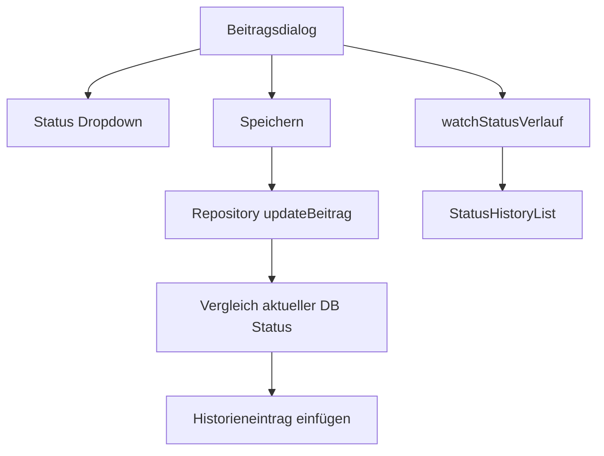
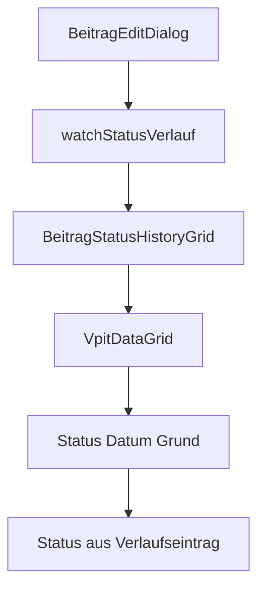

# Refactoring-Plan: Status-Historie im Beitragsdialog mit VpitDataGrid

## Ziel

Dieser Plan beschreibt ein reines Refactoring für den Bereich Beiträge. Die Implementierung soll erst nach Review dieses Plans erfolgen.

Das Ziel ist, die Anzeige der Status-Historie im Beitrags-Detaildialog robust über [VpitDataGrid](lib/widgets/data_grid_v2/vpit_data_grid.dart:44) zu realisieren. Dabei muss sichtbar sein, welcher Status tatsächlich in jedem Historieneintrag gespeichert wurde. Zu jedem Eintrag sollen weiterhin Datum und Begründung für den Statuswechsel angezeigt werden.

## Kontext aus der Analyse

### Aktuelle zentrale Dateien

| Bereich | Datei | Beobachtung |
|---|---|---|
| Beitragsdialog | [beitrag_edit_dialog.dart](lib/features/beitraege/presentation/dialogs/beitrag_edit_dialog.dart:23) | Lädt Beitrag und Status-Historie, zeigt Status-Historie aktuell über [StatusHistoryList](lib/features/beitraege/presentation/widgets/status_history_list.dart:12). |
| Status-Historie UI | [status_history_list.dart](lib/features/beitraege/presentation/widgets/status_history_list.dart:12) | Eigene ListView-basierte Anzeige mit Badge, Datum und Bemerkung. Soll durch VpitDataGrid-basierte Anzeige ersetzt werden. |
| Repository | [beitraege_repository.dart](lib/features/beitraege/data/beitraege_repository.dart:11) | Statuswechsel werden in [updateBeitrag](lib/features/beitraege/data/beitraege_repository.dart:134) automatisch erkannt und über einen neuen Verlaufseintrag gespeichert. |
| Status-Verlauf Stream | [beitraege_repository.dart](lib/features/beitraege/data/beitraege_repository.dart:187) | [watchStatusVerlauf](lib/features/beitraege/data/beitraege_repository.dart:187) liefert alle Verlaufseinträge absteigend nach Änderungszeitpunkt. |
| Status-Domain | [beitrag_status.dart](lib/features/beitraege/domain/models/beitrag_status.dart:7) | Enthält alle zulässigen Statuswerte und Labels. |
| Status-Farben | [beitrag_status_colors.dart](lib/features/beitraege/utils/beitrag_status_colors.dart:1) | Zentrale Quelle für Statusfarben. Keine Hex-Werte außerhalb dieser Datei hardcoden. |
| Generisches Grid | [vpit_data_grid.dart](lib/widgets/data_grid_v2/vpit_data_grid.dart:44) | Domain-unabhängiges Grid auf Basis von PlutoGrid mit Suche, Sortierung, Filter, Export und optionalem Detaildialog. |
| Spaltenkonfiguration | [data_grid_column_config.dart](lib/widgets/data_grid_v2/data_grid_column_config.dart:9) | Typisierte Spaltenkonfiguration für VpitDataGrid. |
| Grid-Controller | [data_grid_controller.dart](lib/widgets/data_grid_v2/data_grid_controller.dart:25) | Verwaltet Suche, Filter und Sortierung. |
| SSOT | [structur.md](lib/assets/data/structur.md:191) | Status-Versionierung ist verbindlich dokumentiert. |
| Datenbanktabelle | [beitrag_status_verlauf_table.dart](lib/core/database/tables/beitrag_status_verlauf_table.dart:13) | Tabelle enthält beitragId, status, geaendertAm und bemerkung. |

### Aktueller Datenfluss

### Vermutete Problemstellen

1. Die Status-Historie wird aktuell mit einer spezialisierten [StatusHistoryList](lib/features/beitraege/presentation/widgets/status_history_list.dart:12) dargestellt. Diese Anzeige ist weniger überprüfbar als eine tabellarische Darstellung mit klaren Spalten.
2. Im Beitragsdialog wird der bestehende Beitrag aus der gesamten Liste [beitraegeListProvider](lib/features/beitraege/presentation/providers/beitraege_list_provider.dart:10) gesucht. Das ist funktional, aber für einen Detaildialog unnötig breit und erschwert isoliertes Testen.
3. [updateBeitrag](lib/features/beitraege/data/beitraege_repository.dart:134) ist bereits die korrekte zentrale Stelle für Status-History. Das Refactoring darf keine direkte UI-seitige Erstellung von Historieneinträgen einführen.
4. Die Pflicht zur Bemerkung bei Statuswechsel wird aktuell im Dialog geprüft. Diese Regel sollte weiterhin erhalten bleiben und zusätzlich durch Tests abgesichert werden.
5. Die neue History-Anzeige soll nicht den aktuellen Status mehrfach aus dem Beitragsdatensatz ableiten, sondern ausschließlich den Status aus dem jeweiligen [BeitragStatusVerlaufData](lib/core/database/database.dart:19)-Eintrag verwenden.

## Zielarchitektur

Die Status-Historie wird im Beitragsdialog durch ein eigenes, kleines Widget gekapselt. Dieses Widget nutzt [VpitDataGrid](lib/widgets/data_grid_v2/vpit_data_grid.dart:44) mit [DataGridColumnConfig](lib/widgets/data_grid_v2/data_grid_column_config.dart:9) und einer expliziten Spaltenzuordnung auf die Felder des Historieneintrags.

## Fachliche Anforderungen

1. In der Status-Historie muss pro Zeile der Status aus dem jeweiligen Historieneintrag angezeigt werden.
2. Die Historie muss die Spalten Status, Datum und Grund enthalten.
3. Die Spalte Status muss das Label aus [BeitragStatus](lib/features/beitraege/domain/models/beitrag_status.dart:7) anzeigen, nicht den rohen Datenbankwert.
4. Die Status-Spalte soll weiterhin visuell mit [StatusBadge](lib/features/beitraege/presentation/widgets/status_badge.dart:1) oder einer äquivalenten zentralen Status-Komponente dargestellt werden.
5. Das Datum muss im deutschen Format dd.MM.yyyy oder mit Uhrzeit im deutschen Format angezeigt werden. Die Entscheidung soll im Code eindeutig und konsistent dokumentiert sein.
6. Der Grund muss aus dem Feld bemerkung des jeweiligen Verlaufseintrags stammen.
7. Die Reihenfolge der Historie bleibt absteigend nach geaendertAm, sofern fachlich keine andere Reihenfolge gewünscht wird.
8. Bei leerer Historie soll eine verständliche Meldung angezeigt werden, zum Beispiel Keine Status-Historie vorhanden.
9. Beim Statuswechsel muss weiterhin eine Begründung Pflicht sein.
10. Ein Statuswechsel darf nur über [updateBeitrag](lib/features/beitraege/data/beitraege_repository.dart:134) persistiert werden, weil dort die Historie automatisch angelegt wird.

## Projektanforderungen und Regeln für den Coding-Assistenten

1. [structur.md](lib/assets/data/structur.md:1) ist Single Source of Truth. Wenn die UI-Spezifikation der Status-Historie erweitert wird, muss diese Datei vor der Implementierung angepasst werden.
2. Keine Änderung am Datenbankschema planen, sofern keine neue Spalte benötigt wird. Für dieses Refactoring ist voraussichtlich keine Schema-Migration nötig.
3. Falls doch ein Schema-Change entsteht, muss [schemaVersion](lib/core/database/database.dart:47) erhöht und eine forward-only Migration ergänzt werden.
4. Keine direkte Nutzung oder Änderung von generierten Dateien wie .g.dart oder .freezed.dart.
5. Keine neuen Packages hinzufügen.
6. Keine Statusfarben hardcoden. Statusfarben nur über [beitrag_status_colors.dart](lib/features/beitraege/utils/beitrag_status_colors.dart:1) beziehungsweise [BeitragStatus](lib/features/beitraege/domain/models/beitrag_status.dart:7) beziehen.
7. Keine direkte UI-seitige Manipulation der Tabelle beitrag_status_verlauf. Die UI ruft nur Repository-Methoden auf.
8. Keine StatefulWidget-Implementierung. Falls State nötig ist, HookConsumerWidget und Hooks verwenden.
9. Gap-Package für Abstände nutzen, keine neuen SizedBox-Abstände einführen.
10. Dart-Code mit 2 Spaces, maximal 100 Zeichen pro Zeile und trailing commas bei mehrzeiligen Konstrukten schreiben.
11. Nach Codeänderungen mindestens flutter analyze ausführen. Falls Provider oder Drift-Annotationen geändert werden, zusätzlich flutter pub run build_runner build -d ausführen.

## Konkreter Refactoring-Plan

### Schritt 1: SSOT prüfen und minimal erweitern

1. In [structur.md](lib/assets/data/structur.md:510) den Bereich Beitrag bearbeiten prüfen.
2. Falls noch nicht ausreichend beschrieben, im Bereich Status und Daten oder als eigener Unterpunkt Status-Historie ergänzen:
   - Anzeige als VpitDataGrid.
   - Spalten: Status, Datum, Grund.
   - Statuswert kommt aus beitrag_status_verlauf.status.
   - Grund kommt aus beitrag_status_verlauf.bemerkung.
   - Historie ist read-only.
3. Keine Änderung an Tabellenfeldern einplanen.

### Schritt 2: Optionales Domain-View-Model für die Historie einführen

Empfehlung: Ein kleines View-Model im Beiträge-Feature anlegen, zum Beispiel unter lib/features/beitraege/domain/models.

Vorgeschlagene Datei:

- lib/features/beitraege/domain/models/beitrag_status_history_row_data.dart

Vorgeschlagene Felder:

| Feld | Quelle | Zweck |
|---|---|---|
| id | BeitragStatusVerlaufData.id | Stabile Zeilenidentifikation für VpitDataGrid. |
| status | BeitragStatusVerlaufData.status | Der historisierte Status für diese Zeile. |
| geaendertAm | BeitragStatusVerlaufData.geaendertAm | Sortier- und Anzeige-Datum. |
| bemerkung | BeitragStatusVerlaufData.bemerkung | Begründung des Statuswechsels. |

Wichtige Vorgabe: Das View-Model darf den Status nicht aus dem aktuellen Beitrag ableiten. Es muss direkt aus dem Historieneintrag gemappt werden.

### Schritt 3: Neues Widget für die History-Grid-Anzeige erstellen

Empfehlung: Die bisherige [StatusHistoryList](lib/features/beitraege/presentation/widgets/status_history_list.dart:12) nicht direkt weiter ausbauen, sondern durch ein neues Widget ersetzen oder refactoren.

Vorgeschlagene Datei:

- lib/features/beitraege/presentation/widgets/beitrag_status_history_grid.dart

Aufgaben dieses Widgets:

1. Eingabe: Liste von [BeitragStatusVerlaufData](lib/core/database/database.dart:19) oder Liste des neuen History-View-Models.
2. Leerer Zustand: Text Keine Status-Historie vorhanden.
3. Maximalhöhe im Dialog begrenzen, damit [VpitDataGrid](lib/widgets/data_grid_v2/vpit_data_grid.dart:44) in einem bounded Layout liegt.
4. VpitDataGrid mit read-only Spalten konfigurieren.
5. Toolbar-Verhalten prüfen: Für eine kleine Historie kann Suche, Filter und Sortierung nützlich sein, Export eher optional. Da [VpitDataGrid](lib/widgets/data_grid_v2/vpit_data_grid.dart:511) aktuell immer eine Toolbar rendert, soll der Coding-Assistent entscheiden, ob die bestehende Toolbar akzeptiert wird oder ob [VpitDataGrid](lib/widgets/data_grid_v2/vpit_data_grid.dart:44) optional um einen toolbar-Schalter erweitert wird.

### Schritt 4: Spaltenkonfiguration für die Status-Historie definieren

Empfohlene Spalten:

| field | Titel | Quelle | Darstellung |
|---|---|---|---|
| status | Status | row.status | Renderer mit [StatusBadge](lib/features/beitraege/presentation/widgets/status_badge.dart:1), Label über [BeitragStatus](lib/features/beitraege/domain/models/beitrag_status.dart:7). |
| geaendert_am | Datum | row.geaendertAm | Deutsches Datumsformat, optional mit Uhrzeit. |
| bemerkung | Grund | row.bemerkung | Text, bei langen Gründen sinnvoll umbrechen oder ellipsisieren. |

Wichtig für den Coding-Assistenten:

1. [valueExtractor](lib/widgets/data_grid_v2/data_grid_column_config.dart:40) der Status-Spalte muss row.status verwenden.
2. Der Renderer darf nicht existing.beitrag.status oder ctrlStatus.text verwenden.
3. Für Suche und Filter sollen Status-Label, Datum und Grund enthalten sein.
4. Sortierung nach Datum sollte fachlich absteigend bleiben. Wenn [DataGridController](lib/widgets/data_grid_v2/data_grid_controller.dart:25) keine initiale Sortierung unterstützt, soll die Eingabeliste vor Übergabe an das Grid sortiert werden.

### Schritt 5: Beitragsdialog umbauen

In [BeitragEditDialog](lib/features/beitraege/presentation/dialogs/beitrag_edit_dialog.dart:23):

1. Import von [status_history_list.dart](lib/features/beitraege/presentation/widgets/status_history_list.dart:1) durch das neue Grid-Widget ersetzen.
2. Methode [_buildStatusHistoryList](lib/features/beitraege/presentation/dialogs/beitrag_edit_dialog.dart:382) umbenennen oder durch eine neue Methode ersetzen, die das neue Grid zurückgibt.
3. Die Stream-Quelle [watchStatusVerlauf](lib/features/beitraege/data/beitraege_repository.dart:187) beibehalten.
4. Den Statuswechsel-Speicherfluss nicht in die UI verlagern.
5. Sicherstellen, dass nach dem Speichern und erneutem Öffnen des Dialogs die neue History-Zeile mit dem ausgewählten Status erscheint.

### Schritt 6: Statuswechsel-Logik verifizieren und nur bei Bedarf minimal korrigieren

Die zentrale Logik in [updateBeitrag](lib/features/beitraege/data/beitraege_repository.dart:134) ist konzeptionell korrekt:

1. Aktuellen DB-Status lesen.
2. Neuen Status im Companion prüfen.
3. Beitrag aktualisieren.
4. Bei Statusänderung neuen Historieneintrag mit neuem Status und Bemerkung erzeugen.

Der Coding-Assistent soll prüfen:

1. Wird der neue Status tatsächlich im [BeitraegeCompanion](lib/features/beitraege/presentation/dialogs/beitrag_edit_dialog.dart:180) gesetzt?
2. Wird [statusBemerkung](lib/features/beitraege/presentation/dialogs/beitrag_edit_dialog.dart:188) bei Statusänderung korrekt übergeben?
3. Bleibt ctrlStatus nach Dropdown-Wechsel zuverlässig aktuell?
4. Falls das Dropdown keine Rebuilds auslöst, muss die Statusänderungs-Erkennung im Dialog so refactored werden, dass die Anzeige des Pflichtfelds und der Save-Status stabil reagieren. Dabei keine Business-Logik in das Widget verlagern.

### Schritt 7: Bestehende StatusHistoryList entfernen oder deprecaten

Nach erfolgreichem Umbau prüfen:

1. Wird [StatusHistoryList](lib/features/beitraege/presentation/widgets/status_history_list.dart:12) noch irgendwo verwendet?
2. Wenn nein, kann sie in einem späteren Cleanup entfernt werden. Da keine Dateien ohne explizite Bestätigung gelöscht werden sollen, zunächst nur ungenutzten Zustand dokumentieren oder im Code nicht weiter referenzieren.
3. Wenn sie behalten wird, sollte ein Kommentar klarstellen, dass die Beitrags-Historie künftig über das Grid angezeigt wird.

### Schritt 8: Tests und Qualitätssicherung

Empfohlene Tests für den Coding-Assistenten:

1. Repository-Test für Statuswechsel:
   - Beitrag mit Status kontiert anlegen.
   - Update auf offen mit Bemerkung durchführen.
   - Verlauf laden.
   - Prüfen, dass ein Eintrag mit status offen und der Bemerkung existiert.
2. Repository-Test für keinen Statuswechsel:
   - Beitrag ändern, Status bleibt gleich.
   - Prüfen, dass kein zusätzlicher Verlaufseintrag entsteht.
3. Widget-Test für History-Grid:
   - Testdaten mit unterschiedlichen Statuswerten übergeben.
   - Prüfen, dass die Labels Kontiert, Offen, Bezahlt oder andere konkrete Statuswerte sichtbar sind.
   - Prüfen, dass die jeweilige Bemerkung sichtbar ist.
4. Widget-Test oder Integrationstest für Beitragsdialog:
   - Status ändern.
   - Grund eingeben.
   - Speichern.
   - Dialog erneut öffnen oder Stream prüfen.
   - Neuer Status ist in der History sichtbar.

Qualitätssicherung nach Implementierung:

1. flutter analyze
2. dart format --output=none --set-exit-if-changed .
3. Relevante Tests ausführen, bevorzugt gezielt für Beiträge und das neue History-Grid.
4. Falls Provider, Drift oder andere generierte Artefakte geändert werden: flutter pub run build_runner build -d

## Akzeptanzkriterien

1. Die Status-Historie im Beitragsdialog wird über [VpitDataGrid](lib/widgets/data_grid_v2/vpit_data_grid.dart:44) angezeigt.
2. Die History-Zeilen zeigen unterschiedliche Status korrekt an, wenn unterschiedliche Statuswechsel durchgeführt wurden.
3. Jede History-Zeile nutzt den Status aus dem zugehörigen Verlaufseintrag.
4. Datum und Grund sind pro History-Zeile sichtbar.
5. Die Begründung bleibt Pflicht, sobald der Status im Dialog geändert wird.
6. Die zentrale Repository-Logik [updateBeitrag](lib/features/beitraege/data/beitraege_repository.dart:134) bleibt die einzige Stelle, die bei Statuswechseln Historieneinträge erzeugt.
7. Es werden keine Statusfarben hardcodiert.
8. Es wird keine Datenbankmigration eingeführt, solange das vorhandene Schema ausreicht.
9. [structur.md](lib/assets/data/structur.md:1) ist synchron zur UI-Änderung.
10. Analyse und Tests zeigen keine neuen Fehler.

## Nicht-Ziele

1. Keine Änderung des Datenbankschemas für dieses Refactoring.
2. Keine Änderung der fachlichen Statuswerte.
3. Keine Änderung des Rechnungsnummernformats.
4. Keine direkte Editierbarkeit der Status-Historie.
5. Keine Löschung historischer Einträge.
6. Keine Einführung neuer Dependencies.

## Hinweise für den implementierenden Coding-Assistenten

1. Vor jeder Codeänderung die betroffene Datei vollständig lesen.
2. Zuerst [structur.md](lib/assets/data/structur.md:1) anpassen, falls die UI-Spezifikation ergänzt wird.
3. Danach neues History-Grid-Widget ergänzen.
4. Danach [BeitragEditDialog](lib/features/beitraege/presentation/dialogs/beitrag_edit_dialog.dart:23) auf das neue Widget umstellen.
5. Erst danach Tests ergänzen oder anpassen.
6. Keine produktiven Datenbankdateien ändern.
7. Keine generierten Dateien editieren.
8. Bei Unsicherheit, ob die Toolbar im kleinen Dialog gewünscht ist, zuerst die minimal-invasive Variante nutzen und [VpitDataGrid](lib/widgets/data_grid_v2/vpit_data_grid.dart:44) unverändert lassen.
