# Refactoring-Plan: Beiträge & Rechnungen — DRY & OOP

> **Status**: Planungsphase | **Erstellt**: 2026-05-11 | **Modus**: Flutter Architect

## 1. Zusammenfassung

Die Features [`beitraege/`](lib/features/beitraege/) und [`rechnungen/`](lib/features/rechnungen/) weisen einen Duplizierungsgrad von **70–90 %** in mehreren Schichten auf. Zudem fehlen Abstraktionen, die den OOP-Prinzipien (Vererbung, Komposition, Interface Segregation) entsprechen. Dieser Plan beschreibt systematisch die Verstöße und schlägt konkrete Refactoring-Schritte vor.

## 2. Analyse: DRY-Verstöße im Detail

### 2.1 Screen-Ebene (≈90 % Duplikation)

| Aspekt | [`BeitraegeScreen`](lib/features/beitraege/beitraege_screen.dart:17) | [`RechnungenScreen`](lib/features/rechnungen/rechnungen_screen.dart:15) |
|--------|------------------------------------------------------------------------|------------------------------------------------------------------------|
| Basisklasse | `HookConsumerWidget` | `HookConsumerWidget` |
| Selektion-State | `useState<int?>(null)` | `useState<int?>(null)` |
| Bemerkung-Stream | `useMemoized` + `watchBemerkungForBeitrag` | `useMemoized` + `watchBemerkungForRechnung` |
| Bemerkung-Async | `useStream(bemerkungStream)` | `useStream(bemerkungStream)` |
| Scaffold | `FeatureScreenScaffold` | `FeatureScreenScaffold` |
| Delete-Flow | Confirm → `deleteBeitrag` → null | Confirm → `deleteRechnung` → null |
| Error-Handling | `SnackBar(content: Text('Fehler…'))` | `SnackBar(content: Text('Fehler…'))` |
| Bemerkung-Panel | `BemerkungDetailView` + `saveBemerkung` | `BemerkungDetailView` + `saveBemerkung` |
| onCreateNew | `NeuerBeitragDialog.show` | `NeueRechnungDialog.show` |
| onDeleteSelection | Ref → Repo → delete | Ref → Repo → delete |

**Zwei vollständig identische Dateien mit anderem Typ-Parameter.** Nur die Widgets und Repositories sind ausgetauscht.

### 2.2 DataGrid-Ebene (≈80 % Duplikation)

| Aspekt | [`BeitragDataGrid`](lib/features/beitraege/presentation/widgets/beitrag_data_grid.dart:16) | [`RechnungDataGrid`](lib/features/rechnungen/widgets/rechnung_data_grid.dart:16) |
|--------|-----------------------------------------------------------------------------------------|-----------------------------------------------------------------------------------|
| Basisklasse | `HookConsumerWidget` | `HookConsumerWidget` |
| Provider | `beitraegeListProvider` | `rechnungenListProvider` |
| Spalten | `useMemoized` → 6 Spalten | `useMemoized` → 5 Spalten |
| Status-Renderer | `StatusBadge.fromString` | Inline `Container` mit `rechnungStatusColor` |
| VpitDataGrid | Identisches Muster | Identisches Muster |
| toSearchString | `join(' ').toLowerCase()` | `join(' ').toLowerCase()` |
| detailModalBuilder | `*EditDialog.show(context, *)` | `*EditDialog.show(context, *)` |
| exportConfig | `entityType: 'beitrag'` | `entityType: 'rechnung'` |
| Loading/Error | Identisch | Identisch |
| toJson/fromJson | `row.toJson()` / `RowData.fromJson` | `row.toJson()` / `RowData.fromJson` |

**Auffällig**: Der Status-Renderer ist **inkonsistent** – Beiträge nutzt `StatusBadge`, Rechnungen nutzt einen ad-hoc Container. Dies ist ein DRY-Verstoß und UX-Inkonsistenz.

### 2.3 Edit-Dialog-Ebene (≈80 % Duplikation)

| Aspekt | [`BeitragEditDialog`](lib/features/beitraege/presentation/dialogs/beitrag_edit_dialog.dart:39) | [`RechnungEditDialog`](lib/features/rechnungen/widgets/rechnung_edit_dialog.dart:23) |
|--------|----------------------------------------------------------------------------------------------|--------------------------------------------------------------------------------------|
| Basisklasse | `HookConsumerWidget` | `HookConsumerWidget` |
| `show()`-Methode | `showDialog(barrierDismissible: false)` | `showDialog(barrierDismissible: false)` |
| ID-Feld | `int? beitragId` | `int rechnungId` |
| initialFocusField | `String?` | `String?` |
| Controller-Anzahl | 6 TextEditingController | 5 TextEditingController |
| useState-Felder | 4 (`isSaving`, `originalStatus`, `ctrlKontiertAm`, `ctrlStatusDatum`) | 4 (`isSaving`, `selectedStatus`, `bezahltAm`, `rechnungsDatum`, `faelligkeitDatum`) |
| Init-UseEffect | Stream-basiert, `isInitialized`-Flag | Provider-basiert, `isInitialized`-Flag |
| Auto-Fokus | `fnStatus` / `fnRechnungsnummer` | `fnStatus` |
| canSave-Logik | `_canSave()` mit `rechnungsnummer` + `statusBemerkung` | Nicht vorhanden |
| Save-Flow | `updateBeitrag` + `statusBemerkung` | `updateRechnungFull` |
| Delete-Flow | `deleteBeitrag` + invalidate | `deleteRechnung` + invalidate |
| Status-Dropdown | `AppDropdownField` + `BeitragStatus`-Enum | `AppDropdownField` + `kRechnungStatusValues`-Liste |
| Status-Farben | `status.backgroundColor.withOpacityPercent(0.3)` | `bgColor.withAlpha((255 * 0.3).round())` |
| Bemerkung | `ctrlBemerkungTitel` + `ctrlBemerkungText` | `ctrlBemerkungTitel` + `ctrlBemerkungText` |
| Sicherheitsabfrage | `_canSave()` | nicht vorhanden |
| Status-Historie | `BeitragStatusHistoryGrid` (VpitDataGrid) | Keine |
| Positionen-Anzeige | Keine | `_buildPositionenList` (ListView) |

**Kritischer Unterschied**: `RechnungEditDialog` hat **keine** `canSave`-Validierung und **keine** Pflichtfeld-Prüfung vor dem Speichern – das ist ein funktionaler Mangel.

### 2.4 Repository-Ebene (≈50 % Duplikation)

Beide Repositories duplizieren:
1. `generateRechnungsnummer()` – identische Logik, nur Prefix (`RE-` vs `R-`) und Tabellenname (`beitrag` vs `rechnung`) unterschieden sich
2. `rechnungsnummerExists()` – identische Logik
3. `watchBemerkungFor*()` – identische Join-Logik
4. Bemerkung-Delegationsmethoden (`saveBemerkung`, `getBemerkungById`) – identisch
5. Riverpod-Provider-Definition – identisches Muster

### 2.5 Domain-Model-Ebene (≈90 % Duplikation)

| Aspekt | [`BeitragRowData`](lib/features/beitraege/domain/models/beitrag_row_data.dart:8) | [`RechnungRowData`](lib/features/rechnungen/domain/models/rechnung_row_data.dart:8) |
|--------|---------------------------------------------------------------------------------|-----------------------------------------------------------------------------------|
| Freezed-Annotation | `@Freezed(toJson: false, fromJson: false)` | `@Freezed(toJson: false, fromJson: false)` |
| `toJson()` | Manuell, wirft Felder | Manuell, wirft Felder |
| `fromJson()` | `throw UnsupportedError` | `throw UnsupportedError` |

### 2.6 Status-Utils-Ebene (≈60 % Duplikation)

| Aspekt | [`beitrag_status_colors.dart`](lib/features/beitraege/utils/beitrag_status_colors.dart:12) | [`rechnung_status_colors.dart`](lib/features/rechnungen/utils/rechnung_status_colors.dart:10) |
|--------|------------------------------------------------------------------------------------------|----------------------------------------------------------------------------------------------|
| Map-Typ | `Map<String, Color>` | `Map<String, Color>` |
| `statusColor()` | `kBeitragStatusColors[status] ?? Colors.transparent` | `kRechnungStatusColors[status] ?? Colors.transparent` |
| `statusTextColor()` | `Colors.black87` | `Colors.black87` |

**Gleiche Status-Werte** (`offen`, `bezahlt`, `storniert`) haben **identische Farben** in beiden Dateien. Beiträge hat zusätzlich `kontiert`, `angemahnt`, `inkasso`.

### 2.7 Provider-Ebene (≈95 % Duplikation)

[`beitraege_list_provider.dart`](lib/features/beitraege/presentation/providers/beitraege_list_provider.dart:10) und [`rechnungen_list_provider.dart`](lib/features/rechnungen/presentation/providers/rechnungen_list_provider.dart:11) sind strukturell identisch.

## 3. OOP-Verstöße

```mermaid
classDiagram
    direction TB

    class BeitraegeScreen {
        +build() Widget
        -selectedRowId
        -bemerkungStream
        -bemerkungAsync
    }
    class RechnungenScreen {
        +build() Widget
        -selectedRowId
        -bemerkungStream
        -bemerkungAsync
    }

    class BeitragDataGrid {
        +build() Widget
        +onRowSelected
        -columns
    }
    class RechnungDataGrid {
        +build() Widget
        +onRowSelected
        -columns
    }

    class BeitragEditDialog {
        +show() Future~void~
        +build() Widget
        -saveBeitrag()
        -deleteBeitrag()
        -_ctrlStatus
        -_ctrlBemerkungTitel
    }
    class RechnungEditDialog {
        +show() Future~void~
        +build() Widget
        -saveRechnung()
        -deleteRechnung()
        -ctrlStatus
        -ctrlBemerkungTitel
    }

    class BeitraegeRepository {
        +watchBeitraege()
        +watchBemerkungForBeitrag()
        +generateRechnungsnummer()
        +updateBeitrag()
    }
    class RechnungenRepository {
        +watchRechnungen()
        +watchBemerkungForRechnung()
        +generateRechnungsnummer()
        +updateRechnungFull()
    }

    note for BeitraegeScreen "Keine gemeinsame Basis"
    note for RechnungenScreen "Keine gemeinsame Basis"
    note for BeitragDataGrid "Keine gemeinsame Basis"
    note for RechnungDataGrid "Keine gemeinsame Basis"
    note for BeitragEditDialog "Keine gemeinsame Basis"
    note for RechnungEditDialog "Keine gemeinsame Basis"
    note for BeitraegeRepository "Keine gemeinsame Basis"
    note for RechnungenRepository "Keine gemeinsame Basis"
```



### 3.1 Fehlende Abstraktionen

1. **Kein generisches `DataScreen`-Widget**: Jeder Screen dupliziert den kompletten Bemerkungs- und Lösch-Flow
2. **Kein generisches `FeatureDataGrid`-Widget**: Jedes Grid dupliziert die VpitDataGrid-Verkabelung
3. **Kein generischer `EditDialog`-Base**: Beide Dialoge implementieren denselben Lebenszyklus (init→save→delete→invalidate)
4. **Kein `StatusManager`-Interface**: Status-Farben, Labels und Dropdowns werden ad-hoc implementiert
5. **Keine `RechnungsnummerGenerator`-Abstraktion**: Identische Logik in beiden Repositories
6. **Kein `RowData`-Interface**: Beide Models duplizieren Freezed + JSON-Muster

### 3.2 SOLID-Verstöße

| Prinzip | Verstoß |
|---------|---------|
| **S**ingle Responsibility | `BeitragEditDialog` verwaltet Status-Historie-Streams, Bemerkungen und Form-Validierung in einer Klasse |
| **O**pen/Closed | Kein Extension-Point für neue Features; neues Feature = komplette Duplikation |
| **L**iskov Substitution | Keine Basisklassen vorhanden, die substituiert werden könnten |
| **I**nterface Segregation | Keine Interfaces; alle Methoden sind konkret |
| **D**ependency Inversion | Screens hängen direkt von konkreten Repository-Impls ab (via Riverpod, aber ohne Interface) |

## 4. Zielarchitektur

```mermaid
classDiagram
    direction TB

    class DataMaintenanceScreen~TRow~ {
        <<abstract>>
        +String title
        +Widget createNewDialog
        +DataGrid~TRow~ body
        +Repository repo
        -selectedRowId
        -bemerkungStream
    }

    class FeatureDataGrid~TRow~ {
        <<abstract>>
        +List~ColumnConfig~ columns
        +ListProvider~TRow~ provider
        +EditDialog~TRow~ editDialog
        +String entityType
    }

    class EntityEditDialog~TEntity~ {
        <<abstract>>
        +int? entityId
        +String title
        +Future~void~ save()
        +Future~void~ delete()
        +bool canSave
        -isSaving
        -isInitialized
    }

    class StatusManager {
        <<interface>>
        +Color getColor(String status)
        +String getLabel(String status)
        +List~String~ getValues()
    }

    class RechnungsnummerGenerator {
        +Future~String~ generate(String prefix, String table)
        +Future~bool~ exists(String table, String number)
    }

    class BeitraegeScreen {
        +title = "Beiträge"
    }
    class RechnungenScreen {
        +title = "Rechnungen"
    }

    class BeitragDataGrid {
        +entityType = "beitrag"
    }
    class RechnungDataGrid {
        +entityType = "rechnung"
    }

    class BeitragEditDialog {
        +entityId = beitragId
    }
    class RechnungEditDialog {
        +entityId = rechnungId
    }

    class BeitragStatusManager {
        +6 status values
    }
    class RechnungStatusManager {
        +3 status values
    }

    DataMaintenanceScreen <|-- BeitraegeScreen
    DataMaintenanceScreen <|-- RechnungenScreen
    FeatureDataGrid <|-- BeitragDataGrid
    FeatureDataGrid <|-- RechnungDataGrid
    EntityEditDialog <|-- BeitragEditDialog
    EntityEditDialog <|-- RechnungEditDialog
    StatusManager <|-- BeitragStatusManager
    StatusManager <|-- RechnungStatusManager
```



## 5. Refactoring-Schritte (inkrementell, rückwärtskompatibel)

Die Schritte sind so angeordnet, dass jeder Schritt einzeln abschließbar ist und keine Regressionen verursacht.

### Schritt 0: SSOT aktualisieren

**Datei**: [`structur.md`](lib/assets/data/structur.md:1)

- Keine Schema-Änderungen nötig (rein architektonisches Refactoring)
- UI-Sektion prüfen und ggf. Status-Dropdown-Konsistenz dokumentieren

### Schritt 1: `RechnungsnummerGenerator` in `lib/core/` auslagern (DRY)

**Neu**: `lib/core/data/rechnungsnummer_generator.dart`

- Extrahiert `generateRechnungsnummer(prefix, table)` und `rechnungsnummerExists(table, number)` aus beiden Repositories
- Beide Repositories delegieren an diese zentrale Klasse
- Kein Breaking Change: öffentliche API der Repositories bleibt gleich

```dart
// Pseudocode – Interface
class RechnungsnummerGenerator {
  final AppDatabase _db;
  RechnungsnummerGenerator(this._db);

  /// Generates a unique invoice number: {prefix}-{year}-{sequential}
  /// Where [prefix] is 'RE' for Beiträge or 'R' for Rechnungen
  /// and [table] is the Drift table (db.beitraege or db.rechnungen).
  Future<String> generate({required String prefix, required String tableName});

  Future<bool> exists(String tableName, String rechnungsnummer);
}
```

### Schritt 2: `StatusManager`-Interface einführen (OOP)

**Neu**: `lib/core/models/status_manager.dart`

- Interface mit `getColor()`, `getLabel()`, `getTextColor()`, `getValues()`
- `BeitragStatus`-Enum implementiert das Interface
- Neue `RechnungStatus`-Enum-Klasse (ersetzt `kRechnungStatusValues`-Konstante)
- `StatusBadge` wird generisch für `StatusManager` statt nur `BeitragStatus`

```dart
// Pseudocode – Interface
abstract interface class StatusManager {
  String get value;
  String get label;
  Color get backgroundColor;
  Color get textColor;
  static StatusManager fromString(String value, List<StatusManager> values);
}
```

**Impact**:
- [`beitrag_status_colors.dart`](lib/features/beitraege/utils/beitrag_status_colors.dart:12) bleibt SSOT für Beiträge
- [`rechnung_status_colors.dart`](lib/features/rechnungen/utils/rechnung_status_colors.dart:10) bleibt SSOT für Rechnungen
- Beide delegieren an das neue Interface

### Schritt 3: `RechnungDataGrid` konsistent mit `BeitragDataGrid` machen (DRY)

**Änderung**: [`rechnung_data_grid.dart`](lib/features/rechnungen/widgets/rechnung_data_grid.dart:60)

- Status-Renderer von ad-hoc `Container` auf `StatusBadge.fromString()` umstellen
- Nach Schritt 2 nutzt `StatusBadge` dann das `StatusManager`-Interface
- Entfernt die UI-Inkonsistenz zwischen beiden DataGrids

### Schritt 4: `RechnungEditDialog` um fehlende Validierung ergänzen (Funktional)

**Änderung**: [`rechnung_edit_dialog.dart`](lib/features/rechnungen/widgets/rechnung_edit_dialog.dart:22)

- `_canSave()`-Logik analog zu [`beitrag_edit_dialog.dart`](lib/features/beitraege/presentation/dialogs/beitrag_edit_dialog.dart:26) hinzufügen
- Pflichtfeld-Validierung für Rechnungsnummer
- Status-Dropdown von `HookBuilder`-Wrapper auf `_buildStatusDropdown`-Methode vereinheitlichen (analog Beitrag)
- `isSaveEnabled`-Property an `AppEditDialogScaffold` durchreichen

### Schritt 5: Bemerkung-Validierung in `BeitragEditDialog` nach `RechnungEditDialog` replizieren (Konsistenz)

**Prüfung**: `RechnungEditDialog` prüft ob `ctrlBemerkungTitel`/`ctrlBemerkungText` nicht leer sind bevor `bemerkungRepo.saveBemerkung` aufgerufen wird. `BeitragEditDialog` macht das auch. → Konsistent.

### Schritt 6: `updateRechnungFull` in `RechnungenRepository` an `updateBeitrag` angleichen (Konsistenz)

**Änderung**: [`rechnungen_repository.dart`](lib/features/rechnungen/data/rechnungen_repository.dart:145)

- `updateRechnungFull` hat `bemerkungId`, `bemerkungTitel`, `bemerkungText` als separate Parameter – inkonsistent
- Entweder: Bemerkung-Logik aus dem Repository entfernen und dem Caller überlassen (wie bei Beiträge)
- Oder: Bemerkung-Save in beiden Repositories identisch strukturieren
- **Empfehlung**: Repository-Methode nimmt nur `RechnungenCompanion` entgegen; Bemerkung-Save passiert im Dialog wie bei Beiträgen

### Schritt 7: Tests schreiben

**Test-Dateien**:
- `test/core/data/rechnungsnummer_generator_test.dart`
- `test/features/rechnungen/rechnung_edit_dialog_test.dart` (canSave-Validierung)
- `test/core/models/status_manager_test.dart`

## 6. Nicht-Ziele (explizit ausgeklammert)

1. **Keine Generics auf Screen/DataGrid-Ebene**: Eine vollständige Abstraktion zu `DataMaintenanceScreen<T>` wäre ein tiefer Eingriff. Die Zielarchitektur (Kapitel 4) zeigt die Vision, aber die Implementierung beschränkt sich auf die pragmatischen Schritte 1–7.
2. **Keine Schema-Migration**: Keine Datenbankänderungen
3. **Keine neuen Packages**: Alle Refactorings nutzen bestehende Dependencies
4. **Keine Änderung an [`feature_screen_scaffold.dart`](lib/common_widgets/feature_screen_scaffold.dart:12) oder [`app_edit_dialog_scaffold.dart`](lib/common_widgets/app_edit_dialog_scaffold.dart:35)**: Diese sind bereits gut abstrahiert
5. **Kein Refactoring der Riverpod-Provider-Struktur**: Die Duplikation dort ist minimal und durch Code-Generation bedingt

## 7. ADR – Architecture Decision Record

### ADR-001: StatusManager-Interface

**Status**: Vorgeschlagen
**Kontext**: Zwei Features (Beiträge, Rechnungen) mit eigenen Status-Definitionen, aber überlappenden Werten und identischen Farblogiken.
**Entscheidung**: Einführung eines `StatusManager`-Interfaces in `lib/core/models/`. Bestehende Status-Enums implementieren das Interface. `StatusBadge` wird generisch.
**Konsequenzen**:
- Positiv: Einheitliche Status-Darstellung, weniger Duplikation, neue Features können Status einfach hinzufügen
- Negativ: Geringer initialer Refactoring-Aufwand
**Alternativen**: Kein Interface, nur DRY-Fixes → würde zukünftige Inkonsistenzen nicht verhindern

### ADR-002: RechnungsnummerGenerator in core/

**Status**: Vorgeschlagen
**Kontext**: `generateRechnungsnummer()` und `rechnungsnummerExists()` sind in beiden Repositories identisch bis auf Prefix und Tabellenname.
**Entscheidung**: Auslagerung in `lib/core/data/rechnungsnummer_generator.dart`. Repositories delegieren dorthin.
**Konsequenzen**:
- Positiv: Single Source of Truth für Nummerngenerierung, einfacher testbar
- Negativ: Zusätzliche Indirektion
**Alternativen**: Shared Mixin → weniger explizit, schwerer testbar

## 8. Risiken & Rollback

- Alle Schritte sind **inkrementell** und **rückwärtskompatibel**
- Jeder Schritt endet mit `flutter analyze` und ggf. `build_runner`
- Kein Schritt ändert die öffentliche API der Widgets/Screens
- Rollback: Einfaches Zurücksetzen der betroffenen Dateien möglich

## 9. Nächste Schritte

1. ✅ Plan ist erstellt
2. Wechsel in den 💻 Flutter Developer Modus
3. Implementierung in der Reihenfolge: Schritt 1 → 2 → 3 → 4 → 6 → 7
4. Nach jedem Schritt: `flutter analyze` + `build_runner` (falls nötig)
