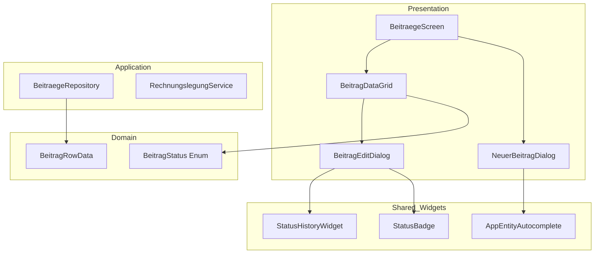

# Beiträge Feature - Refactoring Plan

## Zusammenfassung der Identifizierten Probleme

Nach Analyse der Beiträge-Feature-Dateien wurden folgende architektonische und Code-Qualitäts-Probleme identifiziert:

### 1. Code-Duplikation

#### Problem: Autocomplete-Widgets
**Datei:** [`lib/features/beitraege/presentation/dialogs/neuer_beitrag_dialog.dart`](lib/features/beitraege/presentation/dialogs/neuer_beitrag_dialog.dart:334)

Die Methoden `_buildMemberAutocomplete()` und `_buildLeistungAutocomplete()` sind fast identisch (ca. 100 Zeilen Code pro Methode). Beide implementieren:
- Autocomplete-Suchlogik
- Debouncing-Verhalten
- UI-Rendern der Optionen
- Lade-Logik

**Code-Duplikation:** ~85%

#### Problem: Status-Farblogik
**Dateien:**
- [`lib/features/beitraege/utils/beitrag_status_colors.dart`](lib/features/beitraege/utils/beitrag_status_colors.dart:1)
- [`lib/features/beitraege/presentation/dialogs/beitrag_edit_dialog.dart`](lib/features/beitraege/presentation/dialogs/beitrag_edit_dialog.dart:335)
- [`lib/features/beitraege/presentation/widgets/beitrag_data_grid.dart`](lib/features/beitraege/presentation/widgets/beitrag_data_grid.dart:71)

Status-Strings werden überall als raw Strings verwendet (`'kontiert'`, `'offen'`, etc.) statt als typisierte Enums.

#### Problem: Bemerkungs-Logik
**Mehrere Repositories:**
- [`BeitraegeRepository.saveBemerkung()`](lib/features/beitraege/providers/beitraege_repository.dart:158)
- [`MembersRepository.saveBemerkung()`](lib/features/members/data/members_repository.dart:41)
- [`LeistungenRepository._saveBemerkungBaseLogic()`](lib/features/leistungen/data/leistungen_repository.dart:57)

Fast identische Implementierung in 3 verschiedenen Repositories.

### 2. OOP-Probleme

#### Problem: Fehlende Kapselung
**Datei:** [`lib/features/beitraege/presentation/dialogs/neuer_beitrag_dialog.dart`](lib/features/beitraege/presentation/dialogs/neuer_beitrag_dialog.dart:20)

Der Dialog hat zu viele Verantwortlichkeiten:
- Mitglied-Suche und -Validierung
- Leistung-Suche und -Validierung
- Preisberechnung
- Form-Validierung
- Speicherlogik
- UI-Aufbau

**Klasse hat 600+ Zeilen Code**

#### Problem: Keine klare Trennung von UI und Business-Logic
Status-Historie wird direkt im Dialog-Widget gebaut statt als eigenständige Komponente.

### 3. Performance-Probleme

#### Problem: Unnötige Rebuilds
**Datei:** [`lib/features/beitraege/presentation/dialogs/beitrag_edit_dialog.dart`](lib/features/beitraege/presentation/dialogs/beitrag_edit_dialog.dart:55)

```dart
final beitraegeAsync = ref.watch(beitraegeListProvider);
// Gesamte Liste wird geladen, um einen einzelnen Eintrag zu finden
final existing = beitragId != null
    ? rowData.where((r) => r.beitrag.id == beitragId).firstOrNull
    : null;
```

**Problem:** Der gesamte Provider wird beobachtet, obwohl nur ein einzelner Eintrag benötigt wird.

#### Problem: Fehlende Memoization
**Datei:** [`lib/features/beitraege/presentation/widgets/beitrag_data_grid.dart`](lib/features/beitraege/presentation/widgets/beitrag_data_grid.dart:113)

`PlutoRow`-Erstellung könnte optimiert werden für große Datensätze.

#### Problem: N+1 Queries im Repository
**Datei:** [`lib/features/beitraege/providers/beitraege_repository.dart`](lib/features/beitraege/providers/beitraege_repository.dart:81)

```dart
Future<int> addBeitrag(...) async {
  final id = await _db.into(_db.beitraege).insert(beitrag);
  await _addStatusEintrag(...); // Separate Query
  return id;
}
```

### 4. Wartbarkeits-Probleme

#### Problem: Magische Strings
```dart
const kBeitragStatusValues = [
  'kontiert',  // Was bedeutet das?
  'offen',
  'bezahlt',
  // ...
];
```

Keine Typsicherheit, keine Dokumentation pro Status.

#### Problem: Verstreute Validierungslogik
Validierung ist über mehrere Dialoge verteilt ohne zentrale Regeln.

## Refactoring-Strategie

### Phase 1: Domain Layer (Enum & Models)

```dart
// lib/features/beitraege/domain/models/beitrag_status.dart
enum BeitragStatus {
  kontiert,
  offen,
  bezahlt,
  angemahnt,
  storniert,
  inkasso;

  String get label => name;
  Color get backgroundColor => ...;
  Color get textColor => Colors.black87;
  bool get isEditable => this != bezahlt && this != storniert;
}
```

### Phase 2: Shared Widgets

```dart
// lib/common_widgets/forms/app_entity_autocomplete.dart
class AppEntityAutocomplete<T> extends HookConsumerWidget {
  final Future<List<T>> Function(String) onSearch;
  final Future<List<T>> Function() onLoadAll;
  final String Function(T) displayStringForOption;
  final void Function(T?) onSelected;
  final String label;
  // ...
}
```

### Phase 3: Repository Optimization

- Extraktion gemeinsamer Bemerkungs-Logik in Base-Repository oder Mixin
- Batch-Operations für Status-Verlauf
- Caching für häufige Abfragen

### Phase 4: Dialog Composition

Aufteilung von `NeuerBeitragDialog` in:
- `BeitragFormController` (State Management)
- `MemberSelectionSection`
- `LeistungSelectionSection`
- `BeitragDetailsSection`

### Phase 5: Performance

- Einzelner Beitrag-Provider statt gesamte Liste
- `const` Widgets wo möglich
- Optimierung der PlutoGrid-Row-Erstellung

## Architektur-Diagramm (nach Refactoring)



## Schritt-für-Schritt Implementierung

### Schritt 1: BeitragStatus Enum erstellen
**Ziel:** Typsicherheit und zentrale Status-Logik

### Schritt 2: Generisches Autocomplete-Widget
**Ziel:** Elimination von ~200 Zeilen dupliziertem Code

### Schritt 3: Status-Historie-Widget extrahieren
**Ziel:** Wiederverwendbare Komponente, bessere Testbarkeit

### Schritt 4: Repository-Optimierung
**Ziel:** Reduzierung von Datenbank-Queries, bessere Performance

### Schritt 5: Dialog-Refactoring
**Ziel:** Kleinere, fokussierte Widgets, bessere Wartbarkeit

## Erwartete Ergebnisse

| Metrik | Vorher | Nachher |
|--------|--------|---------|
| Code-Duplikation | ~400 Zeilen | ~50 Zeilen |
| Durchschnittliche Klassengröße | 500+ Zeilen | 150-200 Zeilen |
| Typsicherheit (Status) | String-basiert | Enum-basiert |
| Testbarkeit | Schwer | Einfach |
| Performance | N+1 Queries | Optimiert |
