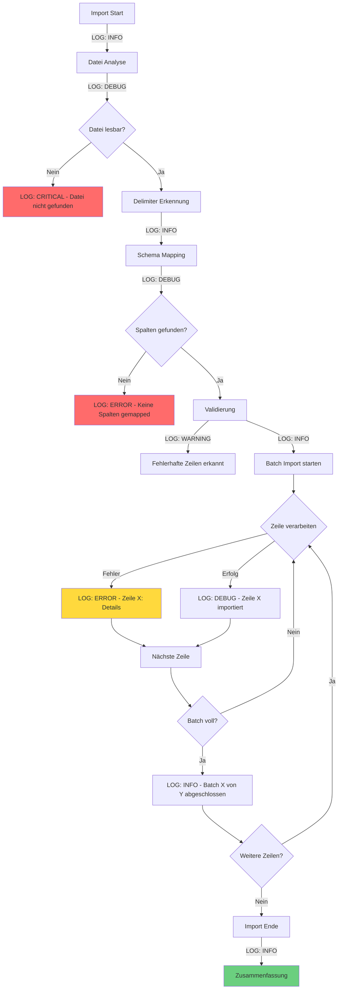

# CSV Import/Export Robustheit & Logging Plan

## 1. Analyse der identifizierten Probleme

### Kritische Fehler

#### 1.1 Division durch Null in `analyzeFile()`
**Datei:** [`lib/core/data/csv_import_service_v2.dart:490`](lib/core/data/csv_import_service_v2.dart:490)

**Problem:**
```dart
final estimatedTotalLines = (totalBytes / buffer.length * lines).round();
```
Wenn `buffer.length == 0` (leere Datei oder Lesefehler), führt dies zu einer Division durch Null.

**Status in v1:** ✅ Behoben (Zeile 491-493)  
**Status in v2:** ❌ Nicht behoben

**Auswirkung:** Kompletter Crash beim Analysieren leerer Dateien

---

#### 1.2 NULL-Handling Fehler in `_toVariable()`
**Dateien:** 
- [`lib/core/data/csv_import_service.dart:771-783`](lib/core/data/csv_import_service.dart:771)
- [`lib/core/data/csv_import_service_v2.dart:770-782`](lib/core/data/csv_import_service_v2.dart:770)

**Problem:**
```dart
static Variable _toVariable(dynamic value, ColumnDataType type) {
  switch (type) {
    case ColumnDataType.integer:
      return Variable(value as int);  // ❌ Crash wenn value == null
    case ColumnDataType.real:
      return Variable(value as double);  // ❌ Crash wenn value == null
    // ...
  }
}
```

Der Code führt Type-Casting ohne NULL-Check durch. Dies führt zu einem Crash, wenn:
- Eine nullable Spalte einen NULL-Wert hat
- Die Konvertierung fehlschlägt und NULL zurückgibt

**Auswirkung:** Import-Abbruch bei NULL-Werten, obwohl diese erlaubt sind

---

#### 1.3 Fehlende Fehler-Resilienz in `_executeBatch()`
**Dateien:**
- [`lib/core/data/csv_import_service.dart:706-741`](lib/core/data/csv_import_service.dart:706)
- [`lib/core/data/csv_import_service_v2.dart:705-741`](lib/core/data/csv_import_service_v2.dart:705)

**Problem:**
```dart
await db.transaction(() async {
  for (final row in rows) {
    // ...
    await db.customStatement(sql, variables);  // ❌ Fehler bricht ALLES ab
    count++;
  }
});
```

Wenn **eine einzelne Zeile** fehlschlägt:
- Bricht die gesamte Transaktion ab
- **Alle Zeilen im Batch** (100 Zeilen) gehen verloren
- Keine Information, welche konkrete Zeile das Problem verursacht hat

**Auswirkung:** Massive Datenverluste bei partiellen Fehlern

---

#### 1.4 Falsche Tabellennamen im CSV Export Dialog
**Datei:** [`lib/common_widgets/csv_export_dialog.dart:216-227`](lib/common_widgets/csv_export_dialog.dart:216)

**Problem:**
```dart
static const _tables = [
  ('mitglieds', 'Mitglieder'),      // ❌ sollte 'mitglied' sein
  ('leistung', 'Leistungen'),       // ✅ korrekt
  ('beitraege', 'Beiträge'),        // ❌ sollte 'beitrag' sein
  ('waren', 'Waren'),               // ✅ korrekt
  ('rechnungen', 'Rechnungen'),     // ❌ sollte 'rechnung' sein
  ('preis', 'Preise'),              // ✅ korrekt
  ('bemerkung', 'Bemerkungen'),     // ✅ korrekt
  ('beitrag_status_verlauf', 'Beitrag Status Verlauf'),  // ✅ korrekt
  ('rechnung_positionen', 'Rechnung Positionen'),  // ❌ sollte 'rechnung_position' sein
  ('stammdaten', 'Stammdaten'),     // ✅ korrekt
];
```

**Auswirkung:** Export schlägt fehl mit SQL-Fehler "no such table"

---

### Strukturelle Probleme

#### 1.5 Unzureichendes Logging
**Akteller Zustand:**
```dart
debugPrint('=== CSV Import gestartet ===');
debugPrint('Fehler: $e');
```

**Probleme:**
- Keine strukturierten Log-Level (INFO, WARNING, ERROR)
- Keine Kontextinformationen (Zeile, Spalte, Wert)
- Keine Unterscheidung zwischen verschiedenen Fehlerarten
- Keine Trace-IDs für Durchverfolgbarkeit

---

#### 1.6 Ineffiziente Fehlersammlung
**Datei:** [`lib/common_widgets/csv_import_dialog.dart:155`](lib/common_widgets/csv_import_dialog.dart:155)

```dart
if (!isCancelled && validationErrors.value.length < 10) {
  failedRows.value++;
  validationErrors.value = [...validationErrors.value, 'Zeile $rowIndex: $error'];
}
```

**Probleme:**
- Limit von 10 Fehlern ohne Hinweis auf weitere
- Benutzer sieht nicht alle Probleme
- Bei 1000 fehlerhaften Zeilen: Nur 10 werden angezeigt

---

#### 1.7 Fehlende Validierung vor Import
**Problem:**
- Import beginnt sofort ohne Pre-Validation
- Benutzer erfährt erst während des Imports von Problemen
- Keine "Trockenlauffunktion"

---

## 2. Logging-Strategie

### 2.1 Log-Level Hierarchie

```dart
enum ImportLogLevel {
  debug,    // Detaillierte Ablaufinformationen
  info,     // Normale Fortschritte
  warning,  // Probleme die behoben wurden
  error,    // Fehler die den Import beeinträchtigen
  critical, // Fehler die den Import abbrechen
}
```

### 2.2 Strukturierte Log-Einträge

```dart
class ImportLogEntry {
  final DateTime timestamp;
  final ImportLogLevel level;
  final ImportPhase phase;
  final String message;
  final Map<String, dynamic>? context;
  final Object? error;
  final StackTrace? stackTrace;
}

enum ImportPhase {
  initialization,
  fileAnalysis,
  schemaMapping,
  dataValidation,
  dataImport,
  completion,
}
```

### 2.3 Logging-Punkte im Ablauf



---

## 3. Lösungsarchitektur

### 3.1 Robuste NULL-Behandlung

```dart
/// Konvertiert einen Wert in eine Drift Variable mit NULL-Safety
static Variable _toVariable(dynamic value, ColumnDataType type) {
  // NULL-Werte explizit behandeln
  if (value == null) {
    return const Variable(null);
  }

  switch (type) {
    case ColumnDataType.integer:
      if (value is! int) {
        throw TypeError('Expected int but got ${value.runtimeType}');
      }
      return Variable<int>(value);
      
    case ColumnDataType.real:
      if (value is! double) {
        throw TypeError('Expected double but got ${value.runtimeType}');
      }
      return Variable<double>(value);
      
    case ColumnDataType.text:
      return Variable<String>(value.toString());
      
    case ColumnDataType.boolean:
      if (value is bool) {
        return Variable<int>(value ? 1 : 0);
      } else if (value is int) {
        return Variable<int>(value);
      } else {
        throw TypeError('Expected bool or int but got ${value.runtimeType}');
      }
      
    case ColumnDataType.datetime:
      if (value is! DateTime) {
        throw TypeError('Expected DateTime but got ${value.runtimeType}');
      }
      return Variable<DateTime>(value);
  }
}
```

### 3.2 Fehler-resiliente Batch-Verarbeitung

**Ziel:** Einzelne fehlerhafte Zeilen überspringen, restliche Zeilen importieren

```dart
static Future<BatchImportResult> _executeBatch(
  AppDatabase db,
  String tableName,
  List<ColumnSchema> columns,
  List<Map<String, dynamic>> rows,
  ImportLogger logger,
) async {
  var successCount = 0;
  var failureCount = 0;
  final failedRows = <int, String>{};

  // KEINE db.transaction() hier - jede Zeile einzeln
  for (var i = 0; i < rows.length; i++) {
    final row = rows[i];
    
    try {
      final insertColumns = <String>[];
      final variables = <Variable>[];

      for (final entry in row.entries) {
        final colName = entry.key;
        final value = entry.value;
        
        insertColumns.add(colName);
        
        final colSchema = columns.firstWhere((c) => c.name == colName);
        
        try {
          variables.add(_toVariable(value, colSchema.dataType));
        } catch (e) {
          logger.error(
            phase: ImportPhase.dataImport,
            message: 'Typ-Konvertierung fehlgeschlagen',
            context: {
              'column': colName,
              'value': value,
              'expectedType': colSchema.dataType.toString(),
            },
            error: e,
          );
          throw ImportRowException('Spalte "$colName": $e');
        }
      }

      if (insertColumns.isEmpty) {
        throw ImportRowException('Keine Daten zum Importieren');
      }

      final placeholders = insertColumns.map((_) => '?').join(', ');
      final sql = 'INSERT INTO $tableName (${insertColumns.join(', ')}) VALUES ($placeholders)';

      // Jede Zeile in eigener Transaktion = atomare Operation
      await db.transaction(() async {
        await db.customStatement(sql, variables);
      });
      
      successCount++;
      
      logger.debug(
        phase: ImportPhase.dataImport,
        message: 'Zeile erfolgreich importiert',
        context: {'rowIndex': i, 'columns': insertColumns.length},
      );
      
    } catch (e, stackTrace) {
      failureCount++;
      failedRows[i] = e.toString();
      
      logger.error(
        phase: ImportPhase.dataImport,
        message: 'Import der Zeile fehlgeschlagen',
        context: {
          'rowIndex': i,
          'rowData': row,
        },
        error: e,
        stackTrace: stackTrace,
      );
      
      // Weiter mit nächster Zeile
      continue;
    }
  }

  return BatchImportResult(
    successCount: successCount,
    failureCount: failureCount,
    failedRows: failedRows,
  );
}

class BatchImportResult {
  final int successCount;
  final int failureCount;
  final Map<int, String> failedRows;  // Index -> Error Message
  
  const BatchImportResult({
    required this.successCount,
    required this.failureCount,
    required this.failedRows,
  });
}
```

### 3.3 Import Logger Implementation

```dart
class ImportLogger {
  final List<ImportLogEntry> _logs = [];
  final void Function(ImportLogEntry)? onLog;
  
  ImportLogger({this.onLog});
  
  List<ImportLogEntry> get logs => List.unmodifiable(_logs);
  
  void debug({
    required ImportPhase phase,
    required String message,
    Map<String, dynamic>? context,
  }) => _log(ImportLogLevel.debug, phase, message, context);
  
  void info({
    required ImportPhase phase,
    required String message,
    Map<String, dynamic>? context,
  }) => _log(ImportLogLevel.info, phase, message, context);
  
  void warning({
    required ImportPhase phase,
    required String message,
    Map<String, dynamic>? context,
    Object? error,
  }) => _log(ImportLogLevel.warning, phase, message, context, error: error);
  
  void error({
    required ImportPhase phase,
    required String message,
    Map<String, dynamic>? context,
    Object? error,
    StackTrace? stackTrace,
  }) => _log(ImportLogLevel.error, phase, message, context, error: error, stackTrace: stackTrace);
  
  void critical({
    required ImportPhase phase,
    required String message,
    Map<String, dynamic>? context,
    Object? error,
    StackTrace? stackTrace,
  }) => _log(ImportLogLevel.critical, phase, message, context, error: error, stackTrace: stackTrace);
  
  void _log(
    ImportLogLevel level,
    ImportPhase phase,
    String message,
    Map<String, dynamic>? context, {
    Object? error,
    StackTrace? stackTrace,
  }) {
    final entry = ImportLogEntry(
      timestamp: DateTime.now(),
      level: level,
      phase: phase,
      message: message,
      context: context,
      error: error,
      stackTrace: stackTrace,
    );
    
    _logs.add(entry);
    onLog?.call(entry);
    
    // Auch in debugPrint für Development
    _printLog(entry);
  }
  
  void _printLog(ImportLogEntry entry) {
    final timestamp = entry.timestamp.toIso8601String();
    final level = entry.level.name.toUpperCase().padRight(8);
    final phase = entry.phase.name.padRight(15);
    
    debugPrint('[$timestamp] $level [$phase] ${entry.message}');
    
    if (entry.context != null && entry.context!.isNotEmpty) {
      debugPrint('  Context: ${entry.context}');
    }
    
    if (entry.error != null) {
      debugPrint('  Error: ${entry.error}');
    }
    
    if (entry.stackTrace != null) {
      debugPrint('  Stack: ${entry.stackTrace}');
    }
  }
  
  /// Exportiert Logs als lesbare Datei
  String exportLogs() {
    final buffer = StringBuffer();
    buffer.writeln('='.repeat(80));
    buffer.writeln('CSV IMPORT LOG');
    buffer.writeln('Generated: ${DateTime.now().toIso8601String()}');
    buffer.writeln('='.repeat(80));
    buffer.writeln();
    
    for (final entry in _logs) {
      buffer.writeln('[${entry.timestamp.toIso8601String()}] ${entry.level.name.toUpperCase()}');
      buffer.writeln('Phase: ${entry.phase.name}');
      buffer.writeln('Message: ${entry.message}');
      
      if (entry.context != null) {
        buffer.writeln('Context:');
        entry.context!.forEach((key, value) {
          buffer.writeln('  $key: $value');
        });
      }
      
      if (entry.error != null) {
        buffer.writeln('Error: ${entry.error}');
      }
      
      if (entry.stackTrace != null) {
        buffer.writeln('Stack Trace:');
        buffer.writeln(entry.stackTrace.toString());
      }
      
      buffer.writeln('-'.repeat(80));
    }
    
    return buffer.toString();
  }
  
  /// Zusammenfassung für UI
  ImportLogSummary getSummary() {
    var errorCount = 0;
    var warningCount = 0;
    
    for (final log in _logs) {
      if (log.level == ImportLogLevel.error || log.level == ImportLogLevel.critical) {
        errorCount++;
      } else if (log.level == ImportLogLevel.warning) {
        warningCount++;
      }
    }
    
    return ImportLogSummary(
      totalLogs: _logs.length,
      errors: errorCount,
      warnings: warningCount,
      firstError: _logs.firstWhereOrNull((l) => l.level == ImportLogLevel.error),
      criticalError: _logs.firstWhereOrNull((l) => l.level == ImportLogLevel.critical),
    );
  }
}

class ImportLogSummary {
  final int totalLogs;
  final int errors;
  final int warnings;
  final ImportLogEntry? firstError;
  final ImportLogEntry? criticalError;
  
  const ImportLogSummary({
    required this.totalLogs,
    required this.errors,
    required this.warnings,
    this.firstError,
    this.criticalError,
  });
}

extension _StringRepeat on String {
  String repeat(int count) => List.filled(count, this).join();
}

extension _FirstWhereOrNull<T> on Iterable<T> {
  T? firstWhereOrNull(bool Function(T) test) {
    for (final element in this) {
      if (test(element)) return element;
    }
    return null;
  }
}
```

---

## 4. Implementierungsplan

### Phase 1: Kritische Bugfixes (Priorität: HOCH)
1. ✅ Division durch Null in `csv_import_service_v2.dart` beheben
2. ✅ NULL-Handling in `_toVariable()` implementieren (beide Services)
3. ✅ Fehler-resiliente `_executeBatch()` implementieren
4. ✅ Tabellennamen in `csv_export_dialog.dart` korrigieren

### Phase 2: Logging-Infrastruktur (Priorität: HOCH)
5. ✅ `ImportLogger` Klasse implementieren
6. ✅ `ImportLogEntry` und Enums hinzufügen
7. ✅ Logger in `importFile()` integrieren
8. ✅ Log-Export-Funktion für Debugging

### Phase 3: UI-Integration (Priorität: MITTEL)
9. ✅ Detaillierte Fehleranzeige im Dialog
10. ✅ Log-Download-Button hinzufügen
11. ✅ Erweiterte Fehlerstatistik anzeigen

### Phase 4: Erweiterte Features (Priorität: NIEDRIG)
12. ⬜ Pre-Validation vor Import (Trockenlauffunktion)
13. ⬜ Progress-Callbacks mit mehr Details
14. ⬜ Rollback-Mechanismus für fehlgeschlagene Importe

---

## 5. Test-Szenarien

### 5.1 Fehlerfall-Tests

| Test-ID | Szenario | Erwartetes Verhalten |
|---------|----------|----------------------|
| T01 | Leere CSV-Datei | Keine Division durch Null, klare Fehlermeldung |
| T02 | NULL in NOT NULL Spalte | Zeile wird übersprungen, Error geloggt |
| T03 | Falscher Datentyp (Text statt Zahl) | Zeile wird übersprungen, Error geloggt |
| T04 | Fehlendes Pflichtfeld | Zeile wird übersprungen, Error geloggt |
| T05 | 50% fehlerhafte Zeilen | 50% importiert, 50% übersprungen, beide Listen korrekt |
| T06 | Ungültiges Datum | Zeile wird übersprungen, Error geloggt |
| T07 | Foreign Key Constraint Verletzung | Zeile wird übersprungen, Error geloggt |
| T08 | CSV mit falschem Delimiter | Auto-Detection oder User-Feedback |
| T09 | UTF-8 BOM Handling | Korrekt erkannt und entfernt |
| T10 | Sehr große Datei (>100MB) | Streaming funktioniert, kein Memory-Overflow |

### 5.2 Erfolgs-Tests

| Test-ID | Szenario | Erwartetes Verhalten |
|---------|----------|----------------------|
| S01 | Standard-Import 1000 Zeilen | 100% Erfolg, korrekte Progress-Anzeige |
| S02 | Import mit NULL-Werten | NULL-Werte korrekt gespeichert |
| S03 | Europäische Zahlenformate | 1.234,56 korrekt als 1234.56 importiert |
| S04 | Deutsche Datumsformate | dd.MM.yyyy korrekt erkannt |
| S05 | Overwrite-Modus | Alte Daten gelöscht, neue importiert |
| S06 | Append-Modus | Alte Daten bleiben, neue hinzugefügt |

---

## 6. Beispiel-Log-Output

```
================================================================================
CSV IMPORT LOG
Generated: 2026-04-22T12:30:45.123Z
================================================================================

[2026-04-22T12:30:45.123Z] INFO
Phase: initialization
Message: CSV Import gestartet
Context:
  filePath: /path/to/members.csv
  tableName: mitglied
  mode: append
  batchSize: 100
--------------------------------------------------------------------------------

[2026-04-22T12:30:45.201Z] DEBUG
Phase: fileAnalysis
Message: Delimiter automatisch erkannt
Context:
  delimiter: ;
  headerCount: 15
  estimatedRows: 523
  fileSize: 87451
--------------------------------------------------------------------------------

[2026-04-22T12:30:45.234Z] INFO
Phase: schemaMapping
Message: Spalten-Mapping erstellt
Context:
  mappedColumns: 12
  unmappedColumns: 3
  unmappedColumnNames: [custom_field_1, legacy_id, temp_column]
--------------------------------------------------------------------------------

[2026-04-22T12:30:45.789Z] ERROR
Phase: dataImport
Message: Import der Zeile fehlgeschlagen
Context:
  rowIndex: 47
  rowData: {name: Mueller, email: invalid-email, geboren: 32.13.1990}
Error: Exception: Pflichtfeld "email" hat ungültiges Format
--------------------------------------------------------------------------------

[2026-04-22T12:30:46.012Z] WARNING
Phase: dataImport
Message: Typ-Konvertierung mit Fallback
Context:
  column: telefon
  value: +49-123-456789
  expectedType: text
  actualType: text
--------------------------------------------------------------------------------

[2026-04-22T12:30:48.456Z] INFO
Phase: completion
Message: Import abgeschlossen
Context:
  duration: 3.3s
  totalRows: 523
  imported: 519
  failed: 4
  successRate: 99.23%
--------------------------------------------------------------------------------
```

---

## 7. Migrationsstrategie

### Empfehlung: Service V1 vs V2

**Aktueller Stand:**
- `csv_import_service.dart` (V1): Hat Division-durch-Null-Fix
- `csv_import_service_v2.dart` (V2): Hat diesen Fix NICHT

**Entscheidung:**
- ✅ **V1 als Basis verwenden** (bereits robuster)
- ❌ V2 ist redundant und hat weniger Bugfixes
- 📝 V2 kann gelöscht werden nach Migration

**Vorgehen:**
1. V1 mit allen Fixes aktualisieren
2. V2-spezifische Features in V1 integrieren (falls vorhanden)
3. `csv_import_dialog_v2.dart` auf V1-Service migrieren
4. V2-Dateien als deprecated markieren
5. Nach Testphase V2-Dateien löschen

---

## 8. Code-Qualitätskriterien

### Nach Implementierung müssen erfüllt sein:

- [ ] Keine Division durch Null möglich
- [ ] Alle NULL-Werte sicher behandelt
- [ ] Einzelne fehlerhafte Zeilen brechen Import nicht ab
- [ ] Jeder Fehler hat genaue Zeilen- und Spaltenangabe
- [ ] Log-Export als Datei möglich
- [ ] Alle Tabellennamen korrekt
- [ ] Performance: >1000 Zeilen/Sekunde
- [ ] Memory: <100MB für 100.000 Zeilen
- [ ] Alle Tests (T01-T10, S01-S06) bestanden

---

## 9. Dokumentation für Benutzer

### Error Messages - Verständlich formulieren

**❌ Schlecht:**
```
Error: Exception: type 'String' is not a subtype of type 'int' in type cast
```

**✅ Gut:**
```
Zeile 47, Spalte "alter": Der Wert "dreißig" ist keine gültige Zahl.
Erlaubtes Format: Ganzzahl (z.B. 30)
```

### Hilfestellung im Dialog

```
┌─────────────────────────────────────────────┐
│ ⚠️  Import mit Fehlern abgeschlossen        │
├─────────────────────────────────────────────┤
│ ✅ Erfolgreich: 519 Zeilen                  │
│ ❌ Fehlgeschlagen: 4 Zeilen                 │
│                                             │
│ Häufigste Fehler:                           │
│ • Zeile 47: Ungültiges E-Mail-Format        │
│ • Zeile 103: Pflichtfeld "name" fehlt       │
│ • Zeile 204: Datum "32.13.1990" ungültig    │
│ • Zeile 391: Duplikat (bereits vorhanden)   │
│                                             │
│ [Alle Fehler anzeigen]  [Log herunterladen] │
└─────────────────────────────────────────────┘
```

---

## 10. Zusammenfassung

### Kritische Änderungen (müssen sofort erfolgen):
1. NULL-Handling in `_toVariable()`
2. Fehler-resiliente `_executeBatch()`
3. Division-durch-Null-Fix in V2
4. Tab