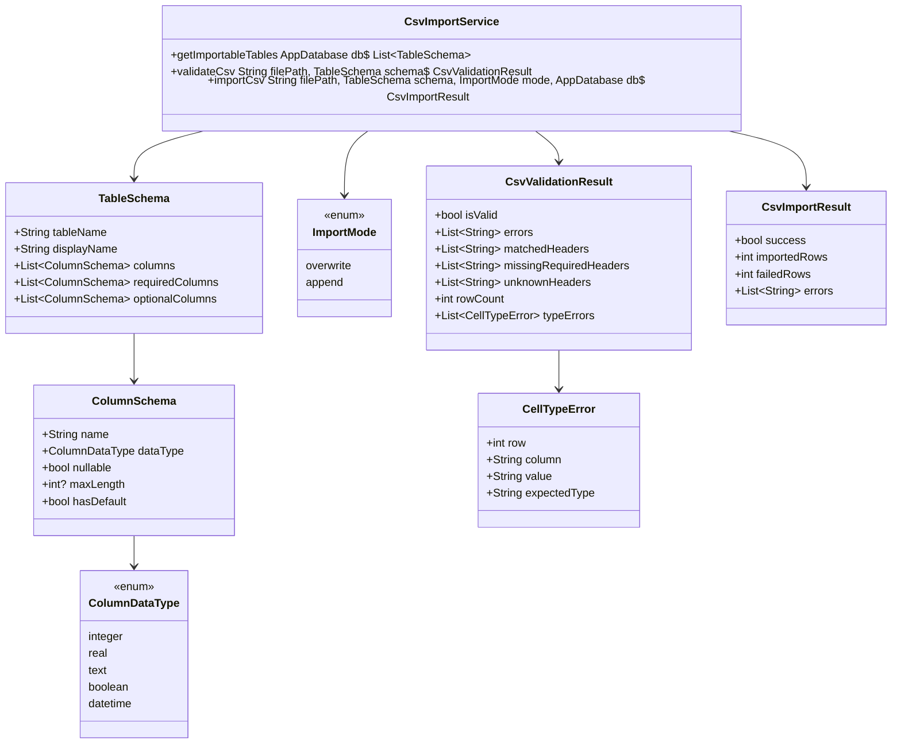
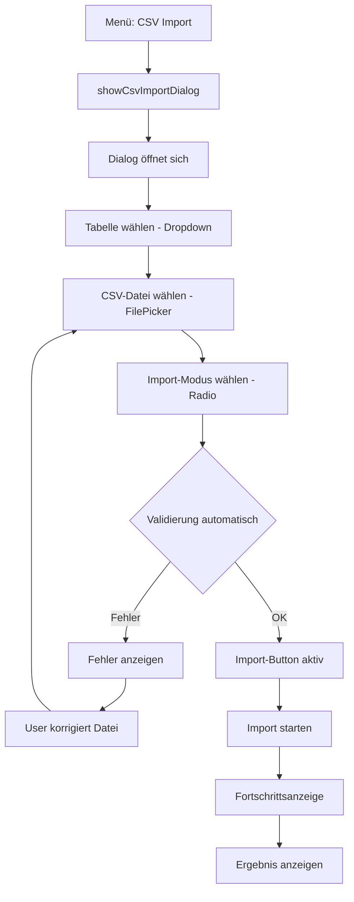
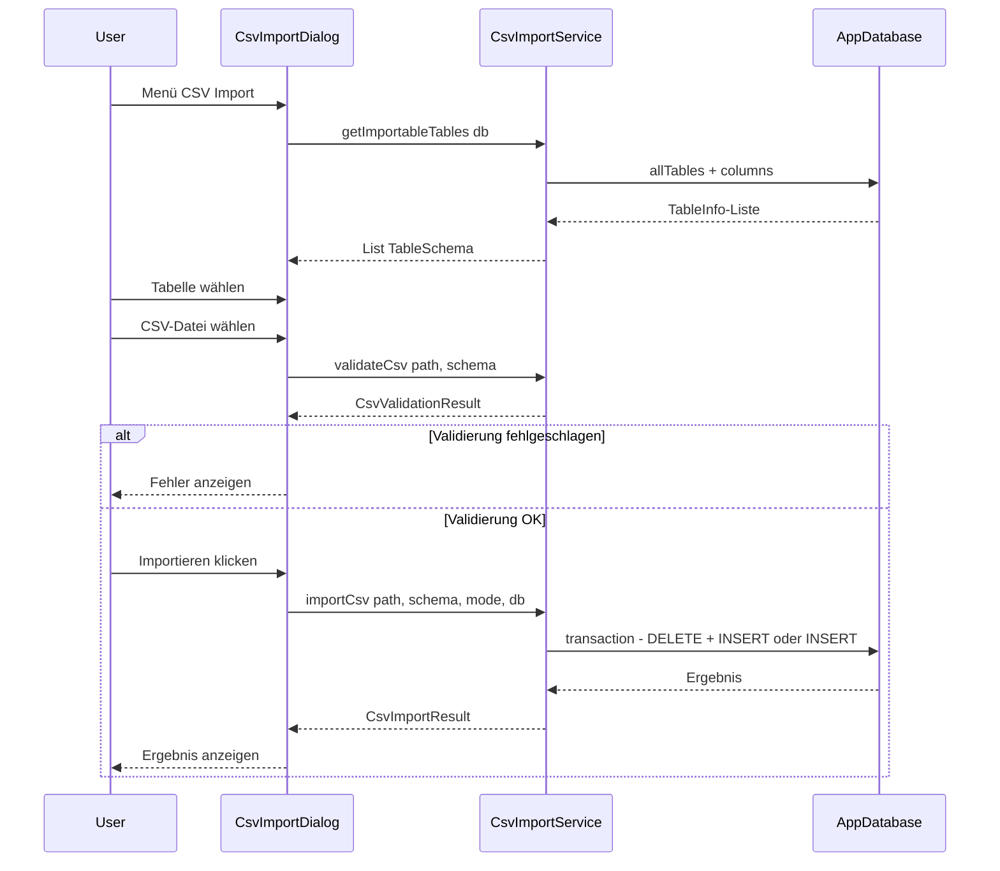

# CSV Import Feature – Architekturplan

## 1. Überblick

Zentrales CSV-Import-Feature, das über das Hauptmenü **Datenübertragung → Import → CSV Import** als Dialog aufgerufen wird. Der User wählt eine Zieltabelle, eine CSV-Datei und den Import-Modus (Überschreiben/Anfügen). Vor dem Import erfolgt eine automatische Validierung von Headern und Datentypen.

## 2. Architektur-Entscheidungen

| Entscheidung | Begründung |
|---|---|
| **Dialog statt Screen** | Konsistent mit bestehendem Backup/Restore-Pattern in `database_backup_dialog.dart` |
| **Service als statische Klasse** | Konsistent mit `DatabaseBackupService` – kein Riverpod-Provider, DB wird als Parameter übergeben |
| **Keine neuen Dependencies** | `csv` und `file_picker` sind bereits im Projekt |
| **Semicolon als Delimiter** | Konsistent mit `CsvExporter` – Deutsch/Excel-Kompatibilität |
| **UTF-8 BOM Support** | Konsistent mit Export – sichert Umlaut-Erkennung |

## 3. Komponenten-Design

### 3.1 Dateistruktur

```
lib/
├── core/data/
│   └── csv_import_service.dart       # Parsing, Validierung, Import-Logik
├── common_widgets/
│   └── csv_import_dialog.dart        # UI-Dialog
```

### 3.2 Klassendiagramm



### 3.3 CsvImportService – Detaildesign

```dart
/// Zentraler Service für CSV-Import.
///
/// Parsing, Validierung und Import in einer Klasse.
/// Kein Riverpod-Provider – DB wird als Parameter übergeben,
/// konsistent mit DatabaseBackupService.
class CsvImportService {
  CsvImportService._();

  /// Liefert alle importierbaren Tabellen mit ihren Schemas.
  /// Nutzt Drift's allTables + GeneratedColumn Metadata.
  static List<TableSchema> getImportableTables(AppDatabase db);

  /// Validiert eine CSV-Datei gegen das Tabellen-Schema.
  /// Prüft: Header-Existenz, Pflichtspalten, Datentypen.
  /// Wird VOR dem eigentlichen Import aufgerufen.
  static CsvValidationResult validateCsv(String filePath, TableSchema schema);

  /// Führt den Import durch.
  /// Modus 'overwrite': DELETE + INSERT (Transaktion)
  /// Modus 'append': INSERT only (Transaktion)
  static CsvImportResult importCsv(
    String filePath,
    TableSchema schema,
    ImportMode mode,
    AppDatabase db,
  );
}
```

**Schema-Ermittlung über Drift API:**

```dart
// Drift bietet alle Metadaten die wir brauchen:
for (final tableInfo in db.allTables) {
  final columns = tableInfo.columns;
  for (final col in columns) {
    // col.name        → Spaltenname
    // col.nullable    → Nullable?
    // col is IntColumn → Datentyp integer
    // col is TextColumn → Datentyp text + maxLength
    // col is RealColumn → Datentyp real
    // col is BoolColumn → Datentyp boolean
    // col is DateTimeColumn → Datentyp datetime
  }
}
```

**Import-Logik (Transaktions-basiert):**

```dart
// Overwrite-Modus: Alles in einer Transaktion
await db.transaction(() async {
  await db.delete(table).go();           // Bestehende Daten löschen
  for (final row in parsedRows) {
    await db.into(table).insert(row);    // Neue Daten einfügen
  }
});

// Append-Modus: Einfach einfügen
await db.transaction(() async {
  for (final row in parsedRows) {
    await db.into(table).insert(row);
  }
});
```

### 3.4 CsvImportDialog – UI-Design



**UI-Elemente:**

| Element | Typ | Beschreibung |
|---|---|---|
| Warnbanner | Banner | Gelb, Icon Warnung: Datensicherung vor Import empfohlen, mit Button Backup starten |
| Tabelle | DropdownButton | Alle DB-Tabellen mit deutschem Anzeigename |
| CSV-Datei | Button + Text | FilePicker, zeigt Dateinamen nach Auswahl |
| Import-Modus | Radio | Überschreiben / Anfügen |
| Validierungsergebnis | Bereich | Zeigt Header-Matches, Fehler, Zeilenanzahl |
| Import-Button | FilledButton | Aktiv erst nach erfolgreicher Validierung |
| Fortschritt | CircularProgressIndicator | Während Import läuft |
| Ergebnis | Text | X Zeilen importiert / Fehler-Liste |

**Dialog-Layout:**

```
┌─────────────────────────────────────────────────┐
│  CSV Import                                     │
├─────────────────────────────────────────────────┤
│  ⚠️ Empfehlung: Führen Sie vor dem Import eine  │
│     Datensicherung durch.  [Backup starten]     │
├─────────────────────────────────────────────────┤
│  Zieltabelle:  [▼ Mitglieder          ]         │
│                                                  │
│  CSV-Datei:    [Datei auswählen...]  mitglieder.csv│
│                                                  │
│  Import-Modus:  ○ Überschreiben  ● Anfügen      │
│                                                  │
│  ┌─ Validierung ──────────────────────────────┐ │
│  │ ✓ Header: 8/10 Spalten erkannt             │ │
│  │ ✓ Datentypen: Alle Werte korrekt           │ │
│  │ ✓ 145 Zeilen zum Import bereit             │ │
│  │ ⚠ Unbekannte Spalten: alter, nettopreis    │ │
│  └────────────────────────────────────────────┘ │
│                                                  │
│                    [Abbrechen] [Importieren]     │
└─────────────────────────────────────────────────┘
```

### 3.5 Menü-Integration

**Änderung in `main_menu_bar.dart`:**

```dart
// VORHER: Setzt nur den Menütext
PopupMenuItem(
  child: const Text('CSV Import'),
  onTap: () => ref
      .read(activeMenuItemProvider.notifier)
      .setActiveItem('Datenübertragung > Import > CSV Import'),
),

// NACHHER: Zeigt direkt den Dialog (wie Backup/Restore)
PopupMenuItem(
  child: const Text('CSV Import'),
  onTap: () => showCsvImportDialog(context, ref),
),
```

## 4. CSV-Format-Spezifikation

| Eigenschaft | Wert |
|---|---|
| Delimiter | Semicolon `;` |
| Encoding | UTF-8 (BOM optional, wird toleriert) |
| Header | **Zwingend** – erste Zeile muss Spaltennamen enthalten |
| Spaltennamen | Müssen DB-Spaltennamen entsprechen, z.B. `name`, `vorname` |
| Datumsformat | `dd.MM.yyyy` oder `yyyy-MM-dd` (beide akzeptiert) |
| Zahlenformat | Deutsch: `1234,56` oder ISO: `1234.56` |
| Boolean | `1`/`0` oder `true`/`false` |
| Pflichtspalten | Alle NOT NULL-Spalten ohne Default, außer `id` |

**Beispiel CSV für Tabelle mitglied:**

```csv
name;vorname;plz;ort;email
Müller;Hans;10115;Berlin;hans@example.de
Schmidt;Anna;80331;München;anna@example.de
```

## 5. Validierungs-Regeln

### 5.1 Header-Validierung

| Prüfung | Ergebnis | Typ |
|---|---|---|
| Alle Pflichtspalten vorhanden | Fehlende Pflichtspalte → Fehler | Error |
| Unbekannte Spaltennamen | Wird ignoriert, aber als Warnung angezeigt | Warning |
| `id`-Spalte in CSV | Wird ignoriert, autoIncrement übernimmt ID | Info |

### 5.2 Datentyp-Validierung

| DB-Typ | Akzeptierte Werte | Fehler bei |
|---|---|---|
| INTEGER | Ganzzahlen, optional mit Vorzeichen | `abc`, `1.5` |
| REAL | Zahlen mit Dezimaltrenner `,` oder `.` | `abc` |
| TEXT | Beliebiger Text | – |
| BOOLEAN | `0`, `1`, `true`, `false` | Andere Werte |
| DATETIME/DATE | `dd.MM.yyyy`, `yyyy-MM-dd`, ISO 8601 | Ungültiges Datum |

### 5.3 Nullable-Validierung

- NOT NULL-Spalten ohne Default: Leerwert → Fehler
- Nullable-Spalten: Leerwert → `NULL` in DB
- Spalten mit Default: Leerwert → Default-Wert wird verwendet

## 6. Ablaufdiagramm



## 7. Tabellen-Anzeigename-Mapping

Für die Dropdown-Box werden deutsche Anzeigenamen verwendet:

| Drift-Tabelle | Anzeigename |
|---|---|
| `Bemerkung` | Bemerkungen |
| `Stammdaten` | Stammdaten |
| `Preis` | Preise |
| `Leistung` | Leistungen |
| `Mitglieds` | Mitglieder |
| `Waren` | Waren |
| `Beitraege` | Beiträge |
| `BeitragStatusVerlauf` | Beitragsstatus-Verlauf |
| `Rechnungen` | Rechnungen |
| `RechnungPositionen` | Rechnungspositionen |

## 8. Implementierungs-Schritte

1. **`csv_import_service.dart`** erstellen – TableSchema, ColumnSchema, Enums, Validierung, Import-Logik
2. **`csv_import_dialog.dart`** erstellen – UI-Dialog mit allen Elementen
3. **`main_menu_bar.dart`** anpassen – CSV Import ruft Dialog auf statt activeMenuItem
4. **Testen** – Manueller Test mit verschiedenen CSV-Dateien und Tabellen

## 9. Randbedingungen

- **Kein Overengineering**: Keine abstrakten Basisklassen, keine Factory-Pattern, keine Interfaces – simple statische Methoden wie bei `DatabaseBackupService`
- **Keine neuen Dependencies**: Nur `csv` und `file_picker` die bereits vorhanden sind
- **Transaktionssicherheit**: Import läuft in einer DB-Transaktion – bei Fehler wird alles zurückgerollt
- **Backup-Empfehlung**: UI zeigt Warnung mit direktem Link zum Backup-Dialog
- **Fehler-Toleranz**: Validierung zeigt alle Fehler auf einmal, nicht nur den ersten
- **Deutschsprachig**: Alle UI-Texte und Fehlermeldungen auf Deutsch
