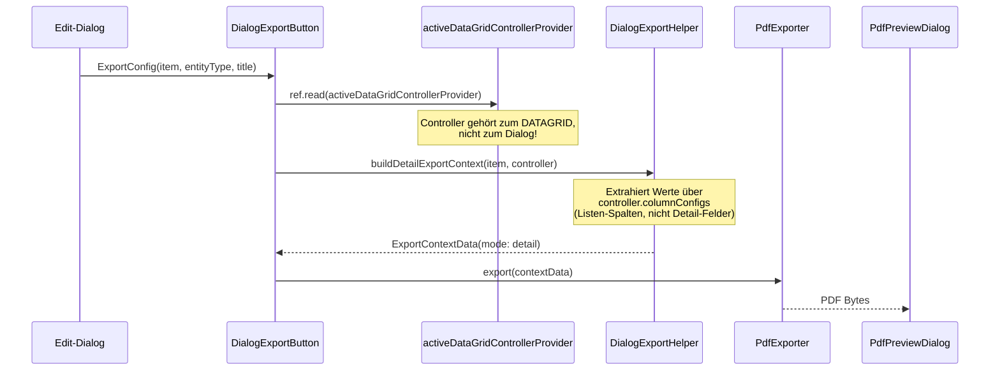
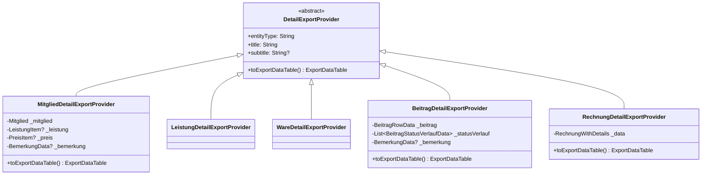
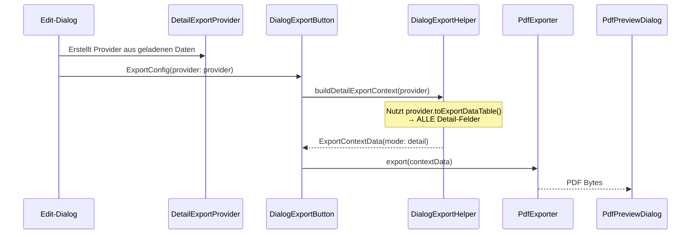

# Plan: Detail-Export für Edit-Dialoge (PDF & Drucken)

> **Status**: Planung | **Erstellt**: 2026-06-09 | **Modus**: Flutter Architect

## 1. Problemstellung

Die aktuellen PDF-Export- und Druck-Buttons in Edit-Dialogen (`DialogExportButton`, `DialogPrintButton`) extrahieren Felddaten über den `activeDataGridControllerProvider`. Dieser Controller enthält aber nur die **Listen-Spalten** der DataGrid-Ansicht — nicht die vollständigen Detail-Felder des Edit-Dialogs.

**Konkret**: Ein Rechnungs-Edit-Dialog zeigt z.B. Positionen, Summen, Bemerkung und Status-Historie — der Export enthält aber nur die 5 Spalten der Listenansicht.

### 1.1 Aktueller Export-Flow (Detail)



### 1.2 Kernproblem

| Komponente | Problem |
|---|---|
| [`DialogExportHelper.buildDetailExportContext()`](lib/features/export/services/dialog_export_helper.dart:16) | Nutzt `controller.columnConfigs` → nur Listen-Spalten |
| [`DialogExportButton._handleExport()`](lib/features/export/presentation/dialog_export_button.dart:70) | Hängt von `activeDataGridControllerProvider` ab |
| [`DialogPrintButton._handlePrint()`](lib/features/export/presentation/dialog_export_button.dart:256) | Gleiche Abhängigkeit |
| `ExportConfig.item` | Wird als `dynamic` übergeben → kein Typsafety |

### 1.3 Betroffene Edit-Dialoge

| Dialog | Detail-Modell | Enthält mehr als Listen-Spalten? |
|---|---|---|
| [`MitgliedEditDialog`](lib/features/members/widgets/member_edit_dialog.dart:374) | `Mitglied` + `Leistung` + `Preis` | ✅ Kontakt, Vertrag, Bemerkung |
| [`LeistungEditDialog`](lib/features/leistungen/widgets/leistung_edit_dialog.dart:188) | `LeistungsDetail` | ✅ Preis-Details, Bemerkung |
| [`WareEditDialog`](lib/features/waren/widgets/waren_edit_dialog.dart:285) | `WarenDetail` | ✅ Eigenschaften, Logistik, Bemerkung |
| [`BeitragEditDialog`](lib/features/beitraege/presentation/dialogs/beitrag_edit_dialog.dart:268) | `BeitragRowData` + Status-Verlauf | ✅ Status-Historie, Bemerkung |
| [`RechnungEditDialog`](lib/features/rechnungen/widgets/rechnung_edit_dialog.dart:333) | `RechnungWithDetails` | ✅ Positionen, Summen, Bemerkung |

---

## 2. Lösungsdesign

### 2.1 Kernidee: `DetailExportProvider` Interface

Jeder Edit-Dialog stellt seine Detail-Daten als `ExportDataTable` bereit — **unabhängig** vom DataGrid-Controller. Die Export-Buttons nutzen diesen Provider statt des DataGrid-Controllers.



### 2.2 Neuer Export-Flow



### 2.3 Interface-Definition (Pseudocode)

```dart
/// Interface for providing detail export data from edit dialogs.
///
/// Each edit dialog creates a concrete implementation that knows
/// which fields to include in the export and how to format them.
/// This decouples the export from the DataGrid controller.
abstract class DetailExportProvider {
  /// Entity type identifier (e.g., 'mitglied', 'rechnung').
  String get entityType;

  /// Display title for the export (e.g., 'Müller, Hans').
  String get title;

  /// Optional subtitle (e.g., 'RE-2026-00001').
  String? get subtitle;

  /// Builds an [ExportDataTable] with ALL detail fields.
  ///
  /// Returns a table with headers ['Feld', 'Wert'] containing
  /// every relevant field from the detail view, properly formatted.
  ExportDataTable toExportDataTable();
}
```

### 2.4 Geänderte `ExportConfig` (Pseudocode)

```dart
class ExportConfig {
  /// Detail export provider (preferred — uses dialog data directly).
  final DetailExportProvider? detailProvider;

  /// Legacy: The item to export (for DataGrid-based export).
  final dynamic item;

  /// Entity type identifier.
  final String entityType;

  /// Display title.
  final String title;

  /// Optional subtitle.
  final String? subtitle;

  const ExportConfig({
    this.detailProvider,
    this.item,
    required this.entityType,
    required this.title,
    this.subtitle,
  });

  /// Returns true if this config has a detail provider.
  bool get hasDetailProvider => detailProvider != null;
}
```

### 2.5 Geänderte Export-Button-Logik (Pseudocode)

```dart
// In DialogExportButton._handleExport():
Future<void> _handleExport(BuildContext context, WidgetRef ref) async {
  ExportContextData exportContext;

  if (exportConfig.detailProvider != null) {
    // NEW: Use detail provider directly — no DataGrid dependency
    exportContext = DialogExportHelper.buildDetailExportContextFromProvider(
      provider: exportConfig.detailProvider!,
    );
  } else {
    // LEGACY: Fall back to DataGrid controller
    final controller = ref.read(activeDataGridControllerProvider);
    if (controller == null) { /* error */ return; }
    exportContext = DialogExportHelper.buildDetailExportContext(
      item: exportConfig.item,
      entityType: exportConfig.entityType,
      title: exportConfig.title,
      controller: controller,
    );
  }

  await showDialog(
    context: context,
    builder: (_) => ExportOptionsDialog(contextData: exportContext),
  );
}
```

---

## 3. Provider-Implementierungen

### 3.1 `MitgliedDetailExportProvider`

**Datenquellen**: `Mitglied`, `LeistungItem?`, `PreisItem?`, `BemerkungData?`

| Feld | Quelle | Format |
|---|---|---|
| Anrede | `mitglied.anrede` | Text |
| Vorname | `mitglied.vorname` | Text |
| Name | `mitglied.name` | Text |
| Geburtsdatum | `mitglied.geboren` | `dd.MM.yyyy` |
| Alter | computed | Integer |
| Geschlecht | `mitglied.geschlecht` | Text |
| PLZ | `mitglied.plz` | Text |
| Ort | `mitglied.ort` | Text |
| Straße | `mitglied.strasse` | Text |
| Hausnummer | `mitglied.hausnummer` | Text |
| Telefon 1 | `mitglied.telefon1` | Text |
| Telefon 2 | `mitglied.telefon2` | Text |
| E-Mail | `mitglied.email` | Text |
| Vertragsart | `leistung.name` | Text |
| Laufzeit | `leistung.laufzeit` | Text |
| Bruttopreis | `preis.bruttopreis` | `1.234,56 €` |
| Kontierung | `mitglied.vertragKontierung` | `dd.MM.yyyy` |
| Laufzeit von | `mitglied.vertragLaufzeitVon` | `dd.MM.yyyy` |
| Laufzeit bis | `mitglied.vertragLaufzeitBis` | `dd.MM.yyyy` |
| Bemerkung Titel | `bemerkung.titel` | Text |
| Bemerkung Text | `bemerkung.textValue` | Text |

### 3.2 `LeistungDetailExportProvider`

**Datenquellen**: `LeistungsDetail` (enthält `LeistungItem`, `PreisItem`, `BemerkungData?`)

| Feld | Quelle | Format |
|---|---|---|
| Name | `leistung.name` | Text |
| Laufzeit | `leistung.laufzeit` | Text |
| Bruttopreis | `preis.bruttopreis` | `1.234,56 €` |
| Nettopreis | computed | `1.234,56 €` |
| Bemerkung Titel | `bemerkung.titel` | Text |
| Bemerkung Text | `bemerkung.textValue` | Text |

### 3.3 `WareDetailExportProvider`

**Datenquellen**: `WarenDetail` (enthält `WarenItem`, `BemerkungData?`)

| Feld | Quelle | Format |
|---|---|---|
| Bezeichnung | `ware.bezeichnung` | Text |
| Kategorie | `ware.kategorie` | Text |
| Beschreibung | `ware.beschreibung` | Text |
| Größe | `ware.groesse` | Text |
| Farbe | `ware.farbe` | Text |
| Geschlecht | `ware.geschlecht` | Text |
| Material | `ware.material` | Text |
| Einkaufspreis | `ware.einkaufspreis` | `1.234,56 €` |
| Bruttopreis | `ware.bruttopreis` | `1.234,56 €` |
| Nettopreis | computed | `1.234,56 €` |
| Bestand | `ware.bestand` | Integer |
| Mindestbestand | `ware.mindestbestand` | Integer |
| Lieferant | `ware.lieferant` | Text |
| Hersteller | `ware.hersteller` | Text |
| Hersteller-Artikelnr. | `ware.herstellerArtikelnr` | Text |
| Gewicht | `ware.gewichtKg` | `1,5 kg` |
| Einheit | `ware.einheit` | Text |
| Aktiv | `ware.aktiv` | Ja/Nein |
| Bemerkung Titel | `bemerkung.titel` | Text |
| Bemerkung Text | `bemerkung.textValue` | Text |

### 3.4 `BeitragDetailExportProvider`

**Datenquellen**: `BeitragRowData`, `List<BeitragStatusVerlaufData>?`, `BemerkungData?`

| Feld | Quelle | Format |
|---|---|---|
| Rechnungsnummer | `beitrag.rechnungsnummer` | Text |
| Mitglied | `rowData.mitgliedName` | Text |
| Leistung | `rowData.leistungName` | Text |
| Status | `beitrag.status` | Label (via `BeitragStatus.fromString`) |
| Kontiert am | `beitrag.kontiertAm` | `dd.MM.yyyy` |
| Abrechnungszeitraum | `beitrag.abrechnungsZeitraum` | `dd.MM.yyyy` |
| Statusdatum | `beitrag.statusDatum` | `dd.MM.yyyy` |
| Bemerkung Titel | `bemerkung.titel` | Text |
| Bemerkung Text | `bemerkung.textValue` | Text |
| **Status-Verlauf** | | *(separater Abschnitt)* |
| {timestamp} | `eintrag.status` | Label + Bemerkung |

### 3.5 `RechnungDetailExportProvider`

**Datenquellen**: `RechnungWithDetails` (enthält `Rechnung`, `List<RechnungPosition>`, `String kundeName`, `BemerkungData?`)

| Feld | Quelle | Format |
|---|---|---|
| Rechnungsnummer | `rechnung.rechnungsnummer` | Text |
| Kunde | `kundeName` | Text |
| Status | `rechnung.status` | Label (via `RechnungStatus.fromString`) |
| Rechnungsdatum | `rechnung.datum` | `dd.MM.yyyy` |
| Fällig am | `rechnung.faelligAm` | `dd.MM.yyyy` |
| Bezahlt am | `rechnung.bezahltAm` | `dd.MM.yyyy` |
| **Positionen** | | *(separater Abschnitt)* |
| Pos 1 | `position.bezeichnung` | `Menge × Einzelpreis = Gesamt` |
| Pos N | ... | ... |
| **Summen** | | |
| Netto | `rechnung.betragNetto` | `1.234,56 €` |
| MwSt | `rechnung.betragMwst` | `1.234,56 €` |
| Brutto | `rechnung.betragBrutto` | `1.234,56 €` |
| Bemerkung Titel | `bemerkung.titel` | Text |
| Bemerkung Text | `bemerkung.textValue` | Text |

---

## 4. Dateistruktur

```
lib/features/export/
├── domain/
│   ├── detail_export_provider.dart          # NEU: Abstract interface
│   └── export_config.dart                   # GEÄNDERT: detailProvider hinzufügen
├── presentation/
│   └── dialog_export_button.dart            # GEÄNDERT: Provider-first Logik
└── services/
    └── dialog_export_helper.dart            # GEÄNDERT: buildDetailExportContextFromProvider()

lib/features/members/widgets/
└── member_edit_dialog.dart                  # GEÄNDERT: Erstellt MemberDetailExportProvider

lib/features/leistungen/widgets/
└── leistung_edit_dialog.dart                # GEÄNDERT: Erstellt LeistungDetailExportProvider

lib/features/waren/widgets/
└── waren_edit_dialog.dart                   # GEÄNDERT: Erstellt WareDetailExportProvider

lib/features/beitraege/presentation/dialogs/
└── beitrag_edit_dialog.dart                 # GEÄNDERT: Erstellt BeitragDetailExportProvider

lib/features/rechnungen/widgets/
└── rechnung_edit_dialog.dart                # GEÄNDERT: Erstellt RechnungDetailExportProvider

lib/common_widgets/
└── app_edit_dialog_scaffold.dart            # GEÄNDERT: ExportConfig → DetailExportProvider
```

---

## 5. ADR: DetailExportProvider statt DataGrid-Controller

### Entscheidung
Die Detail-Export-Funktionalität wird vom `DataGridController` entkoppelt und über ein eigenes `DetailExportProvider`-Interface bereitgestellt.

### Begründung
1. **Korrekttheit**: Der DataGrid-Controller enthält nur Listen-Spalten, nicht Detail-Felder
2. **Entkopplung**: Export sollte nicht von der UI-Komponente (DataGrid) abhängen
3. **OOP**: Jeder Dialog weiß am besten, welche Felder er enthält
4. **Erweiterbarkeit**: Neue Entity-Typen implementieren einfach das Interface
5. **Rückwärtskompatibel**: Legacy-Export über DataGrid-Controller bleibt als Fallback

### Konsequenzen
- `ExportConfig` wird um `detailProvider` erweitert
- `DialogExportHelper` erhält eine neue Methode `buildDetailExportContextFromProvider()`
- Jeder Edit-Dialog erstellt seinen Provider aus geladenen Daten
- `AppEditDialogScaffold` übergibt den Provider an die Export-Buttons

---

## 6. Implementierungs-Reihenfolge

| Schritt | Aufgabe | Dateien | Abhängigkeit |
|---|---|---|---|
| 1 | `DetailExportProvider` Interface erstellen | `lib/features/export/domain/detail_export_provider.dart` | — |
| 2 | `ExportConfig` um `detailProvider` erweitern | `lib/features/export/domain/export_config.dart` | 1 |
| 3 | `DialogExportHelper.buildDetailExportContextFromProvider()` hinzufügen | `lib/features/export/services/dialog_export_helper.dart` | 1 |
| 4 | `DialogExportButton` und `DialogPrintButton` auf Provider-first umstellen | `lib/features/export/presentation/dialog_export_button.dart` | 2, 3 |
| 5 | `AppEditDialogScaffold` — ExportConfig-Übergabe an Buttons prüfen | `lib/common_widgets/app_edit_dialog_scaffold.dart` | 4 |
| 6 | `LeistungDetailExportProvider` implementieren | `lib/features/leistungen/domain/` | 1 |
| 7 | `WareDetailExportProvider` implementieren | `lib/features/waren/domain/` | 1 |
| 8 | `MitgliedDetailExportProvider` implementieren | `lib/features/members/domain/` | 1 |
| 9 | `BeitragDetailExportProvider` implementieren | `lib/features/beitraege/domain/` | 1 |
| 10 | `RechnungDetailExportProvider` implementieren | `lib/features/rechnungen/domain/` | 1 |
| 11 | Edit-Dialoge: Provider erstellen und an ExportConfig übergeben | Alle 5 Edit-Dialoge | 6–10 |
| 12 | `flutter analyze` — keine Errors | — | 11 |

---

## 7. Detail-Provider: Rechnung (Beispiel-Implementierung)

```dart
class RechnungDetailExportProvider implements DetailExportProvider {
  final RechnungWithDetails data;

  RechnungDetailExportProvider(this.data);

  @override
  String get entityType => 'rechnung';

  @override
  String get title => 'Rechnung ${data.rechnung.rechnungsnummer}';

  @override
  String? get subtitle => data.kundeName;

  @override
  ExportDataTable toExportDataTable() {
    final r = data.rechnung;
    final rows = <List<String>>[];

    // Grunddaten
    rows.add(['Rechnungsnummer', r.rechnungsnummer]);
    rows.add(['Kunde', data.kundeName]);
    rows.add(['Status', RechnungStatus.fromString(r.status).label]);
    rows.add(['Rechnungsdatum', DateFormat('dd.MM.yyyy').format(r.datum)]);
    rows.add(['Fällig am', DateFormat('dd.MM.yyyy').format(r.faelligAm)]);
    if (r.bezahltAm != null) {
      rows.add(['Bezahlt am', DateFormat('dd.MM.yyyy').format(r.bezahltAm!)]);
    }

    // Positionen
    rows.add(['', '']);  // Leerzeile
    rows.add(['── Positionen ──', '']);
    for (final pos in data.positionen) {
      rows.add([
        '${pos.positionNr}. ${pos.bezeichnung}',
        '${pos.menge} × ${_formatCurrency(pos.einzelpreisBrutto)} '
        '= ${_formatCurrency(pos.gesamtBrutto)}',
      ]);
    }

    // Summen
    rows.add(['', '']);
    rows.add(['── Summen ──', '']);
    rows.add(['Netto', _formatCurrency(r.betragNetto)]);
    rows.add(['MwSt', _formatCurrency(r.betragMwst)]);
    rows.add(['Brutto', _formatCurrency(r.betragBrutto)]);

    // Bemerkung
    if (data.bemerkung != null) {
      rows.add(['', '']);
      rows.add(['Bemerkung', data.bemerkung!.titel]);
      if (data.bemerkung!.textValue?.isNotEmpty == true) {
        rows.add(['', data.bemerkung!.textValue!]);
      }
    }

    return ExportDataTable(
      title: title,
      headers: ['Feld', 'Wert'],
      rows: rows,
      exportedAt: DateTime.now(),
    );
  }
}
```

---

## 8. Betroffene Dateien (Zusammenfassung)

| Datei | Aktion | Beschreibung |
|---|---|---|
| `lib/features/export/domain/detail_export_provider.dart` | **Neu** | Interface `DetailExportProvider` |
| `lib/features/export/domain/export_config.dart` | **Ändern** | `detailProvider` Feld hinzufügen |
| `lib/features/export/services/dialog_export_helper.dart` | **Ändern** | Neue Methode `buildDetailExportContextFromProvider()` |
| `lib/features/export/presentation/dialog_export_button.dart` | **Ändern** | Provider-first Logik in `DialogExportButton` + `DialogPrintButton` |
| `lib/common_widgets/app_edit_dialog_scaffold.dart` | **Prüfen** | ExportConfig-Übergabe |
| `lib/features/members/widgets/member_edit_dialog.dart` | **Ändern** | Provider erstellen + übergeben |
| `lib/features/leistungen/widgets/leistung_edit_dialog.dart` | **Ändern** | Provider erstellen + übergeben |
| `lib/features/waren/widgets/waren_edit_dialog.dart` | **Ändern** | Provider erstellen + übergeben |
| `lib/features/beitraege/presentation/dialogs/beitrag_edit_dialog.dart` | **Ändern** | Provider erstellen + übergeben |
| `lib/features/rechnungen/widgets/rechnung_edit_dialog.dart` | **Ändern** | Provider erstellen + übergeben |
| `lib/features/members/domain/member_detail_export_provider.dart` | **Neu** | Provider-Implementierung |
| `lib/features/leistungen/domain/leistung_detail_export_provider.dart` | **Neu** | Provider-Implementierung |
| `lib/features/waren/domain/ware_detail_export_provider.dart` | **Neu** | Provider-Implementierung |
| `lib/features/beitraege/domain/beitrag_detail_export_provider.dart` | **Neu** | Provider-Implementierung |
| `lib/features/rechnungen/domain/rechnung_detail_export_provider.dart` | **Neu** | Provider-Implementierung |
