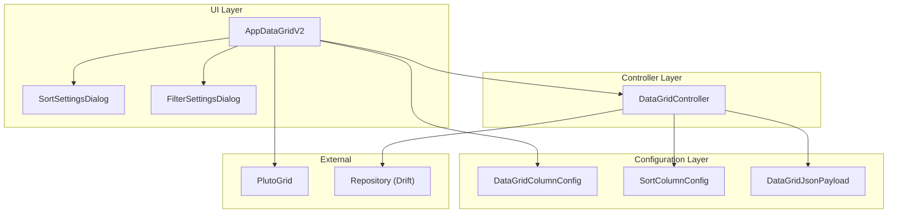

# AppDataGridV2 - Entwicklerdokumentation

> **Zielgruppe**: Flutter/Dart-Anfänger mit Grundkenntnissen in objektorientierter Programmierung

---

## Inhaltsverzeichnis

1. [Architektur-Überblick](#1-architektur-überblick)
2. [Funktionsweise](#2-funktionsweise)
3. [Klassen-Dokumentation](#3-klassen-dokumentation)
   - 3.1 [AppDataGridV2](#31-appdatagridv2)
   - 3.2 [DataGridController](#32-datagridcontroller)
   - 3.3 [DataGridColumnConfig](#33-datagridcolumnconfig)
   - 3.4 [SortColumnConfig](#34-sortcolumnconfig)
   - 3.5 [DataGridJsonPayload](#35-datagridjsonpayload)
   - 3.6 [DataGridJsonMetadata](#36-datagridjsonmetadata)
   - 3.7 [SortSettingsDialog](#37-sortsettingsdialog)
   - 3.8 [FilterSettingsDialog](#38-filtersettingsdialog)
4. [Praktische Beispiele](#4-praktische-beispiele)

---

## 1. Architektur-Überblick

### Was ist das DataGrid?

Das `AppDataGridV2` ist ein **wiederverwendbares Tabellen-Widget** für Flutter Desktop-Anwendungen. Es zeigt Daten in einer strukturierten Tabelle an und bietet folgende Funktionen:

- Volltext-Suche
- Mehrspaltige Sortierung
- Spalten-Filterung
- Doppelklick zum Bearbeiten
- JSON-Import/Export
- Programmatische Steuerung (Headless API)

### Technologie-Stack

| Komponente | Zweck |
|------------|-------|
| **PlutoGrid** | Das zugrunde liegende Tabellen-Widget |
| **flutter_hooks** | Zustandsmanagement im Widget |
| **Riverpod** | Externe State-Management-Lösung |

### Dateistruktur

```
lib/widgets/data_grid_v2/
├── app_data_grid_v2.dart       # Haupt-Widget
├── data_grid_controller.dart   # Controller für programmatische Steuerung
├── data_grid_column_config.dart  # Spalten-Konfiguration
├── sort_column_config.dart     # Sortier-Konfiguration
├── json_payload.dart           # JSON-Datenstruktur
├── sort_settings_dialog.dart   # Sortier-Dialog
├── filter_settings_dialog.dart # Filter-Dialog
└── data_grid_locale_de.dart    # Deutsche Übersetzungen
```

### Architektur-Diagramm



---

## 2. Funktionsweise

### 2.1 Datenfluss

```
┌─────────────────────────────────────────────────────────────┐
│  1. Rohdaten (List<T>) werden an AppDataGridV2 übergeben    │
└─────────────────────────────────────────────────────────────┘
                            │
                            ▼
┌─────────────────────────────────────────────────────────────┐
│  2. DataGridController speichert und filtert die Daten      │
└─────────────────────────────────────────────────────────────┘
                            │
                            ▼
┌─────────────────────────────────────────────────────────────┐
│  3. Filtern → Suchen → Sortieren (in dieser Reihenfolge)    │
└─────────────────────────────────────────────────────────────┘
                            │
                            ▼
┌─────────────────────────────────────────────────────────────┐
│  4. Daten werden zu PlutoRows konvertiert und angezeigt     │
└─────────────────────────────────────────────────────────────┘
```

### 2.2 Filtern und Sortieren

Die Daten werden in **drei Schritten** verarbeitet:

1. **Spalten-Filter** (AND-Logik): Nur Zeilen, die alle aktiven Spaltenfilter erfüllen
2. **Volltext-Suche**: Zeilen, die den Suchbegriff enthalten
3. **Mehrspaltige Sortierung**: Sortiert nach Priorität (0 = zuerst)

### 2.3 Interaktionen

| Aktion | Verhalten |
|--------|-----------|
| **Einfacher Klick** | Zeile wird ausgewählt |
| **Doppelklick** | Detail-Dialog wird geöffnet |
| **Enter-Taste** | Detail-Dialog wird geöffnet (für Barrierefreiheit) |
| **Spalten-Header** | Einzelspalten-Sortierung umschalten |

### 2.4 Toolbar-Layout

```
┌────────────────────────────────────────────────────────────────────┐
│  [Suchfeld...              ]   [Spaltenfilter 🔢]   [Sortierung 🔢] │
├────────────────────────────────────────────────────────────────────┤
│  Spalte 1  │  Spalte 2   │  Spalte 3   │  ...                      │
├────────────────────────────────────────────────────────────────────┤
│  Zelle     │  Zelle      │  Zelle      │  ...                      │
└────────────────────────────────────────────────────────────────────┘
```

Die Badges (🔢) zeigen an, wie viele Filter/Sortierungen aktiv sind.

---

## 3. Klassen-Dokumentation

### 3.1 AppDataGridV2

**Ort**: `lib/widgets/data_grid_v2/app_data_grid_v2.dart`

#### Zweck
Das Haupt-Widget, das eine voll funktionsfähige Datentabelle anzeigt. Es ist **generisch** (typisiert mit `<T>`), was bedeutet, es kann mit beliebigen Datentypen arbeiten.

#### Konzept: Generics
```dart
// T steht für einen beliebigen Typ
AppDataGridV2<Mitglied>   // Für Mitglieder-Daten
AppDataGridV2<Beitrag>    // Für Beitrags-Daten
AppDataGridV2<Produkt>    // Für Produkt-Daten
```

#### Konstruktor-Parameter

| Parameter | Typ | Beschreibung |
|-----------|-----|--------------|
| `items` | `List<T>` | Die anzuzeigenden Daten |
| `columnConfigs` | `List<DataGridColumnConfig<T>>` | Spalten-Definitionen |
| `toSearchString` | `String Function(T)` | Funktion, die einen Suchstring aus einem Item erstellt |
| `toJson` | `Map<String, dynamic> Function(T)` | Serialisiert ein Item zu JSON |
| `fromJson` | `T Function(Map<String, dynamic>)` | Deserialisiert JSON zu einem Item |
| `onItemCreated` | `void Function(T)?` | Callback beim Erstellen (via JSON API) |
| `onItemUpdated` | `void Function(T)?` | Callback beim Aktualisieren (via JSON API) |
| `onItemDeleted` | `void Function(T)?` | Callback beim Löschen (via JSON API) |
| `detailModalBuilder` | `void Function(T, String)?` | Öffnet den Bearbeiten-Dialog |
| `onListExportRequested` | `void Function(String)?` | Wird beim Export-Klick aufgerufen |
| `onDetailExportRequested` | `void Function(String)?` | Wird beim Detail-Export aufgerufen |
| `rowBgColorResolver` | `Color? Function(T)?` | Bestimmt Zeilen-Hintergrundfarbe |
| `onRowSelected` | `void Function(T?)?` | Wird bei Zeilen-Auswahl aufgerufen |
| `controller` | `DataGridController<T>?` | Externer Controller (optional) |
| `initialSelectedId` | `int?` | ID der initial auszuwählenden Zeile (für Navigation-Persistenz) |

#### Wichtige Methoden

Die Klasse hat keine öffentlichen Methoden – sie funktioniert über den übergebenen Controller.

#### Build-Prozess (vereinfacht)

```dart
@override
Widget build(BuildContext context) {
  // 1. Controller initialisieren oder verwenden
  final ctrl = useMemoized(() => controller ?? DataGridController<T>(...));
  
  // 2. Items in Controller laden
  useEffect(() {
    ctrl.updateItems(items);
  }, [items]);
  
  // 3. Spalten konvertieren
  final plutoColumns = useMemoized(
    () => columnConfigs.map((c) => c.toPlutoColumn()).toList()
  );
  
  // 4. Gefilterte Items zu PlutoRows
  final plutoRows = useMemoized(() {
    return ctrl.filteredSortedItems.map((item) {
      // ... Zellen erstellen
    }).toList();
  });
  
  // 5. UI aufbauen
  return Column(
    children: [
      _buildToolbar(),  // Suchfeld + Buttons
      Expanded(
        child: PlutoGrid(columns: plutoColumns, rows: plutoRows),
      ),
    ],
  );
}
```

---

### 3.2 DataGridController

**Ort**: `lib/widgets/data_grid_v2/data_grid_controller.dart`

#### Zweck
Verwaltet den Zustand des DataGrids (Suche, Filter, Sortierung) und bietet eine **programmatische API** für externe Steuerung.

#### Konzept: ChangeNotifier
Der Controller erweitert `ChangeNotifier`, was bedeutet:
- Er kann "zuhörende" Widgets über Änderungen informieren
- `notifyListeners()` aktualisiert alle Listener
- `useListenable(ctrl)` in Hooks verbindet den Controller mit dem Widget

#### Konstruktor

```dart
DataGridController<T>({
  required List<DataGridColumnConfig<T>> columnConfigs,
  required Map<String, dynamic> Function(T item) toJson,
  required T Function(Map<String, dynamic> json) fromJson,
  required String Function(T item) toSearchString,
  this.onItemCreated,
  this.onItemUpdated,
  this.onItemDeleted,
})
```

#### Getter

| Getter | Typ | Beschreibung |
|--------|-----|--------------|
| `searchText` | `String` | Aktueller Suchtext |
| `activeFilters` | `Map<String, String>` | Aktive Spaltenfilter (Feld → Wert) |
| `sortConfigs` | `List<SortColumnConfig>` | Sortier-Konfigurationen |
| `items` | `List<T>` | Alle Rohdaten |
| `filteredSortedItems` | `List<T>` | Daten nach Filter/Suche/Sortierung |
| `columnConfigs` | `List<DataGridColumnConfig<T>>` | Spalten-Definitionen |

#### Setter

| Setter | Beschreibung |
|--------|--------------|
| `searchText = value` | Setzt Suchtext und berechnet neu |
| `activeFilters = value` | Setzt Filter und berechnet neu |
| `sortConfigs = value` | Setzt Sortierung und berechnet neu |

#### Wichtige Methoden

##### `void updateItems(List<T> newItems)`
Aktualisiert die Rohdaten und löst Neuberechnung aus.

```dart
// Beispiel
controller.updateItems(neueMitgliederListe);
```

##### `void updateColumnConfigs(List<DataGridColumnConfig<T>> configs)`
Aktualisiert Spalten-Definitionen zur Laufzeit.

##### `String getExportJson()`
Exportiert aktuell gefilterte/sortierte Daten als JSON.

```dart
final json = controller.getExportJson();
// Speichern oder anzeigen
```

**Beispiel-Output**:
```json
{
  "metadata": {
    "columns": [...],
    "active_sort": [...],
    "active_filters": [...]
  },
  "data": [
    {"id": 1, "name": "Max", ...},
    {"id": 2, "name": "Lisa", ...}
  ]
}
```

##### `String getDetailJson(T item)`
Exportiert ein einzelnes Item als JSON.

##### `void applyStateFromJson(String json)`
Setzt Filter/Sortierung aus JSON-String.

```dart
// Beispiel
controller.applyStateFromJson('''
{
  "metadata": {
    "active_filters": [{"field": "status", "value": "bezahlt"}],
    "active_sort": [{"field": "name", "enabled": true, "ascending": true}]
  }
}
''');
```

##### `void executeCrudFromJson(String json)`
Führt CRUD-Operation aus JSON aus.

**Unterstützte Actions**:
- `CREATE` → ruft `onItemCreated` auf
- `UPDATE` → ruft `onItemUpdated` auf
- `DELETE` → ruft `onItemDeleted` auf

##### `Future<void> exportToFile(String filePath)`
Speichert JSON in Datei.

##### `Future<void> importFromFile(String filePath)`
Lädt Filter/Sortierung aus Datei.

#### Interne Methode: `_recompute()`

Die Kernlogik für Filterung und Sortierung:

```dart
void _recompute() {
  var result = List<T>.from(_items);
  
  // 1. Spaltenfilter anwenden
  if (_activeFilters.isNotEmpty) {
    result = result.where((item) {
      // Prüft, ob Item alle Filter erfüllt
    }).toList();
  }
  
  // 2. Volltext-Suche anwenden
  if (_searchText.isNotEmpty) {
    result = result.where((item) {
      return _toSearchString(item).contains(_searchText);
    }).toList();
  }
  
  // 3. Sortierung anwenden
  if (sortChain.isNotEmpty) {
    result.sort((a, b) {
      // Multi-Spalten-Sortierung
    });
  }
  
  _filteredSortedItems = result;
}
```

---

### 3.3 DataGridColumnConfig

**Ort**: `lib/widgets/data_grid_v2/data_grid_column_config.dart`

#### Zweck
Definiert eine Spalte im DataGrid – von der Anzeige bis zur Datenextraktion.

#### Konzept: Value Extractor
Der `valueExtractor` ist eine Funktion, die aus einem Datensatz den Wert für diese Spalte extrahiert:

```dart
// Beispiel: Name-Spalte
DataGridColumnConfig<Mitglied>(
  field: 'name',
  title: 'Nachname',
  valueExtractor: (mitglied) => mitglied.name,
)

// Beispiel: Berechneter Wert
DataGridColumnConfig<Beitrag>(
  field: 'netto',
  title: 'Nettobetrag',
  valueExtractor: (beitrag) => beitrag.brutto / 1.19,
)
```

#### Konstruktor-Parameter

| Parameter | Typ | Standard | Beschreibung |
|-----------|-----|----------|--------------|
| `field` | `String` | (erforderlich) | Eindeutige ID der Spalte |
| `title` | `String` | (erforderlich) | Angezeigter Titel |
| `type` | `PlutoColumnType` | (erforderlich) | Datentyp (Text, Zahl, Datum) |
| `valueExtractor` | `dynamic Function(T)` | (erforderlich) | Extrahiert Wert aus Item |
| `editable` | `bool` | `false` | Inline-Bearbeitung erlaubt? |
| `sortable` | `bool` | `true` | Sortierung erlaubt? |
| `filterable` | `bool` | `true` | Filterung erlaubt? |
| `textAlign` | `PlutoColumnTextAlign` | `left` | Zellen-Ausrichtung |
| `titleTextAlign` | `PlutoColumnTextAlign` | `left` | Titel-Ausrichtung |
| `formatter` | `String Function(dynamic)?` | `null` | Formatierungsfunktion |
| `renderer` | `Widget Function(PlutoColumnRendererContext)?` | `null` | Benutzerdefinierte Darstellung |
| `minWidth` | `double?` | `null` | Minimale Breite |
| `width` | `double?` | `null` | Standard-Breite |

#### Wichtige Methoden

##### `PlutoColumn toPlutoColumn()`
Konvertiert diese Konfiguration zu einem PlutoGrid-Spaltenobjekt.

```dart
// Wird intern aufgerufen
final plutoColumn = config.toPlutoColumn();
```

##### `Map<String, dynamic> toMetadataMap()`
Serialisiert Spalten-Metadaten zu JSON.

---

### 3.4 SortColumnConfig

**Ort**: `lib/widgets/data_grid_v2/sort_column_config.dart`

#### Zweck
Konfiguriert eine Sortierspalte mit Richtung und Priorität.

#### Eigenschaften

| Eigenschaft | Typ | Beschreibung |
|-------------|-----|--------------|
| `field` | `String` | Spalten-ID |
| `label` | `String` | Angezeigte Bezeichnung |
| `enabled` | `bool` | Ist diese Sortierung aktiv? |
| `ascending` | `bool` | `true` = aufsteigend, `false` = absteigend |
| `priority` | `int` | Priorität (0 = zuerst sortieren) |

#### Methoden

##### `SortColumnConfig copyWith({...})`
Erstellt eine Kopie mit optional geänderten Werten.

```dart
final neueConfig = config.copyWith(
  enabled: true,
  ascending: false,
);
```

##### `Map<String, dynamic> toMap()`
Serialisiert zu JSON.

##### `factory SortColumnConfig.fromMap(Map)`
Deserialisiert aus JSON.

---

### 3.5 DataGridJsonPayload

**Ort**: `lib/widgets/data_grid_v2/json_payload.dart`

#### Zweck
Standardisierte Datenstruktur für JSON-Kommunikation (Import/Export).

#### JSON-Struktur

```json
{
  "action": "OPTIONAL_STRING",
  "metadata": {
    "columns": [...],
    "active_sort": [...],
    "active_filters": [...]
  },
  "data": "PAYLOAD"
}
```

#### Konstruktor

```dart
const DataGridJsonPayload({
  this.action,                    // z.B. "CREATE", "UPDATE", "DELETE"
  required this.metadata,         // Spalten- und Zustandsinfos
  required this.data,             // Die eigentlichen Daten
});
```

#### Methoden

##### `String toJsonString()`
Wandelt Payload in formatierten JSON-String um.

```dart
final payload = DataGridJsonPayload(
  action: 'CREATE',
  metadata: metadata,
  data: {'id': 1, 'name': 'Test'},
);
print(payload.toJsonString());
// Ausgabe:
// {
//   "action": "CREATE",
//   "metadata": {...},
//   "data": {"id": 1, "name": "Test"}
// }
```

##### `factory DataGridJsonPayload.fromJsonString(String)`
Erstellt Payload aus JSON-String.

---

### 3.6 DataGridJsonMetadata

**Ort**: `lib/widgets/data_grid_v2/json_payload.dart`

#### Zweck
Metadaten-Teil der JSON-Payload mit Spalten- und Zustandsinformationen.

#### Eigenschaften

| Eigenschaft | Typ | Beschreibung |
|-------------|-----|--------------|
| `columns` | `List<Map<String, dynamic>>` | Spalten-Definitionen |
| `activeSort` | `List<Map<String, dynamic>>` | Aktive Sortierungen |
| `activeFilters` | `List<Map<String, dynamic>>` | Aktive Filter |

#### Methoden

##### `Map<String, dynamic> toMap()`
Wandelt in Map um.

##### `factory DataGridJsonMetadata.fromMap(Map)`
Erstellt aus Map.

---

### 3.7 SortSettingsDialog

**Ort**: `lib/widgets/data_grid_v2/sort_settings_dialog.dart`

#### Zweck
Modaler Dialog für die Konfiguration der mehrspaltigen Sortierung.

#### Features
- **Drag & Drop**: Spalten per Ziehen umsortieren
- **Checkbox**: Sortierung aktivieren/deaktivieren
- **Pfeil-Button**: Aufsteigend/absteigend umschalten

#### Statische Methode

##### `static Future<List<SortColumnConfig>?> show(BuildContext, {required List<SortColumnConfig> initialConfigs})`

Öffnet den Dialog und gibt die aktualisierten Konfigurationen zurück.

```dart
final result = await SortSettingsDialog.show(
  context,
  initialConfigs: controller.sortConfigs,
);
if (result != null) {
  controller.sortConfigs = result;
}
```

#### UI-Elemente

```
┌─────────────────────────────────────────────────────────────┐
│  Sortierung                                    [X]          │
├─────────────────────────────────────────────────────────────┤
│  Ziehen Sie Spalten in die gewünschte Reihenfolge...        │
├─────────────────────────────────────────────────────────────┤
│  [☑] Name          [↑]  [≡]                                 │
│  [☐] Geburtsdatum  [↓]  [≡]                                 │
│  [☑] Status        [↑]  [≡]                                 │
├─────────────────────────────────────────────────────────────┤
│  [Abbrechen]                      [Übernehmen]              │
└─────────────────────────────────────────────────────────────┘
```

---

### 3.8 FilterSettingsDialog

**Ort**: `lib/widgets/data_grid_v2/filter_settings_dialog.dart`

#### Zweck
Modaler Dialog für die Konfiguration der Spaltenfilter.

#### Features
- **Autocomplete**: Filterwerte werden aus vorhandenen Daten vorgeschlagen
- **AND-Logik**: Mehrere Filter müssen alle erfüllt sein
- **Dynamische Optionen**: Vorschläge aus aktuellen Daten

#### Statische Methode

##### `static Future<Map<String, String>?> show(BuildContext, {required List<PlutoRow> allRows, required List<PlutoColumn> columns, required Map<String, String> initialFilters})`

```dart
final result = await FilterSettingsDialog.show(
  context,
  allRows: alleZeilen,
  columns: spalten,
  initialFilters: controller.activeFilters,
);
if (result != null) {
  controller.activeFilters = result;
}
```

#### Wichtige Konzept: Autocomplete

```dart
Autocomplete<String>(
  optionsBuilder: (textEditingValue) {
    // Filtert Optionen basierend auf Eingabe
    return widget.options.where((option) {
      return option.toLowerCase().contains(
        textEditingValue.text.toLowerCase()
      );
    });
  },
)
```

---

## 4. Praktische Beispiele

### 4.1 Einfaches DataGrid

```dart
class SimpleDataGrid extends StatelessWidget {
  final List<Person> persons = [
    Person(id: 1, name: 'Max', age: 30),
    Person(id: 2, name: 'Lisa', age: 25),
  ];

  @override
  Widget build(BuildContext context) {
    return AppDataGridV2<Person>(
      items: persons,
      columnConfigs: [
        DataGridColumnConfig<Person>(
          field: 'name',
          title: 'Name',
          type: PlutoColumnType.text(),
          valueExtractor: (p) => p.name,
        ),
        DataGridColumnConfig<Person>(
          field: 'age',
          title: 'Alter',
          type: PlutoColumnType.number(),
          valueExtractor: (p) => p.age,
        ),
      ],
      toSearchString: (p) => '${p.name} ${p.age}',
      toJson: (p) => {'id': p.id, 'name': p.name, 'age': p.age},
      fromJson: (json) => Person(
        id: json['id'],
        name: json['name'],
        age: json['age'],
      ),
    );
  }
}
```

### 4.2 Mit externem Controller

```dart
class ManagedDataGrid extends HookWidget {
  @override
  Widget build(BuildContext context) {
    // Controller erstellen
    final controller = useMemoized(() => DataGridController<Person>(
      columnConfigs: [...],
      toJson: (p) => {...},
      fromJson: (json) => Person(...),
      toSearchString: (p) => '${p.name} ${p.age}',
    ));

    // Controller beim Entladen bereinigen
    useEffect(() => controller.dispose, []);

    return Column(
      children: [
        // Eigene Toolbar-Buttons
        Row(
          children: [
            ElevatedButton(
              onPressed: () {
                // Programmatisch filtern
                controller.searchText = 'Max';
              },
              child: Text('Nur Max anzeigen'),
            ),
            ElevatedButton(
              onPressed: () {
                // Exportieren
                final json = controller.getExportJson();
                print(json);
              },
              child: Text('Exportieren'),
            ),
          ],
        ),
        
        // DataGrid mit Controller
        Expanded(
          child: AppDataGridV2<Person>(
            controller: controller,
            items: persons,
            columnConfigs: columnConfigs,
            toSearchString: (p) => '${p.name} ${p.age}',
            toJson: (p) => {...},
            fromJson: (json) => Person(...),
          ),
        ),
      ],
    );
  }
}
```

### 4.3 Mit Detail-Dialog

```dart
AppDataGridV2<Person>(
  items: persons,
  columnConfigs: [...],
  toSearchString: (p) => '${p.name} ${p.age}',
  toJson: (p) => {...},
  fromJson: (json) => Person(...),
  
  // Öffnet Dialog bei Doppelklick
  detailModalBuilder: (person, focusedColumnId) {
    showDialog(
      context: context,
      builder: (_) => PersonEditDialog(
        person: person,
        // Setzt Fokus auf das geklickte Feld
        initialField: focusedColumnId,
      ),
    );
  },
)
```

### 4.4 Mit CRUD-Callbacks

```dart
AppDataGridV2<Person>(
  items: persons,
  columnConfigs: [...],
  toSearchString: (p) => '${p.name} ${p.age}',
  toJson: (p) => {...},
  fromJson: (json) => Person(...),
  
  // Wird aufgerufen, wenn via JSON-API ein Item erstellt werden soll
  onItemCreated: (person) async {
    await repository.insert(person);
  },
  
  // Wird aufgerufen, wenn ein Item aktualisiert werden soll
  onItemUpdated: (person) async {
    await repository.update(person);
  },
  
  // Wird aufgerufen, wenn ein Item gelöscht werden soll
  onItemDeleted: (person) async {
    await repository.delete(person.id);
  },
)
```

### 4.5 Mit farbigen Zeilen

```dart
AppDataGridV2<Beitrag>(
  items: beitraege,
  columnConfigs: [...],
  toSearchString: (b) => '${b.mitgliedName} ${b.status}',
  toJson: (b) => {...},
  fromJson: (json) => Beitrag(...),
  
  // Zeilenfarbe basierend auf Status
  rowBgColorResolver: (beitrag) {
    return switch (beitrag.status) {
      BeitragStatus.bezahlt => Colors.green.shade100,
      BeitragStatus.offen => Colors.orange.shade100,
      BeitragStatus.angemahnt => Colors.red.shade100,
      _ => null, // Standard-Farbe
    };
  },
)
```

### 4.6 Mit persistierter Zeilenauswahl (Navigation)

```dart
// 1. Provider für persistierte Auswahl erstellen
@Riverpod(keepAlive: true)
class SelectedPersonId extends _$SelectedPersonId {
  @override
  int? build() => null;

  void select(int? id) => state = id;
  void clear() => state = null;
}

// 2. Screen mit persistierter Auswahl
class PersonsScreen extends HookConsumerWidget {
  @override
  Widget build(BuildContext context, WidgetRef ref) {
    // Persistierte ID aus dem Provider laden
    final persistedId = ref.watch(selectedPersonIdProvider);
    final selectedId = useState<int?>(persistedId);

    return FeatureScreenScaffold(
      title: 'Personen',
      hasSelection: selectedId.value != null,
      body: AppDataGridV2<Person>(
        items: persons,
        columnConfigs: [...],
        toSearchString: (p) => '${p.name} ${p.age}',
        toJson: (p) => {...},
        fromJson: (json) => Person(...),
        // Initiale Auswahl beim Zurückkehren zum Screen
        initialSelectedId: persistedId,
        // Auswahl speichern wenn sich etwas ändert
        onRowSelected: (person) {
          selectedId.value = person?.id;
          ref.read(selectedPersonIdProvider.notifier).select(person?.id);
        },
      ),
    );
  }
}
```

**Wichtig**: Die `keepAlive: true` Eigenschaft des Providers stellt sicher, dass die Auswahl auch nach dem Verlassen des Screens erhalten bleibt.

### 4.7 JSON-State laden/speichern

```dart
// Speichern
await controller.exportToFile('/home/user/grid_state.json');

// Laden
await controller.importFromFile('/home/user/grid_state.json');
// → Filter und Sortierung werden wiederhergestellt

// Oder manuell aus JSON-String
controller.applyStateFromJson('''
{
  "metadata": {
    "active_filters": [
      {"field": "status", "value": "bezahlt"}
    ],
    "active_sort": [
      {"field": "name", "enabled": true, "ascending": true, "priority": 0}
    ]
  }
}
''');
```

---

## Zusammenfassung

| Konzept | Wichtigste Klasse/Datei |
|---------|------------------------|
| Haupt-Widget | `AppDataGridV2<T>` |
| Zustandsverwaltung | `DataGridController<T>` |
| Spalten definieren | `DataGridColumnConfig<T>` |
| Sortierung konfigurieren | `SortSettingsDialog` |
| Filter konfigurieren | `FilterSettingsDialog` |
| JSON-Import/Export | `DataGridJsonPayload` |
| Deutsche Übersetzung | `data_grid_locale_de.dart` |

### Nächste Schritte zum Lernen

1. **Studiere existierende Implementierungen**: Siehe `lib/features/*/widgets/*_data_grid.dart`
2. **Experimentiere**: Erstelle ein einfaches DataGrid mit Testdaten
3. **Lies die PlutoGrid-Doku**: Verstehe die zugrunde liegende Bibliothek
4. **Fragen?**: Schau in die Beispiele im Projekt oder konsultiere die `.agent/rules/datagrid.md`
