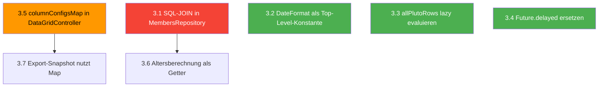

# Performance-Korrekturen Plan

## Überblick

7 Performance-Issues, geordnet nach Priorität und Abhängigkeiten.

**Abhängigkeiten:**
- 3.1 + 3.6 sind gekoppelt (beide betreffen Members-Provider/Repository)
- 3.5 + 3.7 sind gekoppelt (beide brauchen `columnConfigsMap`)
- 3.2, 3.3, 3.4 sind unabhängig

**Empfohlene Reihenfolge:**



---

## 3.5 + 3.7: columnConfigsMap als Map-Cache

### Problem
- [`DataGridController._recompute()`](lib/widgets/data_grid_v2/data_grid_controller.dart:134) sucht per `.where().firstOrNull` linear nach Column-Configs – O(n) pro Filter-Eintrag × Item
- [`generateExportSnapshot()`](lib/widgets/data_grid_v2/vpit_data_grid.dart:183) sucht ebenfalls linear pro sichtbarer Spalte

### Lösung

**Datei: [`data_grid_controller.dart`](lib/widgets/data_grid_v2/data_grid_controller.dart)**

1. Neues Feld hinzufügen:
```dart
Map<String, DataGridColumnConfig<T>> _columnConfigsMap = {};
```

2. Map im Konstruktor und bei `updateColumnConfigs()` aufbauen:
```dart
// Im Konstruktor-Body:
_columnConfigsMap = {
  for (final c in _columnConfigs) c.field: c
};

// In updateColumnConfigs():
void updateColumnConfigs(List<DataGridColumnConfig<T>> configs) {
  _columnConfigs = List.from(configs);
  _columnConfigsMap = {for (final c in _columnConfigs) c.field: c};
  notifyListeners();
}
```

3. In `_recompute()` alle `.where().firstOrNull` ersetzen durch `_columnConfigsMap[entry.key]`:
   - Zeile 143-145: Filter-Schleife
   - Zeile 170-172: Sort-Schleife

4. Öffentlichen Getter hinzufügen für 3.7:
```dart
Map<String, DataGridColumnConfig<T>> get columnConfigsMap =>
    Map.unmodifiable(_columnConfigsMap);
```

**Datei: [`vpit_data_grid.dart`](lib/widgets/data_grid_v2/vpit_data_grid.dart)**

5. In `generateExportSnapshot()` (Zeile 183-185) ersetzen:
```dart
// ALT:
final config = columnConfigs.where((c) => c.field == plutoCol.field).firstOrNull;

// NEU:
final config = ctrl.columnConfigsMap[plutoCol.field];
```

6. Gleiches Muster für Sort-String-Generierung (Zeile 228):
```dart
// ALT:
columnConfigs.firstWhere((c) => c.field == s.field).title

// NEU:
ctrl.columnConfigsMap[s.field]?.title ?? s.field
```

### Betroffene Dateien
| Datei | Änderung |
|-------|----------|
| [`data_grid_controller.dart`](lib/widgets/data_grid_v2/data_grid_controller.dart) | `_columnConfigsMap` Feld + Konstruktor + `updateColumnConfigs()` + `_recompute()` |
| [`vpit_data_grid.dart`](lib/widgets/data_grid_v2/vpit_data_grid.dart) | `generateExportSnapshot()` nutzt `ctrl.columnConfigsMap` |

---

## 3.1 + 3.6: SQL-JOIN in MembersRepository + Altersberechnung

### Problem
- [`membersGridRowsProvider`](lib/features/members/presentation/providers/members_list_provider.dart:28) abonniert 3 separate Streams und führt den Join in Dart durch
- Jede Änderung an Leistung oder Preis triggert ein Rebuild des gesamten Members-Grid
- Altersberechnung erfolgt bei jedem Stream-Emit neu im Provider

### Lösung

**Datei: [`member_row_data.dart`](lib/features/members/domain/models/member_row_data.dart)**

1. `alter` aus Factory entfernen, `geboren` hinzufügen, berechneten Getter hinzufügen:
```dart
@freezed
abstract class MemberRowData with _$MemberRowData {
  const MemberRowData._(); // Private Konstruktor für Getter

  const factory MemberRowData({
    required int id,
    required String name,
    required String vorname,
    String? ort,
    String? plz,
    String? telefon1,
    String? telefon2,
    String? email,
    String? leistungName,
    DateTime? vertragLaufzeitVon,
    DateTime? vertragLaufzeitBis,
    DateTime? vertragKontierung,
    DateTime? geboren, // NEU: statt alter
    double? beitrag,
  }) = _MemberRowData;

  factory MemberRowData.fromJson(Map<String, dynamic> json) =>
      _$MemberRowDataFromJson(json);

  /// Berechnet das Alter aus dem Geburtsdatum.
  /// Wird nur bei Bedarf berechnet, nicht bei jedem Stream-Emit.
  int? get alter {
    if (geboren == null) return null;
    final days = DateTime.now().difference(geboren!).inDays;
    return (days / 365.25).floor();
  }
}
```

**Datei: [`members_repository.dart`](lib/features/members/data/members_repository.dart)**

2. Neue Methode `watchMembersWithDetails()` mit SQL-JOIN (analog [`BeitraegeRepository.watchBeitraege()`](lib/features/beitraege/data/beitraege_repository.dart:32)):
```dart
Stream<List<MemberRowData>> watchMembersWithDetails() {
  final query = _db.select(_db.mitglieds).join([
    drift.leftOuterJoin(
      _db.leistung,
      _db.leistung.id.equalsExp(_db.mitglieds.leistungId),
    ),
    drift.leftOuterJoin(
      _db.preis,
      _db.preis.id.equalsExp(_db.mitglieds.preisId),
    ),
  ]);

  return query.watch().map((rows) {
    return rows.map((row) {
      final mitglied = row.readTable(_db.mitglieds);
      final leistung = row.readTableOrNull(_db.leistung);
      final preis = row.readTableOrNull(_db.preis);

      return MemberRowData(
        id: mitglied.id,
        name: mitglied.name,
        vorname: mitglied.vorname,
        ort: mitglied.ort,
        plz: mitglied.plz,
        telefon1: mitglied.telefon1,
        telefon2: mitglied.telefon2,
        email: mitglied.email,
        leistungName: leistung?.name,
        vertragLaufzeitVon: mitglied.vertragLaufzeitVon,
        vertragLaufzeitBis: mitglied.vertragLaufzeitBis,
        vertragKontierung: mitglied.vertragKontierung,
        geboren: mitglied.geboren,
        beitrag: preis?.bruttopreis,
      );
    }).toList();
  });
}
```

**Datei: [`members_list_provider.dart`](lib/features/members/presentation/providers/members_list_provider.dart)**

3. Provider drastisch vereinfachen – nur noch ein Stream:
```dart
import 'package:hooks_riverpod/hooks_riverpod.dart';
import 'package:clupdata/features/members/data/members_repository.dart';
import '../../domain/models/member_row_data.dart';

final bemerkungForMemberProvider = StreamProvider.family<BemerkungData?, int>((
  ref,
  memberId,
) {
  return ref.watch(membersRepositoryProvider).watchBemerkungForMember(memberId);
});

final membersGridRowsProvider = StreamProvider<List<MemberRowData>>((ref) {
  return ref.watch(membersRepositoryProvider).watchMembersWithDetails();
});
```

4. Entfernen: `_membersStreamProvider`, `_leistungenStreamProvider`, `_preiseStreamProvider` sowie der gesamte In-Memory-Join-Block

5. Aufrufer die `AsyncValue`-Struktur anpassen: Statt `Provider<AsyncValue<...>>` ist es jetzt `StreamProvider<...>` – das liefert bereits `AsyncValue`. Die Consumer (`member_data_grid.dart`) müssen ggf. angepasst werden, falls sie `.when()` nutzen – das sollte aber kompatibel sein.

### Betroffene Dateien
| Datei | Änderung |
|-------|----------|
| [`member_row_data.dart`](lib/features/members/domain/models/member_row_data.dart) | `alter` → Getter, `geboren` Feld hinzufügen |
| [`members_repository.dart`](lib/features/members/data/members_repository.dart) | `watchMembersWithDetails()` mit SQL-JOIN |
| [`members_list_provider.dart`](lib/features/members/presentation/providers/members_list_provider.dart) | Vereinfachung auf einzelnen StreamProvider |

### Nachbearbeitung
- `build_runner` muss laufen: `flutter pub run build_runner build -d` (wegen `@freezed` und `@riverpod` Änderungen)
- Prüfen, ob `member_data_grid.dart` oder `member_edit_dialog.dart` auf `alter` als Feld zugreifen (sollte über Getter kompatibel sein)

---

## 3.2: DateFormat als Top-Level-Konstante

### Problem
- [`BeitragDataGrid`](lib/features/beitraege/presentation/widgets/beitrag_data_grid.dart:24): `final dateFormatter = DateFormat('dd.MM.yyyy');` wird bei jedem Build neu erstellt
- [`RechnungDataGrid`](lib/features/rechnungen/widgets/rechnung_data_grid.dart:24): gleiches Problem

### Lösung

**Option A (empfohlen): Top-Level-Konstante in einer Shared-Datei**

Neue Datei `lib/core/utils/date_formatters.dart`:
```dart
import 'package:intl/intl.dart';

/// Zentraler DateFormatter für dd.MM.yyyy Format.
/// Wird nur einmal instanziiert statt bei jedem Widget-Build.
final dateFormatter = DateFormat('dd.MM.yyyy');

/// Zentraler CurrencyFormatter für deutsches Währungsformat.
final currencyFormatter = NumberFormat.currency(
  locale: 'de_DE',
  symbol: '€',
);
```

**Datei: [`beitrag_data_grid.dart`](lib/features/beitraege/presentation/widgets/beitrag_data_grid.dart)**
- Zeile 24 entfernen, Import hinzufügen, `dateFormatter` aus Shared-Datei nutzen

**Datei: [`rechnung_data_grid.dart`](lib/features/rechnungen/widgets/rechnung_data_grid.dart)**
- Zeile 24-25 entfernen, Import hinzufügen, `dateFormatter` und `currencyFormatter` aus Shared-Datei nutzen

### Betroffene Dateien
| Datei | Änderung |
|-------|----------|
| Neu: `lib/core/utils/date_formatters.dart` | Zentrale Formatter |
| [`beitrag_data_grid.dart`](lib/features/beitraege/presentation/widgets/beitrag_data_grid.dart) | Import + lokale Variable entfernen |
| [`rechnung_data_grid.dart`](lib/features/rechnungen/widgets/rechnung_data_grid.dart) | Import + lokale Variablen entfernen |

---

## 3.3: allPlutoRows lazy evaluieren

### Problem
- [`vpit_data_grid.dart`](lib/widgets/data_grid_v2/vpit_data_grid.dart:327) berechnet `allPlutoRows` eager in `useMemoized`, auch wenn der Filter-Dialog nie geöffnet wird
- Bei großen Datensätzen entsteht unnötiger Overhead

### Lösung

**Datei: [`vpit_data_grid.dart`](lib/widgets/data_grid_v2/vpit_data_grid.dart)**

1. `allPlutoRows` aus `useMemoized` entfernen und durch eine Lazy-Funktion ersetzen:
```dart
// ALT (Zeile 327-335):
final allPlutoRows = useMemoized(() {
  return items.map((item) {
    final cells = <String, PlutoCell>{};
    for (final config in columnConfigs) {
      cells[config.field] = PlutoCell(value: config.valueExtractor(item));
    }
    return PlutoRow(cells: cells);
  }).toList();
}, [items, columnConfigs]);

// NEU: Lazy Builder-Funktion
List<PlutoRow> buildAllPlutoRows() {
  return items.map((item) {
    final cells = <String, PlutoCell>{};
    for (final config in columnConfigs) {
      cells[config.field] = PlutoCell(value: config.valueExtractor(item));
    }
    return PlutoRow(cells: cells);
  }).toList();
}
```

2. Aufrufstelle im Filter-Button (Zeile 561) anpassen:
```dart
// ALT:
final result = await FilterSettingsDialog.show(
  context,
  allRows: allPlutoRows,
  columns: plutoColumns,
  initialFilters: Map.from(ctrl.activeFilters),
);

// NEU:
final result = await FilterSettingsDialog.show(
  context,
  allRows: buildAllPlutoRows(), // Erst hier wird berechnet
  columns: plutoColumns,
  initialFilters: Map.from(ctrl.activeFilters),
);
```

### Betroffene Dateien
| Datei | Änderung |
|-------|----------|
| [`vpit_data_grid.dart`](lib/widgets/data_grid_v2/vpit_data_grid.dart) | `allPlutoRows` → `buildAllPlutoRows()` Lazy-Funktion |

---

## 3.4: Future.delayed ersetzen durch addPostFrameCallback

### Problem
- [`vpit_data_grid.dart`](lib/widgets/data_grid_v2/vpit_data_grid.dart:377) verwendet `Future.delayed(const Duration(milliseconds: 50), ...)` für Selection-Restore
- Fragiles Timing – kann auf langsameren Systemen fehlschlagen

### Lösung

**Datei: [`vpit_data_grid.dart`](lib/widgets/data_grid_v2/vpit_data_grid.dart)**

Zeile 376-405 ersetzen:

```dart
// ALT:
if (initialSelectedId != null) {
  Future.delayed(const Duration(milliseconds: 50), () {
    // ... selection restore logic
  });
}

// NEU:
if (initialSelectedId != null) {
  WidgetsBinding.instance.addPostFrameCallback((_) {
    // Check if state manager is still valid
    if (sm.rows.isEmpty) return;
    for (final row in plutoRows) {
      final item = rowItemMap.value[row.key];
      if (item != null) {
        try {
          final id = (item as dynamic).id;
          if (id == initialSelectedId) {
            final rowIdx = plutoRows.indexOf(row);
            if (rowIdx >= 0 && rowIdx < sm.rows.length) {
              final actualRow = sm.rows[rowIdx];
              sm.setCurrentCell(
                actualRow.cells.entries.first.value,
                rowIdx,
              );
              sm.notifyListeners();
            }
            break;
          }
        } catch (_) {}
      }
    }
  });
}
```

### Betroffene Dateien
| Datei | Änderung |
|-------|----------|
| [`vpit_data_grid.dart`](lib/widgets/data_grid_v2/vpit_data_grid.dart) | `Future.delayed` → `addPostFrameCallback` |

---

## Zusammenfassung: Änderungsmatrix

| Issue | Dateien | Risiko | Abhängigkeit |
|-------|---------|--------|--------------|
| 3.5 | `data_grid_controller.dart` | Niedrig | Keine |
| 3.7 | `vpit_data_grid.dart` | Niedrig | 3.5 |
| 3.1 | `members_repository.dart`, `members_list_provider.dart` | Mittel | 3.6 |
| 3.6 | `member_row_data.dart` | Niedrig | 3.1 |
| 3.2 | Neu: `date_formatters.dart`, `beitrag_data_grid.dart`, `rechnung_data_grid.dart` | Niedrig | Keine |
| 3.3 | `vpit_data_grid.dart` | Niedrig | Keine |
| 3.4 | `vpit_data_grid.dart` | Niedrig | Keine |

## Build-Runner

Nach Abschluss aller Änderungen muss `build_runner` ausgeführt werden:
```bash
flutter pub run build_runner build -d
```

Betroffene generierte Dateien:
- `member_row_data.freezed.dart` / `member_row_data.g.dart` (3.6)
- `members_repository.g.dart` (3.1 – falls sich der Provider-Code ändert)
- `members_list_provider.g.dart` (3.1 – falls @riverpod-Annotationen hinzukommen)
