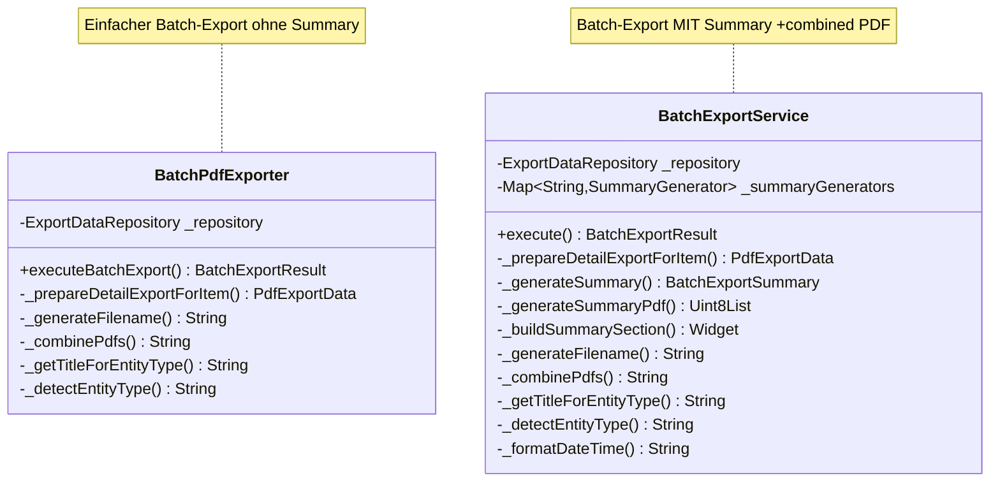
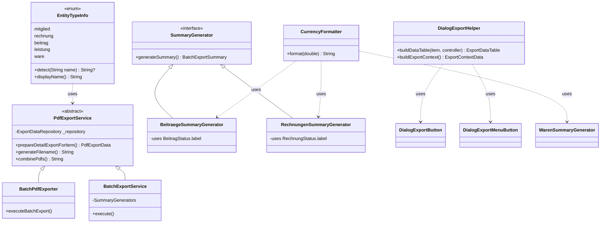

# Refactoring-Plan: Drucken & PDF-Erstellung — Zentrales Modul

> **Status**: Teilweise implementiert | **Erstellt**: 2026-05-11 | **Aktualisiert**: 2026-06-11 | **Modus**: Flutter Architect

## 1. Zusammenfassung

Die PDF-Export/Druck-Funktionalität ist auf zwei Pfade verteilt:

| Pfad | Ort | Zweck |
|------|-----|-------|
| **Detail-Export** | [`DialogExportButton`](lib/features/export/presentation/dialog_export_button.dart:33) + [`ExportOptionsDialog`](lib/features/export/presentation/export_options_dialog.dart:16) → [`PdfPreviewDialog`](lib/widgets/data_grid_v2/export/pdf/pdf_preview_dialog.dart) | Einzel-PDF aus Edit-Dialogen |
| **Batch-Export** | [`BatchPdfExporter`](lib/features/export/services/batch_pdf_exporter.dart:16) UND [`BatchExportService`](lib/features/export/services/batch_export_service.dart:27) | Massenexport mehrerer Einträge |

**Kernproblem**: Zwei konkurrierende Batch-Exporter-Klassen mit ~90 % Duplikation plus mehrere verteilte Hilfsmethoden ohne zentrale Abstraktion.

## 2. Analyse: DRY-Verstöße

### 2.1 `BatchPdfExporter` ≈ `BatchExportService` (≈90 % Duplikation)



**Gemeinsame Methoden (100 % identisch):**
- `_prepareDetailExportForItem` – 17 Zeilen identisch
- `_generateFilename` – 15 Zeilen identisch
- `_combinePdfs` – 8 Zeilen identisch (beide Copy-Paste-Kommentar)
- `_getTitleForEntityType` – 12 Zeilen identisch
- `_detectEntityType` – 10 Zeilen identisch

**Unterschiede**: `BatchExportService` hat zusätzlich Summary-Generierung und `outputMode` (individualFiles vs combinedPdf).

### 2.2 `_detectEntityType` 3× dupliziert

| Datei | Zeile |
|-------|-------|
| [`PdfExporter._detectEntityType`](lib/widgets/data_grid_v2/export/pdf/pdf_exporter.dart:120) | 120–132 |
| [`BatchPdfExporter._detectEntityType`](lib/features/export/services/batch_pdf_exporter.dart:228) | 228–238 |
| [`BatchExportService._detectEntityType`](lib/features/export/services/batch_export_service.dart:361) | 361–368 |

### 2.3 `_getTitleForEntityType` 2× dupliziert

| Datei | Zeile |
|-------|-------|
| [`BatchPdfExporter._getTitleForEntityType`](lib/features/export/services/batch_pdf_exporter.dart:211) | 211–226 |
| [`BatchExportService._getTitleForEntityType`](lib/features/export/services/batch_export_service.dart:344) | 344–358 |

### 2.4 `_statusLabel` in Summary-Generatoren dupliziert

[`BeitraegeSummaryGenerator._statusLabel`](lib/features/export/services/summary_generators/beitraege_summary_generator.dart:91) und [`RechnungenSummaryGenerator._statusLabel`](lib/features/export/services/summary_generators/rechnungen_summary_generator.dart:96) mappen Status-Strings manuell — sollten `BeitragStatus.fromString(s).label` / `RechnungStatus.fromString(s).label` nutzen.

### 2.5 `_formatCurrency` 2× dupliziert

[`RechnungenSummaryGenerator._formatCurrency`](lib/features/export/services/summary_generators/rechnungen_summary_generator.dart:109) und [`WarenSummaryGenerator._formatCurrency`](lib/features/export/services/summary_generators/waren_summary_generator.dart:106).

### 2.6 Dialog `rows`-Building 2× dupliziert

[`DialogExportButton._handleExport`](lib/features/export/presentation/dialog_export_button.dart:82) und [`DialogExportMenuButton._handleSelection`](lib/features/export/presentation/dialog_export_button.dart:190) bauen identische `List<List<String>> rows` aus Controller-ColumnConfigs.

### 2.7 Leere-Batch-Guard 5× dupliziert

Jeder Summary-Generator hat den identischen `if (exportedItemIds.isEmpty)` Guard mit gleichem Return-Wert.

## 3. OOP-Verstöße

| Verstoß | Beschreibung |
|---------|-------------|
| Keine Abstraktion für Entity-Typ-Mapping | `_detectEntityType` und `_getTitleForEntityType` sind freie Hilfsmethoden ohne zentrale Enum/Map |
| Summary-Generatoren ignorieren `StatusManager` | `_statusLabel` macht manuelles String-Mapping statt `BeitragStatus.fromString().label` zu verwenden |
| Kein Interface für Batch-Export-Strategie | `BatchPdfExporter` und `BatchExportService` sind konkurrierende Implementierungen ohne gemeinsames Interface |
| `_formatCurrency` kein Shared Utility | Deutsche Währungsformatierung sollte einmalig in `lib/core/utils/` definiert sein |
| `DialogExportButton` + `DialogExportMenuButton` teilen keine Basis | Beide bauen dasselbe `ExportDataTable`-Setup, aber ohne gemeinsame Methode |

## 4. Zielarchitektur



## 5. Refactoring-Schritte

### Schritt 1: `EntityTypeInfo`-Enum in `lib/core/models/` (DRY) — ✅ ERLEDIGT

**Implementiert**: [`lib/core/models/entity_type_info.dart`](lib/core/models/entity_type_info.dart)

Zentralisiert `_detectEntityType` und `_getTitleForEntityType` aus 3 Dateien in einen Enum.

```dart
enum EntityTypeInfo {
  mitglied('Mitglieder'),
  rechnung('Rechnungen'),
  beitrag('Beiträge'),
  leistung('Leistungen'),
  ware('Waren');

  final String displayName;
  const EntityTypeInfo(this.displayName);

  /// Detects entity type from a name string (case-insensitive).
  static String? detect(String? name) { ... }

  /// Returns the display name for a type string or the raw string.
  static String displayNameFor(String type) { ... }
}
```

**Impact**: 3 Dateien vereinfacht, ~30 Zeilen Duplikation eliminiert.

### Schritt 2: `BatchPdfExporter` in `BatchExportService` integrieren (DRY) — ❌ OFFEN

**Status**: `BatchPdfExporter` existiert noch parallel zu `BatchExportService`. Beide Klassen leben in `lib/features/export/services/`.

**Strategie**: `BatchPdfExporter` wird entfernt, seine Funktionalität geht in `BatchExportService` auf. `BatchExportService` wird die einzige Batch-Export-Klasse.

- `BatchExportService` erhält einen optionalen `summaryGenerators`-Parameter (null = kein Summary)
- Provider [`batchPdfExporterProvider`](lib/features/export/services/batch_pdf_exporter_provider.dart:10) delegiert an `BatchExportService` ohne Summary-Generatoren
- Überschüssige Klasse `BatchPdfExporter` wird deprecated und später entfernt

**Impact**: ~80 Zeilen Duplikation eliminiert, eine Klasse weniger zu warten.

### Schritt 3: `CurrencyFormatter` in `lib/core/utils/` (DRY) — ✅ ERLEDIGT

**Implementiert**: [`lib/core/utils/currency_formatter.dart`](lib/core/utils/currency_formatter.dart)

Extrahiert `_formatCurrency` aus [`RechnungenSummaryGenerator`](lib/features/export/services/summary_generators/rechnungen_summary_generator.dart:109) und [`WarenSummaryGenerator`](lib/features/export/services/summary_generators/waren_summary_generator.dart:106).

```dart
String formatCurrencyEur(double amount) =>
    '${amount.toStringAsFixed(2).replaceAll('.', ',')} €';
```

### Schritt 4: Summary-Generatoren nutzen `StatusManager`-Enums (OOP) — ✅ ERLEDIGT

**Implementiert**: Beide Summary-Generatoren nutzen jetzt die Status-Enums:
- [`BeitraegeSummaryGenerator._statusLabel`](lib/features/export/services/summary_generators/beitraege_summary_generator.dart:90) → `BeitragStatus.fromString(status).label`
- [`RechnungenSummaryGenerator._statusLabel`](lib/features/export/services/summary_generators/rechnungen_summary_generator.dart:96) → `RechnungStatus.fromString(status).label`

### Schritt 5: `_buildDetailExportData` in `DialogExportHelper` auslagern (DRY) — ✅ ERLEDIGT

**Implementiert**: [`lib/features/export/services/dialog_export_helper.dart`](lib/features/export/services/dialog_export_helper.dart) mit `buildDetailExportContextFromProvider()` für den neuen DetailExportProvider-Flow.

Extrahiert das 2× duplizierte `rows`-Building aus [`DialogExportButton`](lib/features/export/presentation/dialog_export_button.dart:82) und [`DialogExportMenuButton`](lib/features/export/presentation/dialog_export_button.dart:190).

```dart
ExportContextData buildDetailExportContext({
  required dynamic item,
  required String entityType,
  required String title,
  String? subtitle,
  required DataGridController controller,
}) { ... }
```

### Schritt 6: Leere-Batch-Guard in `SummaryGenerator`-Basisklasse (DRY) — ❌ OFFEN

**Änderung**: [`SummaryGenerator`](lib/features/export/services/summary_generator.dart:7) erhält eine `protected`-Methode für den leeren Fall.

```dart
BatchExportSummary emptySummary(String entityType, String displayName, ...) => ...
```

**Impact**: 5× 10 Zeilen Duplikation eliminiert.

### Schritt 7: Tests — ✅ ERLEDIGT

- [`test/core/models/entity_type_info_test.dart`](test/core/models/entity_type_info_test.dart)
- [`test/core/utils/currency_formatter_test.dart`](test/core/utils/currency_formatter_test.dart)

## 6. Nicht-Ziele

1. **Keine Änderung am Template-System** ([`PdfTemplate`](lib/widgets/data_grid_v2/export/pdf/pdf_template.dart:82), [`PdfTemplateRegistry`](lib/widgets/data_grid_v2/export/pdf/pdf_template_registry.dart:30)) — bereits gut abstrahiert
2. **Keine Änderung an `PdfExporter`** — korrekt als Domain-unabhängiger Service
3. **Keine Schema-Migration**
4. **Keine neuen Packages**

## 7. Implementierungsfortschritt

| Schritt | Beschreibung | Risiko | Status |
|---------|-------------|--------|--------|
| 1 | `EntityTypeInfo`-Enum | Niedrig | ✅ Erledigt |
| 3 | `CurrencyFormatter` | Niedrig | ✅ Erledigt |
| 4 | Summary-Generatoren auf `StatusManager` umstellen | Niedrig | ✅ Erledigt |
| 5 | `DialogExportHelper` extrahieren | Mittel | ✅ Erledigt |
| 7 | Tests | Niedrig | ✅ Erledigt |
| 6 | Leere-Batch-Guard in Basisklasse | Niedrig | ❌ Offen |
| 2 | `BatchPdfExporter` in `BatchExportService` integrieren | **Hoch** | ❌ Offen |

**Verbleibend**: Schritt 6 (DRY, niedrige Priorität) und Schritt 2 (Konsolidierung der Batch-Exporter, hohe Priorität).
