# Plan: Batch-Rechnungserstellung (Beiträge & Verkauf)

> **Status**: Teilweise implementiert
> **Erstellt**: 2026-06-09
> **Aktualisiert**: 2026-06-11
> **Betroffene Menüpunkte**: Extras → Rechnungserstellung → Beiträge | Verkauf

## 1. Ausgangslage

### 1.1 Aktueller Stand

| Komponente | Status | Datei |
|---|---|---|
| `BatchRechnungService` (abstract) | ✅ Implementiert | [`batch_rechnung_service.dart`](lib/features/rechnungserstellung/services/batch_rechnung_service.dart:1) |
| `BeitraegeBatchService` | ✅ Implementiert | [`beitraege_batch_service.dart`](lib/features/rechnungserstellung/services/beitraege_batch_service.dart:1) |
| `BeitraegeBatchDialog` | ✅ Implementiert | [`beitraege_batch_dialog.dart`](lib/features/rechnungserstellung/presentation/dialogs/beitraege_batch_dialog.dart:1) |
| `BatchRechnungResult` | ✅ Implementiert | [`batch_rechnung_result.dart`](lib/features/rechnungserstellung/domain/models/batch_rechnung_result.dart:1) |
| `VerkaufBatchService` | ❌ Offen | — |
| `VerkaufBatchDialog` | ❌ Offen | — |
| `RechnungenRepository` | ✅ Funktional | [`rechnungen_repository.dart`](lib/features/rechnungen/data/rechnungen_repository.dart:1) |
| `RechnungsnummerGenerator` | ✅ Funktional | [`rechnungsnummer_generator.dart`](lib/core/data/rechnungsnummer_generator.dart:1) |
| POS-System | ❌ Placeholder | [`pos_screen.dart`](lib/features/pos/pos_screen.dart:1) |

### 1.2 Datenmodell-Übersicht

```
┌─────────────┐     ┌─────────────┐     ┌──────────────┐
│  mitglied   │────▶│  leistung   │────▶│    preis     │
│  (Mitglied) │     │ (Vertragsart)│     │  (Preissatz) │
└──────┬──────┘     └──────┬──────┘     └──────────────┘
       │                   │
       ▼                   ▼
┌─────────────┐     ┌─────────────┐
│   beitrag   │     │   waren     │
│ (Rechnung   │     │ (Artikel/   │
│  Leistungen)│     │  Produkte)  │
└─────────────┘     └──────┬──────┘
                           │
┌─────────────┐            ▼
│   rechnung  │◀──── rechnung_position
│ (Rechnung   │      (Rechnungsposition)
│  Waren/POS) │
└─────────────┘
```

**Wichtige Unterschiede:**

| | Beiträge (Leistungen) | Rechnungen (Waren/Verkauf) |
|---|---|---|
| Tabelle | `beitrag` | `rechnung` + `rechnung_position` |
| Nummernformat | `RE-YYYY-XXXXX` | `R-YYYY-XXXXX` |
| Bezug | Mitglied → Leistung → Preis | Kunde → Waren (Positionen) |
| Status-Workflow | kontiert → offen → bezahlt/angemahnt/storniert/inkasso | offen → bezahlt/storniert |
| Mehrfachpositionen | Nein (1 Beitrag = 1 Leistung) | Ja (N Positionen pro Rechnung) |
| Abrechnungszeitraum | Ja (`abrechnungs_zeitraum`) | Nein (nur `datum` + `faellig_am`) |

---

## 2. Dialog 1: Beitrags-Rechnungen erstellen

### 2.1 Konzept — ✅ IMPLEMENTIERT

Der bestehende [`RechnungslegungDialog`](lib/features/beitraege/presentation/dialogs/rechnungslegung_dialog.dart:14) wurde durch [`BeitraegeBatchDialog`](lib/features/rechnungserstellung/presentation/dialogs/beitraege_batch_dialog.dart:1) **ersetzt**, der über das Menü **Extras → Rechnungserstellung → Beiträge** aufgerufen wird.

Der Dialog erzeugt `beitrag`-Datensätze für alle Mitglieder mit gültigem Vertrag für einen gewählten Zeitraum.

### 2.2 Dialog-Layout

```
┌──────────────────────────────────────────────────────┐
│  Beitrags-Rechnungen erstellen                    [X]│
├──────────────────────────────────────────────────────┤
│                                                      │
│  ── Abrechnungszeitraum ──────────────────────────   │
│  │  Jahr:    [2026 ▼]                               │
│  │  Monat:   [Juni ▼]                               │
│  │                                                   │
│  │  ☐ Quartalsweise abrechnen                        │
│  │    → Erstellt Beiträge für 3 Monate gleichzeitig  │
│  │                                                   │
│  ── Filter ──────────────────────────────────────    │
│  │  Leistungen:  [Alle ▼] (Mehrfachauswahl)          │
│  │  ☐ Nur aktive Verträge (Laufzeit bis >= heute)    │
│  │  ☐ Nur Mitglieder ohne offene Beiträge            │
│  │                                                   │
│  ── Optionen ────────────────────────────────────    │
│  │  Status nach Erstellung:                          │
│  │    (●) Kontiert (Standard)                        │
│  │    ( ) Offen (direkt zahlbar)                     │
│  │                                                   │
│  │  Bemerkung (optional):                            │
│  │  [Rechnungslegung Juni 2026              ]        │
│  │                                                   │
│  ── Vorschau ────────────────────────────────────    │
│  │  Betroffene Mitglieder: 42                        │
│  │  Geschätzter Gesamtbetrag: 4.200,00 €             │
│  │  Bereits abgerechnet (wird übersprungen): 3       │
│  │                                                   │
│  │  [Details anzeigen...]                            │
│                                                      │
├──────────────────────────────────────────────────────┤
│  [Abbrechen]                          [Erstellen ▶]  │
└──────────────────────────────────────────────────────┘
```

### 2.3 Einstellungen & Regeln

| Einstellung | Typ | Standard | Beschreibung |
|---|---|---|---|
| `jahr` | Dropdown | Aktuelles Jahr | Auswählbare Jahre: aktuell −5 bis aktuell |
| `monat` | Dropdown | Aktueller Monat | 1–12 (deutsche Monatsnamen) |
| `quartalsweise` | Checkbox | false | Bei true: erstellt Beiträge für Monat, Monat+1, Monat+2 |
| `leistungen` | MultiSelect | Alle | Nur Mitglieder mit diesen Leistungen werden berücksichtigt |
| `nur_aktive_vertraege` | Checkbox | true | Nur wenn `vertrag_laufzeit_bis >= heute` |
| `nur_ohne_offene` | Checkbox | false | Überspringt Mitglieder mit bestehenden offenen/kontierten Beiträgen |
| `status_nach_erstellung` | Radio | `kontiert` | `kontiert` oder `offen` |
| `bemerkung` | Textfeld | Leer | Wird als `bemerkung` im initialen Status-Eintrag gespeichert |

### 2.4 Batch-Regeln

1. **Duplikat-Prüfung**: Mitglieder, die bereits einen Beitrag mit gleichem `abrechnungs_zeitraum` haben, werden übersprungen (bereits in [`RechnungslegungService._getExistingBeitragKeys()`](lib/features/beitraege/services/rechnungslegung_service.dart:128))
2. **Preis-Ermittlung**: 1. `mitglied.preis_id` → 2. `leistung.preis_id` (Fallback). Preis wird als Snapshot kopiert.
3. **Rechnungsnummer**: `RE-YYYY-XXXXX` via [`RechnungsnummerGenerator.generateForBeitrag()`](lib/core/data/rechnungsnummer_generator.dart:20)
4. **Kontierungsdatum**: Immer `DateTime.now()` (Zeitpunkt der Erstellung)
5. **Abrechnungszeitraum**: `1.{Monat}.{Jahr}` (z.B. `1.6.2026`)
6. **Status-Eintrag**: Initialer Verlaufseintrag mit Bemerkung "Beitrag durch Rechnungslegung erstellt" + optionale Zusatz-Bemerkung

### 2.5 Ergebnis-Anzeige

Nach Abschluss wird ein Ergebnis-Dialog angezeigt (analog zum bestehenden [`_buildResultState()`](lib/features/beitraege/presentation/dialogs/rechnungslegung_dialog.dart:250)):

```
┌──────────────────────────────────────────────────────┐
│  Rechnungslegung abgeschlossen                     [X]│
├──────────────────────────────────────────────────────┤
│                                                      │
│         ✅ (grünes Icon)                             │
│                                                      │
│    Rechnungslegung erfolgreich                       │
│                                                      │
│    Erstellt:           42                            │
│    Übersprungen:        3                            │
│    Gesamtbetrag:    4.200,00 €                       │
│                                                      │
│    [Details anzeigen]                                │
│                                                      │
├──────────────────────────────────────────────────────┤
│                                    [Schließen]        │
└──────────────────────────────────────────────────────┘
```

### 2.6 Service-Erweiterung — ✅ IMPLEMENTIERT

Der bestehende [`RechnungslegungService`](lib/features/beitraege/services/rechnungslegung_service.dart:29) wurde durch [`BeitraegeBatchService`](lib/features/rechnungserstellung/services/beitraege_batch_service.dart:36) ersetzt, der von [`BatchRechnungService`](lib/features/rechnungserstellung/services/batch_rechnung_service.dart:15) erbt.

Die Konfiguration erfolgt über [`BeitraegeBatchConfig`](lib/features/rechnungserstellung/services/beitraege_batch_service.dart:8) mit allen geplanten Parametern (Jahr, Monat, Leistungsfilter, aktive Verträge, Status-Auswahl, Bemerkung, Quartalsweise).

---

## 3. Dialog 2: Verkaufs-Rechnungen erstellen (Waren) — ❌ NICHT IMPLEMENTIERT

### 3.1 Konzept

Ein **neuer Dialog** für die Batch-Erstellung von Waren-Rechnungen (`rechnung` + `rechnung_position`). Wird über **Extras → Rechnungserstellung → Verkauf** aufgerufen.

Zwei Modi:
- **Einzelrechnung**: Eine Rechnung mit mehreren Positionen für ein Mitglied/einen Kunden
- **Sammelrechnung**: Mehrere Rechnungen (eine pro Mitglied) für eine Auswahl von Waren

### 3.2 Dialog-Layout: Sammelrechnung (Standard)

```
┌──────────────────────────────────────────────────────┐
│  Verkaufs-Rechnungen erstellen                    [X]│
├──────────────────────────────────────────────────────┤
│                                                      │
│  ── Rechnungsdetails ────────────────────────────    │
│  │  Rechnungsdatum:  [09.06.2026  ]  📅              │
│  │  Fällig am:       [23.06.2026  ]  📅              │
│  │  Zahlungsziel:    [14] Tage                       │
│  │                                                   │
│  ── Waren auswählen ─────────────────────────────    │
│  │  [+ Artikel hinzufügen...]                        │
│  │                                                   │
│  │  ┌──────────────────────────────────────────┐     │
│  │  │ Bezeichnung    │ Einzelpreis │ Menge │ ✓ │     │
│  │  ├────────────────┼─────────────┼───────┼───┤     │
│  │  │ Karate-Gi L    │   45,00 €   │   1   │ 🗑 │     │
│  │  │ Boxhandschuhe  │   35,00 €   │   1   │ 🗑 │     │
│  │  │ Handbandagen   │    8,50 €   │   2   │ 🗑 │     │
│  │  └──────────────────────────────────────────┘     │
│  │                                                   │
│  ── Empfänger auswählen ─────────────────────────    │
│  │  Modus:  (●) Sammelrechnung (eine pro Mitglied)   │
│  │          ( ) Einzelrechnung (ein Kunde)            │
│  │                                                   │
│  │  [+] Mitglieder auswählen...                      │
│  │                                                   │
│  │  ┌──────────────────────────────────────────┐     │
│  │  │ ☑ Müller, Hans                          │     │
│  │  │ ☑ Schmidt, Petra                        │     │
│  │  │ ☐ Weber, Klaus                          │     │
│  │  │ ☑ Fischer, Anna                         │     │
│  │  └──────────────────────────────────────────┘     │
│  │                                                   │
│  │  [Alle auswählen] [Alle abwählen]                 │
│  │                                                   │
│  ── Vorschau ────────────────────────────────────    │
│  │  3 Rechnungen werden erstellt                     │
│  │  Gesamtbetrag pro Rechnung: 88,50 €               │
│  │  Gesamtsumme: 265,50 €                            │
│                                                      │
├──────────────────────────────────────────────────────┤
│  [Abbrechen]                          [Erstellen ▶]  │
└──────────────────────────────────────────────────────┘
```

### 3.3 Dialog-Layout: Einzelrechnung

Wenn **"Einzelrechnung"** gewählt wird, ändert sich der Empfänger-Bereich:

```
│  ── Empfänger ───────────────────────────────────    │
│  │  Modus:  ( ) Sammelrechnung (eine pro Mitglied)   │
│  │          (●) Einzelrechnung (ein Kunde)            │
│  │                                                   │
│  │  Mitglied suchen: [Müller           ] 🔍          │
│  │  ODER                                             │
│  │  Kundenname:      [Walk-in Kunde    ]             │
│  │                                                   │
│  │  → Es wird genau EINE Rechnung erstellt           │
```

### 3.4 Einstellungen & Regeln

| Einstellung | Typ | Standard | Beschreibung |
|---|---|---|---|
| `rechnungsdatum` | DateField | Heute | Das auf der Rechnung ausgewiesene Datum |
| `zahlungsziel_tage` | Zahl | 14 | Anzahl Tage bis Fälligkeit |
| `faellig_am` | DateField | Heute + 14 Tage | Wird automatisch berechnet, aber manuell überschreibbar |
| `modus` | Radio | `sammelrechnung` | `sammelrechnung` oder `einzelrechnung` |
| `waren` | WarenAuswahl | Leer | Liste der zu verkaufenden Artikel mit Mengen |
| `mitglieder` | MultiSelect | Leer | (Sammelmodus) Empfängerliste |
| `mitglied_oder_kunde` | Search/Text | Leer | (Einzelmodus) Ein Empfänger |

### 3.5 Batch-Regeln (Sammelrechnung)

Für **jedes ausgewählte Mitglied** wird eine separate `rechnung` erstellt:

1. **Rechnungsnummer**: `R-YYYY-XXXXX` via [`RechnungsnummerGenerator.generateForRechnung()`](lib/core/data/rechnungsnummer_generator.dart:29) — für jede Rechnung einzeln
2. **Positionen**: Alle ausgewählten Waren werden als `rechnung_position` eingetragen
3. **Preis-Snapshot**: Aktuelle Bruttopreise der Waren werden als Snapshot gespeichert
4. **MwSt**: Aus Stammdaten (`mwst_aktiv_schluessel`) ermittelt, aktuell 19%
5. **Netto-Preis**: `bruttopreis / (1 + mwst / 100)` — wird als Snapshot berechnet
6. **Status**: `offen` (neu erstellte Rechnungen sind immer offen)
7. **Bestand**: **Nicht** reduziert — die Batch-Erstellung ist kein Kassenvorgang, sondern eine Rechnungsstellung

### 3.6 Bestandsprüfung

Vor der Erstellung wird geprüft:

```
┌──────────────────────────────────────────────────────┐
│  ⚠️ Bestandswarnung                               [X]│
├──────────────────────────────────────────────────────┤
│                                                      │
│  Folgende Artikel haben nicht genügend Bestand:      │
│                                                      │
│  │ Artikel          │ Bestand │ Benötigt │ Fehlt │   │
│  │ Karate-Gi L      │    2    │    3     │   1   │   │
│  │ Boxhandschuhe    │    0    │    3     │   3   │   │
│                                                      │
│  Möchten Sie fortfahren? Der Bestand wird NICHT      │
│  automatisch reduziert.                              │
│                                                      │
├──────────────────────────────────────────────────────┤
│  [Abbrechen]                        [Trotzdem ▶]     │
└──────────────────────────────────────────────────────┘
```

### 3.7 Ergebnis-Anzeige

```
┌──────────────────────────────────────────────────────┐
│  Verkaufs-Rechnungen erstellt                      [X]│
├──────────────────────────────────────────────────────┤
│                                                      │
│         ✅ (grünes Icon)                             │
│                                                      │
│    3 Rechnungen erfolgreich erstellt                 │
│                                                      │
│    R-2026-00012  Müller, Hans       88,50 €          │
│    R-2026-00013  Schmidt, Petra     88,50 €          │
│    R-2026-00014  Fischer, Anna      88,50 €          │
│                                                      │
│    Gesamtsumme: 265,50 €                             │
│                                                      │
├──────────────────────────────────────────────────────┤
│                                    [Schließen]        │
└──────────────────────────────────────────────────────┘
```

---

## 4. Architektur-Entscheidungen

### 4.1 Feature-Struktur (aktuell)

```
lib/features/rechnungserstellung/
├── domain/models/
│   └── batch_rechnung_result.dart           # ✅ Implementiert
├── presentation/
│   └── dialogs/
│       └── beitraege_batch_dialog.dart      # ✅ Implementiert (Dialog 1)
│       └── verkauf_batch_dialog.dart        # ❌ Offen (Dialog 2)
└── services/
    ├── batch_rechnung_service.dart          # ✅ Implementiert (abstract base)
    ├── beitraege_batch_service.dart         # ✅ Implementiert
    └── verkauf_batch_service.dart           # ❌ Offen
```

### 4.2 Menü-Integration

Die bestehenden Menüpunkte in [`main_menu_bar.dart`](lib/common_widgets/main_menu_bar.dart:103) werden geändert:

```dart
// ALT: Platzhalter-Screen per MaterialPageRoute
onTap: () {
  Navigator.of(context).push(
    MaterialPageRoute(
      builder: (context) => const RechnungserstellungScreen(title: '...'),
    ),
  );
}

// NEU: Dialog direkt öffnen
onTap: () => BeitraegeBatchDialog.show(context),
onTap: () => VerkaufBatchDialog.show(context),
```

Die Keyboard-Shortcuts bleiben unverändert:
- `Shift+F1` → Beiträge
- `Shift+F2` → Verkauf

### 4.3 Wiederverwendete Komponenten

| Komponente | Wiederverwendet für |
|---|---|
| [`AppEditDialogScaffold`](lib/common_widgets/app_edit_dialog_scaffold.dart) | Dialog-Rahmen |
| [`RechnungsnummerGenerator`](lib/core/data/rechnungsnummer_generator.dart:13) | Nummerngenerierung |
| [`AppDatePickerField`](lib/common_widgets/forms/app_date_picker_field.dart) | Datumsfelder |
| [`AppTextField`](lib/common_widgets/forms/app_text_field.dart) | Textfelder |
| [`RechnungenRepository.addRechnung()`](lib/features/rechnungen/data/rechnungen_repository.dart:197) | Rechnung + Positionen speichern |
| [`BeitraegeRepository`](lib/features/beitraege/data/beitraege_repository.dart:12) | Beiträge speichern |

### 4.4 Datenfluss-Diagramm

```mermaid
flowchart TD
    subgraph "Dialog 1: Beiträge"
        A1[Jahr + Monat wählen] --> A2[Leistungen filtern]
        A2 --> A3[Mitglieder mit Verträgen laden]
        A3 --> A4[Duplikate prüfen]
        A4 --> A5[Vorschau anzeigen]
        A5 --> A6["Batch: beitrag erstellen<br/>(pro Mitglied)"]
        A6 --> A7[Status-Verlauf anlegen]
        A7 --> A8[Ergebnis anzeigen]
    end

    subgraph "Dialog 2: Verkauf"
        B1[Waren auswählen + Mengen] --> B2[Modus wählen]
        B2 -->|Sammelrechnung| B3[Mitglieder auswählen]
        B2 -->|Einzelrechnung| B4[Kunde wählen/eingeben]
        B3 --> B5[Bestandsprüfung]
        B4 --> B5
        B5 --> B6["Batch: rechnung + positionen<br/>(pro Kunde)"]
        B6 --> B7[Ergebnis anzeigen]
    end
```



---

## 5. Implementierungs-Fortschritt

| Schritt | Aufgabe | Abhängigkeit | Status |
|---|---|---|---|
| 2 | `BatchRechnungService` (abstract) + `BeitraegeBatchService` erstellen | — | ✅ Erledigt |
| 6 | `BeitraegeBatchDialog` erstellen (Dialog 1) | 2 | ✅ Erledigt |
| 8 | `RechnungserstellungScreen` entfernen (Platzhalter) | — | ✅ Erledigt (Datei existiert nicht mehr) |
| 7 | `main_menu_bar.dart` anpassen (Dialog statt Screen für Beiträge) | 6 | ✅ Erledigt |
| 1 | `VerkaufBatchService` erstellen (Service-Schicht) | — | ❌ Offen |
| 3 | `WarenAuswahlWidget` erstellen (Waren-Suche + Mengen-Eingabe) | — | ❌ Offen |
| 4 | `MitgliederAuswahlWidget` erstellen (MultiSelect mit Checkboxen) | — | ❌ Offen |
| 5 | `VerkaufBatchDialog` erstellen (Dialog 2) | 1, 3, 4 | ❌ Offen |
| 9 | `structur.md` aktualisieren (Verkaufs-Dialog dokumentieren) | 5 | ❌ Offen |

### 5.1 ADR: Bestand nicht automatisch reduzieren

**Entscheidung**: Die Batch-Rechnungserstellung reduziert den Warenbestand NICHT automatisch.

**Begründung**:
- Eine Rechnung ist kein Kassenvorgang — sie dokumentiert nur die Forderung
- Der Bestand wird erst bei tatsächlichem Verkauf (POS) oder manuellem Versand reduziert
- Automatische Reduktion könnte zu inkonsistenzen führen, wenn Rechnungen storniert werden

**Konsequenz**: Die Bestandsprüfung ist eine Warnung, keine Blockade.

### 5.2 ADR: RechnungslegungService erweitern statt ersetzen

**Entscheidung**: Der bestehende `RechnungslegungService` wird um Filter-Parameter erweitert, nicht neu geschrieben.

**Begründung**:
- Die Kern-Logik (Mitglieder laden, Duplikate prüfen, Beiträge erstellen) ist korrekt und getestet
- Erweiterung um optionale Parameter (Leistungs-Filter, Status-Auswahl) ist rückwärtskompatibel
- Der bestehende `RechnungslegungDialog` wird durch den neuen `BeitraegeBatchDialog` ersetzt

---

## 6. Betroffene Dateien (aktualisiert)

| Datei | Aktion | Status |
|---|---|---|
| `lib/features/rechnungserstellung/rechnungserstellung_screen.dart` | **Gelöscht** | ✅ Existiert nicht mehr |
| `lib/features/rechnungserstellung/domain/models/batch_rechnung_result.dart` | **Neu** | ✅ Implementiert |
| `lib/features/rechnungserstellung/services/batch_rechnung_service.dart` | **Neu** | ✅ Implementiert (abstract base) |
| `lib/features/rechnungserstellung/services/beitraege_batch_service.dart` | **Neu** | ✅ Implementiert |
| `lib/features/rechnungserstellung/presentation/dialogs/beitraege_batch_dialog.dart` | **Neu** | ✅ Implementiert |
| `lib/features/rechnungserstellung/services/verkauf_batch_service.dart` | **Neu** | ❌ Offen |
| `lib/features/rechnungserstellung/presentation/dialogs/verkauf_batch_dialog.dart` | **Neu** | ❌ Offen |
| `lib/features/rechnungserstellung/presentation/widgets/waren_auswahl_widget.dart` | **Neu** | ❌ Offen |
| `lib/features/rechnungserstellung/presentation/widgets/mitglieder_auswahl_widget.dart` | **Neu** | ❌ Offen |
| `lib/common_widgets/main_menu_bar.dart` | **Ändern** | ✅ Beiträge-Dialog integriert |
| `lib/assets/data/structur.md` | **Ändern** | ❌ Verkaufs-Dialog noch nicht dokumentiert |
